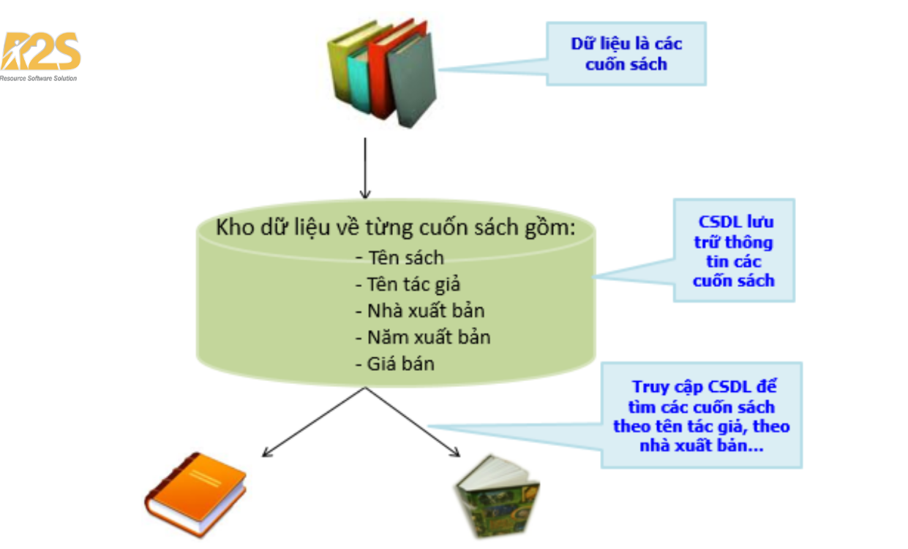
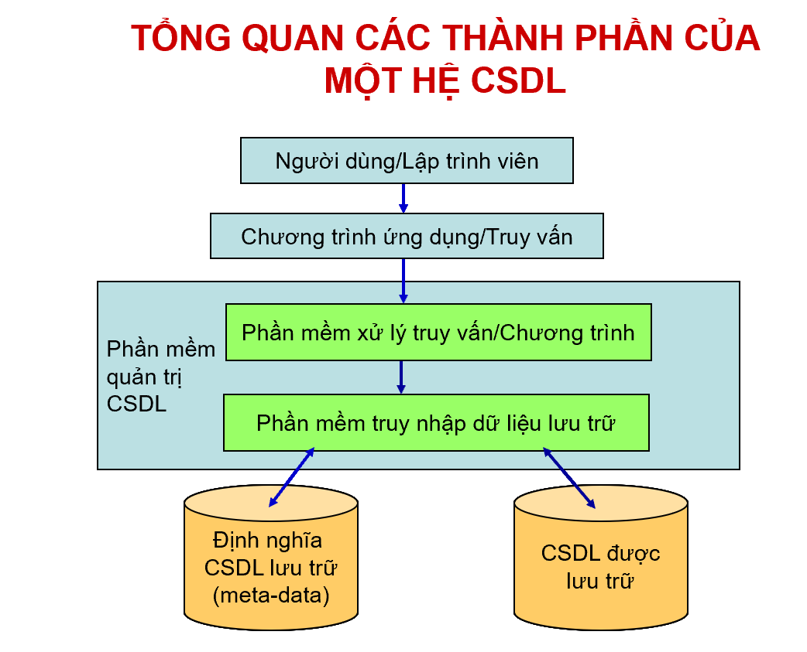
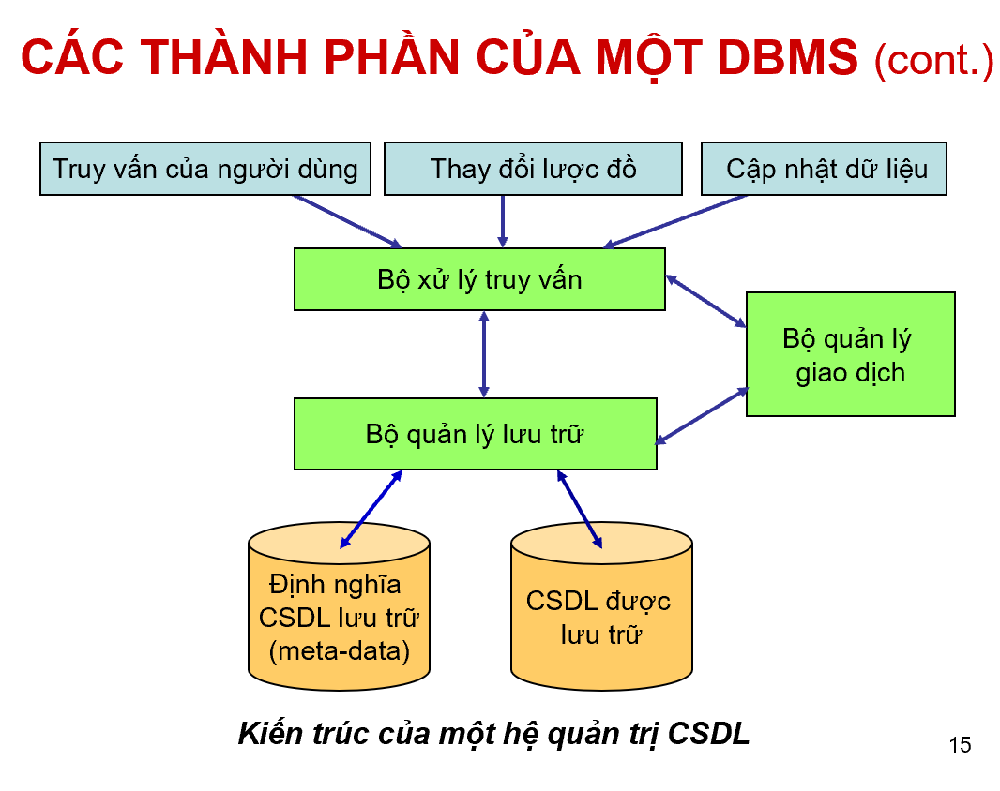

# Nguyễn Quốc Khánh
*Tài liệu chuẩn bị buổi 1*


---

# Buổi 1: Nhập môn Cơ sở dữ liệu
**Mục lục**
- [Nguyễn Quốc Khánh](#nguyễn-quốc-khánh)
- [Buổi 1: Nhập môn Cơ sở dữ liệu](#buổi-1-nhập-môn-cơ-sở-dữ-liệu)
  - [Phần 1: Nội dung cần chuẩn bị](#phần-1-nội-dung-cần-chuẩn-bị)
    - [1. Cơ sở dữ liệu là gì?](#1-cơ-sở-dữ-liệu-là-gì)
    - [2. Hệ quản trị Cơ sở dữ liệu là gì?](#2-hệ-quản-trị-cơ-sở-dữ-liệu-là-gì)
    - [3.  Câu lệnh SQL cơ bản trong MS SQL Server](#3--câu-lệnh-sql-cơ-bản-trong-ms-sql-server)
      - [A. Cú pháp lệnh tạo Cơ sở dữ liệu (Database)](#a-cú-pháp-lệnh-tạo-cơ-sở-dữ-liệu-database)
      - [B. Cú pháp lệnh tạo Bảng (Table):](#b-cú-pháp-lệnh-tạo-bảng-table)
    - [4. Một số kiểu dữ liệu thông dụng](#4-một-số-kiểu-dữ-liệu-thông-dụng)
      - [A. Kiểu dữ liệu số (Numeric)](#a-kiểu-dữ-liệu-số-numeric)
      - [B. Kiểu dữ liệu chuỗi ký tự (String)](#b-kiểu-dữ-liệu-chuỗi-ký-tự-string)
      - [C. Kiểu dữ liệu ngày và giờ (Date \& Time)](#c-kiểu-dữ-liệu-ngày-và-giờ-date--time)
      - [D. Kiểu dữ liệu logic và khác](#d-kiểu-dữ-liệu-logic-và-khác)

---
## Phần 1: Nội dung cần chuẩn bị

### 1. Cơ sở dữ liệu là gì?
- **Cơ sở dữ liệu** (*Database*) là một tập hợp các dữ liệu có liên quan đến nhau được tổ chức, lưu trữ và quản lý theo một hệ thống trên thiết bị điện tử. 
- Chúng giúp người dùng dễ dàng truy xuất, cập nhật, thêm mới hoặc xóa bỏ thông tin một cách nhanh chóng và an toàn.



* **Các loại cơ sở dữ liệu phổ biến**:
  - **Quan hệ** (SQL): Lưu dữ liệu thành các bảng có hàng và cột (ví dụ: MySQL, SQL Server).
  - **Phi quan hệ** (NoSQL): Lưu dữ liệu theo dạng linh hoạt như tài liệu, cặp khóa-giá trị (ví dụ: MongoDB).
  - **Đám mây** (Cloud): Lưu trữ và vận hành trên nền tảng đám mây, dễ dàng mở rộng quy mô.

* **Vai trò của cơ sở dữ liệu**:
    - **Lưu trữ lớn**: Chứa đựng lượng thông tin khổng lồ của tổ chức hay ứng dụng.
    - **Truy xuất nhanh**: Tìm kiếm dữ liệu trong tích tắc bằng các câu lệnh truy vấn.
    - **Bảo mật cao**: Giúp phân quyền và bảo vệ thông tin khỏi mất mát hoặc truy cập trái phép

* **Lưu ý**:
    - Sự khác biệt lớn nhất giữa Cơ sở dữ liệu và một tệp tin văn bản nằm ở cấu trúc. 
    - Thay vì lưu trữ thông tin một cách **lộn xộn và tùy hứng**, Cơ sở dữ liệu tổ chức dữ liệu thành các dạng bảng biểu (gồm nhiều hàng và cột giống như excel), **có tính liên kết chặt chẽ với nhau**. 
    - Sự ngăn nắp có quy tắc này giúp các ứng dụng Web có thể thực hiện hàng triệu thao tác tìm kiếm, thêm mới, hoặc chỉnh sửa dữ liệu.
    - Nếu không có Cơ sở dữ liệu, mọi thông tin người dùng nhập vào trang Web sẽ biến mất ngay khi họ tắt trình duyệt.

### 2. Hệ quản trị Cơ sở dữ liệu là gì?

- **Hệ quản trị cơ sở dữ liệu** (*Database Management System - DBMS*) là một phần mềm chuyên dụng **đóng vai trò trung gian** giữa cơ sở dữ liệu với người dùng hoặc các chương trình ứng dụng. 
- Phần mềm này cho phép **tạo lập, lưu trữ, truy xuất, cập nhật, sắp xếp và bảo mật** toàn bộ dữ liệu một cách hiệu quả.




* **Chức năng chính**:
  - **Tạo lập dữ liệu**: Cho phép định nghĩa kiểu dữ liệu, cấu trúc lưu trữ và các ràng buộc toàn vẹn của cơ sở dữ liệu.
  - **Cập nhật và thao tác**: Hỗ trợ thêm mới, sửa đổi hoặc xóa bỏ các bản ghi thông qua các câu lệnh (như SQL).
  - **Truy xuất thông tin**: Tìm kiếm, lọc và trích xuất dữ liệu nhanh chóng theo các điều kiện khác nhau.
  - **Bảo mật và phân quyền**: Kiểm soát quyền truy cập của người dùng để ngăn chặn rò rỉ hoặc mất mát thông tin.
  - **Sao lưu và phục hồi**: Bảo vệ dữ liệu trước các sự cố phần cứng hoặc lỗi hệ thống.

* **Phân loại phổ biến**:
  - **Hệ quản trị cơ sở dữ liệu quan hệ** (RDBMS): Dữ liệu lưu dưới dạng bảng (hàng và cột). Ví dụ: *MySQL, Microsoft SQL Server, PostgreSQL, Oracle Database*.
  - **Hệ quản trị cơ sở dữ liệu phi quan hệ** (NoSQL): Dữ liệu lưu bằng văn bản, biểu đồ hoặc khóa-giá trị, phù hợp với dữ liệu lớn, linh hoạt. Ví dụ: *MongoDB, Redis, Cassandra*.

* **Sự nhầm lẫn**: 
    - Mặc dù Cơ sở dữ liệu là nơi chứa thông tin, nhưng bản thân nó chỉ là những tập tin tĩnh vô tri vô giác nằm trên ổ cứng.
    - Các phần mềm sẽ không bao giờ tự mình đọc hay ghi trực tiếp vào các tập tin này vì việc đó vô cùng phức tạp, dễ gây hỏng hóc cấu trúc và tiềm ẩn rủi ro bảo mật nghiêm trọng.
    - Để giải quyết bài toán này chúng ta mới cần tới hệ quản trị cơ sở dữ liệu. 
    - Ví dụ: Cơ sở dữ liệu chính là một Kho hàng chứa tất cả các kiện hàng hóa (tượng trưng cho dữ liệu). Còn hệ quản trị CSDL (DBMS) chính là người thủ kho quản lý kho hàng đó. 

### 3.  Câu lệnh SQL cơ bản trong MS SQL Server
- Để ra lệnh, chúng ta phải sử dụng một bộ quy tắc ngôn ngữ chuẩn mực có tên là SQL (viết tắt của Structured Query Language - Ngôn ngữ truy vấn có cấu trúc).
- Mọi mệnh lệnh từ việc khởi tạo kho chứa, phân chia các ngăn kệ, cho đến tìm kiếm thông tin khách hàng đều phải được viết bằng ngôn ngữ SQL. 
- Các câu lệnh SQL cơ bản trong MS SQL Server được chia thành các nhóm chính dùng để truy vấn, thêm, sửa, xóa và quản lý cấu trúc dữ liệu như `SELECT`, `INSERT`, `UPDATE`, `DELETE`, `CREATE` và `ALTER`.

#### A. Cú pháp lệnh tạo Cơ sở dữ liệu (Database)
```SQL
CREATE DATABASE TenCoSoDuLieu;
```

Đây là câu lệnh sơ khai nhất nhằm tạo ra một vùng không gian lưu trữ trống trên máy tính. Các thành phần trong câu lệnh được giải nghĩa như sau:
- `CREATE`: Từ khóa hành động cốt lõi của SQL, mang ý nghĩa ra lệnh cho hệ thống "Hãy **tạo ra** một **đối tượng mới**".
- `DATABASE`: Từ khóa **định danh loại đối tượng**. Khi kết hợp cùng `CREATE`, hệ thống hiểu một cách chính xác rằng cần phải xây dựng một hệ thống cơ sở dữ liệu mới.
- `TenCoSoDuLieu`: Đây là khoảng trống để tự đặt tên cho dự án. **Quy tắc**: tên CSDL không được chứa khoảng trắng, không chứa dấu tiếng Việt và nên viết hoa chữ cái đầu của mỗi từ (Ví dụ: QuanLyBanHang, HeThongNhanSu).
- Dấu chấm phẩy `;`: Đây là ký tự dùng để kết thúc một câu lệnh SQL.

#### B. Cú pháp lệnh tạo Bảng (Table):

Một Cơ sở dữ liệu vừa tạo ra sẽ hoàn toàn trống rỗng.
Để có thể **lưu trữ thông tin**, phải **chia không gian đó thành các bảng** (Table). 
Mỗi bảng đại diện cho một danh từ, một đối tượng cụ thể và chứa các cột thông tin mô tả cho đối tượng đó.

```SQL
CREATE TABLE TenBang (
    TenCot1 KieuDuLieu1,
    TenCot2 KieuDuLieu2,
    TenCot3 KieuDuLieu3
);
```


* Phân tích chi tiết cú pháp tạo bảng:
  - `CREATE TABLE`: Mệnh lệnh yêu cầu hệ thống **sinh ra một bảng dữ liệu mới**.
  - `TenBang`: **Tên** của **đối tượng cần lưu trữ** (Ví dụ: NhanVien, SanPham).
  - Cặp ngoặc đơn `( )`: Mọi thiết kế về các cột (trường thông tin) của bảng đều phải được bao bọc bên trong cặp ngoặc đơn này. Nó **khoanh vùng phạm vi** định nghĩa của bảng.
  - `TenCot1, TenCot2`: **Tên** của **các cột dữ liệu** (Ví dụ: MaSo, HoTen).
  - `KieuDuLieu1, KieuDuLieu2`: Đây là yếu tố sống còn bảo vệ tính đúng đắn của dữ liệu. Nó **quy định chặt chẽ loại thông tin nào được phép đưa vào cột**. Nếu một cột được gán kiểu "số nguyên", hệ thống sẽ tự động chặn đứng mọi hành vi cố tình chèn văn bản (chữ cái) vào cột đó, giúp loại bỏ các rác thải dữ liệu ngay từ đầu.
  - Dấu phẩy `,`: Đóng vai trò **làm dải phân cách giữa định nghĩa của cột này với cột khác**. Một lưu ý vô cùng quan trọng: tuyệt đối không đặt dấu phẩy ở dòng định nghĩa cột cuối cùng sát với dấu ngoặc đóng, điều này sẽ khiến câu lệnh báo lỗi cú pháp.

### 4. Một số kiểu dữ liệu thông dụng
Trong SQL, các kiểu dữ liệu phổ biến nhất bao gồm kiểu số (`INT`, `DECIMAL`), kiểu chuỗi ký tự (`VARCHAR`, `NVARCHAR`), kiểu ngày giờ (`DATE`,`DATETIME`), và kiểu logic (`BOOLEAN`), giúp xác định rõ loại giá trị được lưu trữ trong mỗi cột của bảng cơ sở dữ liệu.

#### A. Kiểu dữ liệu số (Numeric)
- `INT` hoặc `INTEGER`: Lưu số nguyên bình thường (ví dụ: 100, -5).
- `BIGINT`: Lưu số nguyên rất lớn (dùng cho ID có lượng dữ liệu khổng lồ).
- `DECIMAL(p, s)` hoặc `NUMERIC(p, s)`: Lưu số thập phân chính xác tuyệt đối, hay dùng cho tiền tệ.
- `FLOAT` / `REAL`: Lưu số thực có độ chính xác xấp xỉ.
#### B. Kiểu dữ liệu chuỗi ký tự (String)
- `VARCHAR(n)`: Lưu chuỗi ký tự thông thường không dấu hoặc ASCII, tiết kiệm dung lượng.
- `NVARCHAR(n)` hoặc `VARCHAR` hỗ trợ Unicode: Lưu chuỗi ký tự có dấu Tiếng Việt hoặc đa ngôn ngữ.
- `CHAR(n)`: Lưu chuỗi ký tự có độ dài cố định.
#### C. Kiểu dữ liệu ngày và giờ (Date & Time)
- `DATE`: Chỉ lưu ngày, tháng, năm (ví dụ: 2026-06-08).
- `TIME`: Chỉ lưu giờ, phút, giây.
- `DATETIME` hoặc `TIMESTAMP`: Lưu cả ngày và giờ chi tiết.
#### D. Kiểu dữ liệu logic và khác
- `BOOLEAN`: Lưu giá trị đúng/sai (TRUE / FALSE).
- `BLOB` / `IMAGE`: Lưu dữ liệu nhị phân lớn như file ảnh, âm thanh.