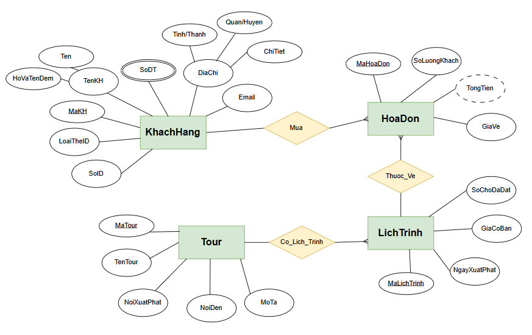

# Bài tập hoàn thiện thiết kế cơ sở dữ liệu cho module đã chọn.

## I. Đề bài

### 1. Mô tả chung

**Khách hàng** yêu cầu chúng ta phát triển một phần mềm quản lí đặt **tour** du lịch, được mô tả như sau:

- Mỗi **tour** (Mã tour, tên, nơi xuất phát, nơi đến, mô tả) có thể xuất phát vào nhiều ngày khác nhau, tùy vào ngày xuất phát và số lượng người mua tour cho mỗi đoàn sẽ có giá khác nhau.
- Mỗi **khách hàng** (Mã, tên, số ID, loại thẻ ID, số ĐT, email, địa chỉ) có thể mua **vé** nhiều tour khác nhau. Mỗi **tour** có thể mua số lượng vé khác nhau. Mỗi lần mua có xuất **hóa đơn** ghi rõ thông tin tour, ngày xuất phát, giá tour, số lượng khách, tên khách hàng đại diện, tổng số tiền thanh toán.
- Cùng một **khách hàng** có thể đi cùng một **tour** nhiều lần, chỉ khác nhau ở ngày xuất phát và giá vé.
- **Khách hàng** có thể trả vé, nếu trả trước giờ xuất phát trước 7 ngày thì phạt 10%, trước 5 ngày phạt 20%, trước 3 ngày phạt 50%, trước ít hơn 3 ngày phạt 100% giá ghi trên vé.

### 2. Module chi tiết: Mua vé

- Nhân viên chọn chức năng mua vé theo yêu cầu của khách → giao diện tìm tour (*theo tên nơi đến*) → NV nhập tên nơi đến và bấm tìm → kết quả hiện ra gồm danh sách các tour còn chỗ trống tương ứng với tiêu chí đã chọn.
- Mỗi tour hiển thị đấy đủ thông tin + ngày xuất phát + giá tương ứng tại thời điểm tìm → NV chọn 1 tour theo lựa chọn của KH → hóa đơn (vé) hiện ra chi tiết: tên tour, nơi đi, nơi đến, ngày đi, tên khách đại diện đoàn, số ID, kiểu ID, địa chỉ khách, số điện thoại, email, số lượng khách, giá vé → NV chọn thanh toán → khách hàng thanh toán → hệ thống lưu kết quả vào và in vé cho khách hàng.

---

## I. Thiết kế CSDL

### 1. Bước 1: Khảo sát yêu cầu nghiệp vụ

* Hệ thống cần quản lý thông tin các tour du lịch và khách hàng đặt tour.
* Một tour có thể xuất phát vào nhiều ngày khác nhau với mức giá khác nhau tùy thời điểm.
* Khách hàng có thể đặt nhiều tour, và cùng một tour có thể đi nhiều lần vào các ngày khác nhau.
* Hệ thống cần xử lý nghiệp vụ mua vé.

* Hệ thống cần quản lý những đối tượng sau đây:
  - Tour
  - Khách hàng
  - Hóa đơn
  - Vé
  - Nhân viên
  - Lịch trình (Đối với từng Tour)

### 2. Bước 2:Xác định thực thể và thuộc tính

Mỗi thực thể cụ thể có thuộc tính sau:
- `Tour`: Lưu thông tin gốc của tour. Dữ liệu đề bài yêu cầu: Mã, tên, nơi xuất phát, nơi đến, mô tả.
- `KhachHang`: Lưu thông tin người đặt. Gồm: Mã, tên, số ID, loại thẻ ID, số ĐT, email, địa chỉ.
- `HoaDon`: Lưu giao dịch mua của khách. Gồm: ID hóa đơn, liên kết đến Khách hàng, liên kết đến Lịch trình, số lượng khách, đơn giá tại thời điểm mua, tổng tiền.
- `LichTrinh`: Nếu chỉ dùng 1 bảng Tour, ta sẽ không thể lưu nhiều ngày xuất phát cho cùng 1 tour. Do đó, ta cần tách riêng một bảng lịch trình. Gồm: Mã lịch trình, ngày xuất phát, giá vé cơ bản.

### 3. Bước 3: Xác định mối quan hệ của từng thực thể

- `Tour` và `LichTrinh`: Quan hệ 1-N. Một Tour có thể có nhiều Lịch trình xuất phát.
- `KhachHang` có quan hệ 1 - N với `HoaDon`: Một khách hàng đại diện có thể thực hiện nhiều giao dịch mua vé.
- `LichTrinh` và `HoaDon`: Quan hệ 1-N. Một lịch trình cụ thể có thể tiếp nhận nhiều hóa đơn đặt vé từ các khách hàng khác nhau.

### 4. Bước 4: Vẽ lược đồ E-R

### 5. Bước 5: Chuyển lược đồ E-R sang mô hình quan hệ

Chuyển 4 thực thể thành 4 bảng.

* Quy tắc: 

  - Trong quan hệ 1-N, khóa chính của bảng phía 1 sẽ trở thành khóa ngoại của bảng phía N.
  - Bảng `LichTrinh` sẽ nhận `MaTour` làm khóa ngoại
  - Bảng `HoaDon` sẽ nhận `MaKH` và `MaLichTrinh` làm khóa ngoại

### 6. Bước 6: Chuẩn hóa dữ liệu (1NF, 2NF, 3NF)

Cấu trúc này đã đạt chuẩn 3NF vì:

- **1NF** (*Loại bỏ thuộc tính đa trị*): Các trường dữ liệu đều lưu giá trị đơn. 

- **2NF** (*Phụ thuộc hàm đầy đủ*): Các bảng đều có khóa chính đơn (MaKH, MaTour...), không có khóa phức hợp nên tự động đạt 2NF.

- **3NF** (*Không phụ thuộc bắc cầu*): Sửa đổi bằng cách lưu cột `GiaVe` thẳng vào bảng `HoaDon`. Nếu không lưu, mà mỗi lần tính tiền lại gọi sang `GiaCoBan` của bảng `LichTrinh`, thì sau này khi đổi giá tour, toàn bộ doanh thu của các hóa đơn cũ trong quá khứ sẽ bị sai lệch.