# Nguyễn Quốc Khánh

*Tài liệu chuẩn bị buổi 2*

---

# [BUỔI 2] CƠ BẢN VỀ THIẾT KẾ CƠ SỞ DỮ LIỆU

**Mục lục**
- [Nguyễn Quốc Khánh](#nguyễn-quốc-khánh)
- [\[BUỔI 2\] CƠ BẢN VỀ THIẾT KẾ CƠ SỞ DỮ LIỆU](#buổi-2-cơ-bản-về-thiết-kế-cơ-sở-dữ-liệu)
  - [Phần 1: Kiến thức cần chuẩn bị](#phần-1-kiến-thức-cần-chuẩn-bị)
    - [I. Lý thuyết cơ bản về thiết kế Cơ sở dữ liệu](#i-lý-thuyết-cơ-bản-về-thiết-kế-cơ-sở-dữ-liệu)
      - [A. Khái niệm](#a-khái-niệm)
      - [B. Tính chất](#b-tính-chất)
      - [C. Các bước thiết kế](#c-các-bước-thiết-kế)
        - [Bước 1: Xác định các thành phần dữ liệu](#bước-1-xác-định-các-thành-phần-dữ-liệu)
        - [Bước 2: Chia nhỏ các thành phần dữ liệu ra thành các phần nhỏ nhất mà hệ thống sử dụng](#bước-2-chia-nhỏ-các-thành-phần-dữ-liệu-ra-thành-các-phần-nhỏ-nhất-mà-hệ-thống-sử-dụng)
        - [Bước 3: Xác định các bảng và các cột](#bước-3-xác-định-các-bảng-và-các-cột)
        - [Bước 4: Xác định khóa chính, khóa ngoại và mối quan hệ](#bước-4-xác-định-khóa-chính-khóa-ngoại-và-mối-quan-hệ)
        - [Bước 5: Kiểm tra cấu trúc cơ sở dữ liệu được thiết kế với qui định chuẩn hóa](#bước-5-kiểm-tra-cấu-trúc-cơ-sở-dữ-liệu-được-thiết-kế-với-qui-định-chuẩn-hóa)
    - [II. Lược đồ quan hệ E-R (Entity-Relationship Diagram)](#ii-lược-đồ-quan-hệ-e-r-entity-relationship-diagram)
      - [A. Khái niệm](#a-khái-niệm-1)
      - [B. Các ký hiệu trong lược đồ E - R](#b-các-ký-hiệu-trong-lược-đồ-e---r)
      - [C. Các thuộc tính trong lược đồ E - R](#c-các-thuộc-tính-trong-lược-đồ-e---r)
      - [D. Các loại ánh xạ lực lượng liên kết (Cardinality Mapping)](#d-các-loại-ánh-xạ-lực-lượng-liên-kết-cardinality-mapping)
      - [E. Phân biệt: "Thực thể" (trong bản vẽ E-R) và "Bảng" (trong CSDL vật lý)](#e-phân-biệt-thực-thể-trong-bản-vẽ-e-r-và-bảng-trong-csdl-vật-lý)
    - [III. Mô hình dữ liệu quan hệ (Relational Data Model)](#iii-mô-hình-dữ-liệu-quan-hệ-relational-data-model)
      - [A. Các thành phần cốt lõi của mô hình dữ liệu quan hệ](#a-các-thành-phần-cốt-lõi-của-mô-hình-dữ-liệu-quan-hệ)
        - [1. Bảng (Quan hệ)](#1-bảng-quan-hệ)
        - [2. Sơ đồ](#2-sơ-đồ)
        - [3. Tên miền](#3-tên-miền)
      - [B. Chìa khóa và các mối quan hệ](#b-chìa-khóa-và-các-mối-quan-hệ)
      - [C. Phân biệt nhanh: Khóa chính (Primary Key) vs Khóa ngoại (Foreign Key)](#c-phân-biệt-nhanh-khóa-chính-primary-key-vs-khóa-ngoại-foreign-key)
    - [IV. Chuẩn hóa dữ liệu (Normalization)](#iv-chuẩn-hóa-dữ-liệu-normalization)
      - [A. Khái niệm](#a-khái-niệm-2)
      - [B. Mục đích](#b-mục-đích)
      - [C. Các dạng chuẩn](#c-các-dạng-chuẩn)
        - [1. Dạng chưa chuẩn hóa (Non-first Nomal Form - N1NF)](#1-dạng-chưa-chuẩn-hóa-non-first-nomal-form---n1nf)
        - [2. Dạng chuẩn 1 (First Nomal Form - 1NF)](#2-dạng-chuẩn-1-first-nomal-form---1nf)
        - [3. Dạng chuẩn 2 (Second Nomal Form - 2NF)](#3-dạng-chuẩn-2-second-nomal-form---2nf)
      - [4. Dạng chuẩn 3 (Third Nomal Form - 3NF)](#4-dạng-chuẩn-3-third-nomal-form---3nf)
      - [D. Phân biệt: Tiêu chí cốt lõi của các Dạng chuẩn](#d-phân-biệt-tiêu-chí-cốt-lõi-của-các-dạng-chuẩn)
  - [Phần 2: Bài tập](#phần-2-bài-tập)
    - [I.  Cài đặt MySQL và MySQL Workbench](#i--cài-đặt-mysql-và-mysql-workbench)
    - [II. Xây dựng hệ thống Quản lý đặt tour](#ii-xây-dựng-hệ-thống-quản-lý-đặt-tour)
      - [Bước 1: Phân tích thực thể từ yêu cầu](#bước-1-phân-tích-thực-thể-từ-yêu-cầu)
      - [Bước 2: Script SQL cập nhật](#bước-2-script-sql-cập-nhật)
        - [1. Khởi tạo Database](#1-khởi-tạo-database)
        - [2. Tạo bảng Khách Hàng (Định nghĩa đối tượng Khách hàng)](#2-tạo-bảng-khách-hàng-định-nghĩa-đối-tượng-khách-hàng)
        - [3. Tạo bảng Tour](#3-tạo-bảng-tour)
        - [4. Tạo bảng Lịch Trình (Nơi quy định ngày đi và giá)](#4-tạo-bảng-lịch-trình-nơi-quy-định-ngày-đi-và-giá)
        - [5. Tạo bảng Hóa Đơn (Nơi lưu trữ giao dịch)](#5-tạo-bảng-hóa-đơn-nơi-lưu-trữ-giao-dịch)


---
## Phần 1: Kiến thức cần chuẩn bị

### I. Lý thuyết cơ bản về thiết kế Cơ sở dữ liệu

#### A. Khái niệm

- **Thiết kế cơ sở dữ liệu** (*Database Design*) là quá trình tổ chức dữ liệu thành các bảng hoặc cấu trúc logic sao cho việc lưu trữ, truy xuất và quản lý diễn ra nhanh chóng, chính xác, tiết kiệm bộ nhớ và tránh trùng lặp dữ liệu không cần thiết.
- Hiểu cơ bản, thiết kế cấu trúc cơ sở dữ liệu là **quá trình mô hình hóa** nhằm **chuyển đổi các đối tượng** từ thế giới thực sang các bảng trong hệ thống cơ sở dữ liệu đáp ứng các yêu cầu lưu trữ và khai thác dữ liệu.

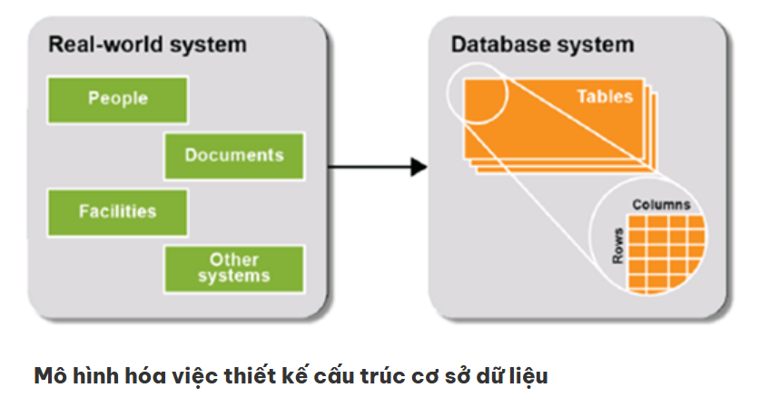

Trong đó:

- **People** (*con người*): những người tham gia vào hệ thống,ta cần làm việc với những người này để xác định các dữ liệu cần lưu trữ, cần khai thác.
- **Documents** (*tài liệu*): ta cần khảo sát các tài liệu trong hệ thống để xác định dữ liệu.
- **Facilities** (*cơ sở vật chất*): ta cần quan tâm những cơ sở vật chất nào cần quản lý.
- **Other systems** (*hệ thống khác, hệ thống tương tự*): ta cần tìm hiểu nghiên cứu các hệ thống tương tự để thu thập thêm dữ liệu.

#### B. Tính chất

Việc tuân thủ quy trình thiết kế bài bản nhằm đáp ứng các mục tiêu học thuật và kỹ thuật cốt lõi sau:

  - **Đảm bảo tính độc lập dữ liệu** (*Data Independence*): Phân tách cấu trúc lưu trữ vật lý khỏi các chương trình ứng dụng bên trên, cho phép thay đổi cấu trúc dữ liệu mà không làm gián đoạn mã nguồn ứng dụng.
  - **Tối thiểu hóa dư thừa dữ liệu** (*Data Redundancy*): Đảm bảo một thuộc tính thông tin chỉ được lưu trữ tại một vị trí duy nhất, giúp tối ưu hóa không gian lưu trữ và đảm bảo tính nhất quán của dữ liệu.
  - **Ngăn chặn dị thường dữ liệu** (*Data Anomalies*): Triệt tiêu các lỗi logic phát sinh khi thực hiện thao tác Thêm (Insertion Anomaly), Sửa (Update Anomaly) hoặc Xóa (Deletion Anomaly).
  - **Tối ưu hóa hiệu suất**: Hỗ trợ bộ xử lý truy vấn (Query Processor) hoạt động hiệu quả trên các cấu trúc dữ liệu chuẩn hóa, tăng cường tốc độ truy xuất.

#### C. Các bước thiết kế
Để thực hiện việc thiết kế cơ sở dữ liệu chúng ta cần thực hiện các bước sau đây:
##### Bước 1: Xác định các thành phần dữ liệu

* Để xác định các thành phần dữ liệu chúng ta cần thực hiện các bước sau đây:
    1. Phân tích hệ thống hiện tại
    2. Đánh giá, xem xét các hệ thống tương tự
    3. Phỏng vấn người dùng
    4. Phân tích các tài liệu trong hệ thống hiện tại

* Lưu ý: Vì tiếng Việt có dấu nên dễ gây lỗi khi code, nếu dùng không dấu thì dễ nhầm lẫn. Nên đặt tên các thành phần dữ liệu bằng tiếng Anh.

* Loại bỏ các dữ liệu trùng ở các dạng sau:
  * Hai thành phần dữ liệu nhưng trỏ đến một thành phần dữ liệu thực tế
  * Bỏ những thành phần tính toán được
  * Những trường không cần lưu trữ hoặc không có thực

##### Bước 2: Chia nhỏ các thành phần dữ liệu ra thành các phần nhỏ nhất mà hệ thống sử dụng

Để hiểu phần này bạn xem xét ví dụ sau:

- CustomerName có giá  trị là Nguyễn Văn A, trường này có thể tách ra là Lastname (Nguyễn), Middlename (Văn) và Firstname (A).
- Tuy nhiên, có hệ thống thì lưu hết vào một trường là ‘Nguyễn Văn A’ như giao hàng chẳng hạn, có hệ thống chia ra là ‘Nguyễn Văn’, ‘A’ như hệ thống quản lý sinh viên, có hệ thống chia ra thành ‘Nguyễn’, ‘Văn’, ‘A’ như hệ thống quản lý bay… Do vậy, bạn cần xem xét hệ thống bạn đang xây dựng sẽ lưu như thế nào.
- Trong hệ thống mẫu này do hay sắp xếp theo tên khách hàng nên chúng ta tách nó ra thành 02 phần là CustomerLastName và CustomerFirstName.

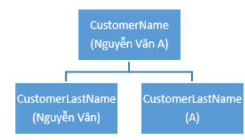

- Tương tự trường CustomerAddress cung vậy, để quản lý theo tỉnh/thành phố và quận/huyện chúng ta chia nó ra thành 03 trường như sau: CustomerAddress, CustomerDistrict và CustomerCity.
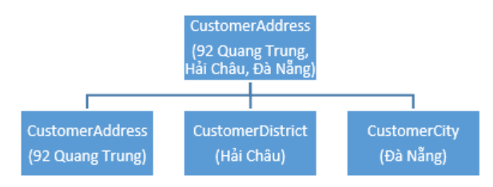

##### Bước 3: Xác định các bảng và các cột

Thực hiện theo các bước sau:

- Nhóm các trường theo các thực thể (Entities)
  - nhóm các thành phần dữ liệu tương ứng vào các thực thể
- Kiểm tra lại các trường thừa/thiếu.
  - Nếu có trường thừa ra, ta cần xem xét nó có thực sự cần lưu trữ không? Nếu cần lưu trữ thì cần bổ sung thực thể chứa thuộc tính này. Nếu không cần lưu trữ thì cần loại bỏ nó đi.
  - Cần kiểm tra từng thực thể xem có cần bổ sung thuộc tính nào không? Nếu cần thì thêm vào.

##### Bước 4: Xác định khóa chính, khóa ngoại và mối quan hệ

* a. Xác định khóa chính cho các thực thể
  - Khóa chính của thực thể có thể xác định như sau:
    - Chọn từ một trường có sẵn đủ điều kiện làm khóa chính như InvoiceNo chẳng hạn.
    - Nếu chưa có thì có thể bổ sung một trường tự tăng để làm khóa chính như CustomerNo, ProductNo.

* b. Xác định mối quan hệ giữa các bảng
  - Xem xét các thực thể để có để xác định các định mối quan hệ của chúng.
  - VD: chúng ta có các thực thể Customer, Product và Invoice thì mối quan hệ của chúng chỉ có thể là Customer mua Product và sinh ra Invoice để ghi nhận thông tin.
  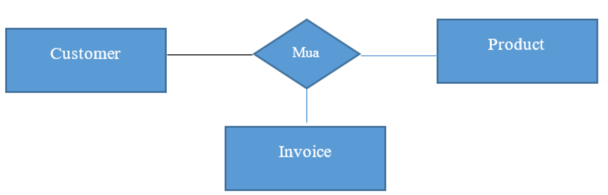
  - Xác định loại quan hệ giữa các thực thể như sau:
    - Quan hệ giữa Customer và Invoice, chúng ta thấy mỗi khách hàng có thể mua nhiều đơn hàng, nhưng mỗi đơn hàng chỉ bán cho 1 khách hàng. Do vậy quan hệ này là 1-n.
    - Tương tự quan hệ giữa Invoice và Product, mỗi hóa đơn có thể mua nhiều sản phẩm, mỗi sản phẩm có thể bán cho nhiều hóa đơn nên quan hệ này là quan hệ n-n.

* c. Phân tách các quan hệ để đưa về mô hình nhị nguyên

  - Theo mô hình cơ sở dữ liệu quan hệ nếu để tồn tại mối quan hệ n-n nó sẽ gây ra dư thừa dữ liệu.
  - Do vậy, ta cần tách quan hệ ra thành các quan hệ 1-n bằng cách thêm vào bảng dữ liệu mới.

* d. Bổ sung khóa ngoại cho các mối quan hệ

  - Khi đã xác định xong các mối quan hệ, bạn cần đặt các khóa ngoại vào các bảng bên n trong  quan hệ 1-n  để tạo liên kết giữa chúng.

##### Bước 5: Kiểm tra cấu trúc cơ sở dữ liệu được thiết kế với qui định chuẩn hóa

- Bước này giúp ta xem lại cơ sở dữ liệu vừa thiết kế có đáp ứng được qui định của cơ sở dữ liệu quan hệ hay không.


### II. Lược đồ quan hệ E-R (Entity-Relationship Diagram)

#### A. Khái niệm

- Lược đồ thực thể liên kết hay lược đồ quan hệ E - R (Entity-Relationship Diagram) gồm 3 khái niệm cơ bản: **tập thực thể**, **tập quan hệ** và **thuộc tính**
  - **Thực thể** (`Entity`) là một đối tượng trong thế giới thực và có thể phân biệt được với các đối tượng khác. Thực thể có thể cụ thể (một người, một quyển sách,…) hoặc cũng có thể trừu tượng (một khoản vay ngân hàng, một khái niệm,…). Thực thể được biểu diễn bởi một tập các **thuộc tính** 
  - **Tập thực thể** là một nhóm các **thực thể** có **cùng thuộc tính**. Ví dụ: tập tất cả khách hàng của ngân hàng có thể được định nghĩa là tập khách hàng. Các tập thực thể không nhất thiết phải tách rời nhau.
  - **Thuộc tính** (`Attribute`) là các thuộc tính mô tả hoặc các đặc tính của thực thể. Mỗi **thuộc tính** có một tập giá trị cho phép, được gọi là **miền** (hay tập giá trị) của thuộc tính đó. 
    - Một thuộc tính của một tập thực thể là một hàm ánh xạ từ một tập thực thể vào một miền giá trị.
    - Một tập thực thể có thể có nhiều thuộc tính.
    => Mỗi thực thể trong tập có thể được mô tả bởi một tập các cặp <tên thuộc tính, giá trị>, ứng với từng thuộc tính trong tập thực thể.
  - Một CSDL bao gồm một tập các thực thể.

#### B. Các ký hiệu trong lược đồ E - R
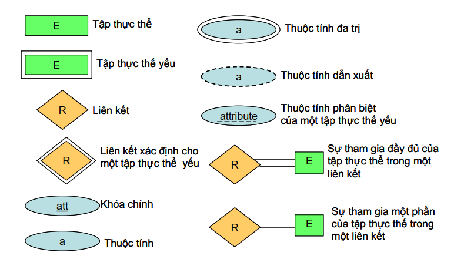
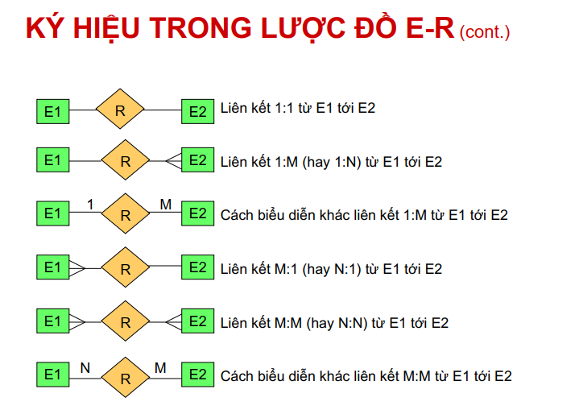
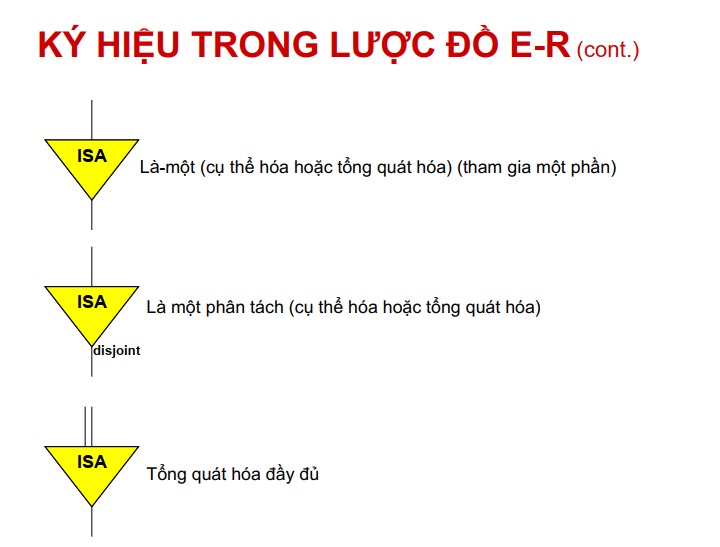
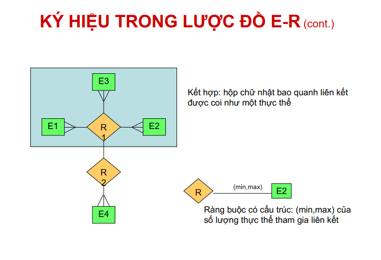
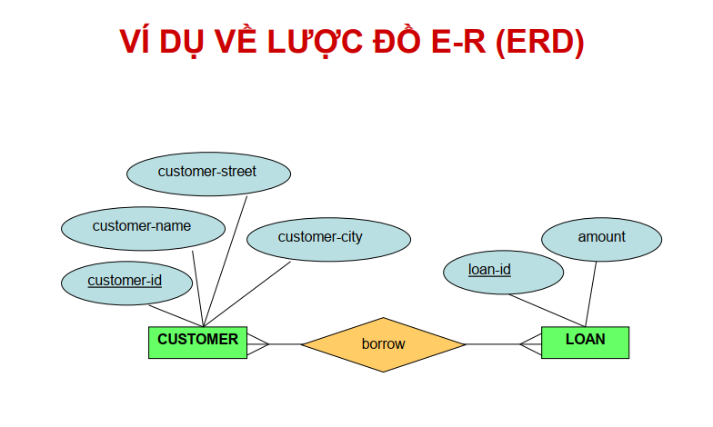

#### C. Các thuộc tính trong lược đồ E - R

* **Thuộc tính đơn hoặc thuộc tính kép**: Thuộc tính đơn không bao gồm các thành phần cấu thành, trong khi thuộc tính kép bao gồm các
thành phần con cấu thành.
  - Ví dụ: thuộc tính **tên**: Nếu tên biểu diễn một thuộc tính đơn thì có thể coi bộ ba cấu thành tên là **họ**, **tên đệm** và **tên** gọi là một thuộc tính nguyên tố, không phân chia được nữa.
  - Còn nếu coi tên là một thuộc tính kép thì có thể lựa chọn thao tác với thuộc tính này là một tên đầy đủ hoặc có thể thao tác với từng thành phần cấu thành tên.

* **Thuộc tính đơn trị hoặc thuộc tính đa trị**: Thuộc tính đơn trị có nhiều nhất một giá trị tại một thời điểm cụ thể. Thuộc tính đa trị có thể có nhiều giá trị khác nhau tại một thời điểm.
  - Ví dụ: Tại một trường học sinh viên được đăng ký học theo tín chỉ. Tại một kỳ học nào đó, số tín chỉ một sinh viên đăng ký là đơn trị, ví dụ là 7 (tín chỉ) => số tín chỉ không thể nhận giá trị đa trị.
  - Thuộc tính số điện thoại của sinh viên có thể chứa nhiều giá trị cùng lúc do tại một thời điểm, một sinh viên có thể có một vài số điện thoại khác nhau. => thuộc tính số điện thoại là đa trị

* **Thuộc tính dẫn xuất**: là thuộc tính mà giá trị của nó được dẫn xuất (hoặc được tính toán) từ những giá trị của các thuộc tính hoặc các thực thể có liên quan.

  - Ví dụ: Giả sử thực thể **KHÁCH HÀNG** của một ngân hàng có một thuộc tính tên là `loansheld`, chứa số lượng các khoản vay của một khách hàng tại ngân hàng. Giá trị của thuộc tính này có thể được tính bằng cách đếm số lượng thực thể các khoản vay liên quan tới khách hàng.

* **Thuộc tính rỗng** (`Null`): thuộc tính nhận giá trị rỗng khi một thực thể không có giá trị cho nó.

#### D. Các loại ánh xạ lực lượng liên kết (Cardinality Mapping)

| Loại | Ký hiệu | Bản chất học thuật                                                                                                               | Ảnh minh họa                    |
| ---- | ------- | -------------------------------------------------------------------------------------------------------------------------------- | ------------------------------- |
| 1-1  | 1:1     | Một thực thể thuộc tập A liên kết với tối đa một thực thể thuộc tập B, và ngược lại.                                             | 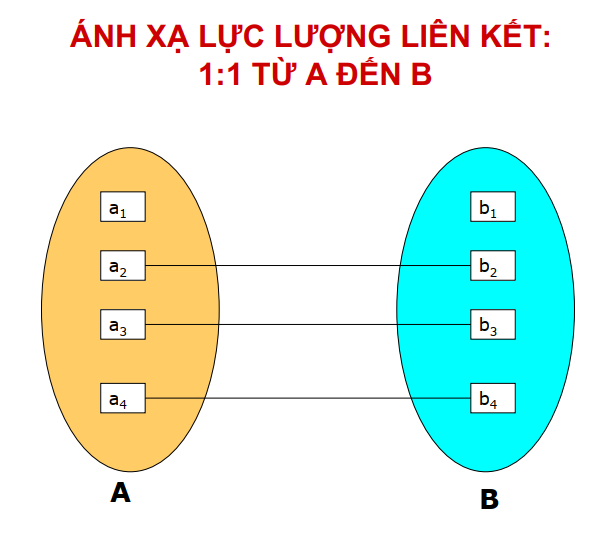  |
| 1-N  | 1:N     | Một thực thể thuộc tập A liên kết với nhiều thực thể thuộc tập B, nhưng một thực thể B chỉ liên kết với duy nhất một thực thể A. | 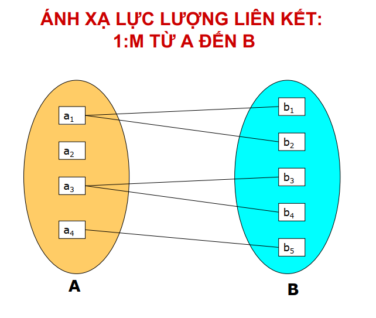 |
| N-1  | N:1     | Nhiều thực thể thuộc tập A liên kết với một thực thể thuộc tập B và một thực thể B có thể liên kết với nhiều thực thể A.         | 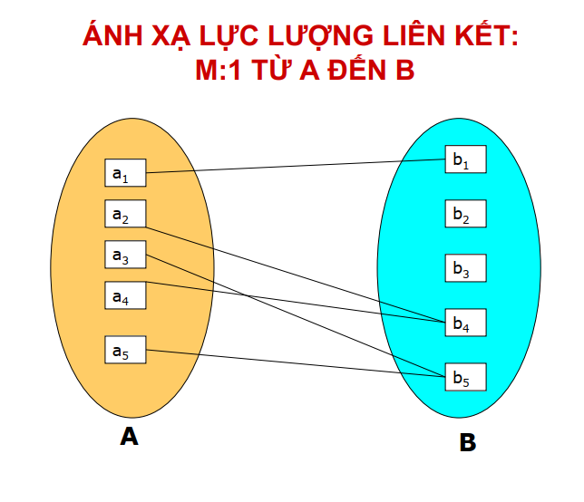 |
| N-N  | M:N     | Một thực thể thuộc tập A có thể liên kết với nhiều thực thể thuộc tập B, và ngược lại.                                           | 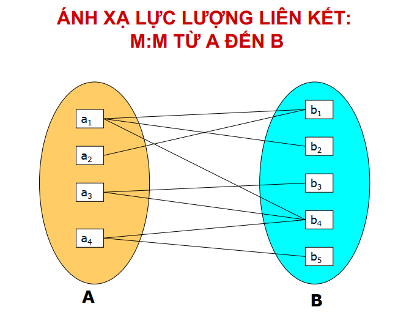 |

#### E. Phân biệt: "Thực thể" (trong bản vẽ E-R) và "Bảng" (trong CSDL vật lý)

| Tiêu chí          | Thực thể (Entity)                                              | Bảng (Table)                                                                                                |
| ----------------- | -------------------------------------------------------------- | ----------------------------------------------------------------------------------------------------------- |
| Mức độ trừu tượng | Thuộc mô hình dữ liệu mức khái niệm (Conceptual Model)         | Thuộc mô hình dữ liệu mức vật lý (Physical Model) được cài đặt bằng DDL (Data Definition Language)          |
| Quan hệ N-N       | Được phép biểu diễn trực tiếp trên lược đồ E-R                 | KHÔNG tồn tại trực tiếp. Bắt buộc phải thực hiện phép phân rã thành một bảng trung gian với hai quan hệ 1-N |
| Thuộc tính đa trị | Cho phép định nghĩa thuộc tính đa trị (Multi-valued Attribute) | Một ô giao điểm giữa cột và dòng chỉ được chứa một giá trị nguyên tố duy nhất                               |


### III. Mô hình dữ liệu quan hệ (Relational Data Model)

- **Mô hình dữ liệu** là tập hợp các khái niệm dùng cho việc mô tả và thao tác dữ liệu, các mối quan hệ và các ràng buộc trên dữ liệu của tổ chức.

- **Mô hình dữ liệu** phải cung cấp các khái niệm và kí hiệu cơ bản, cho phép ng thiết kế CSDL và người dùng trao đổi với nhau những hiểu biết về dữ liệu của tổ chức một cách **chính xác** và **không đa nghĩa**.

- **Quan hệ**: là một bảng (ma trận) với các hàng và các cột, lưu giữ thông tin về các đối tượng được mô hình hóa trong CSDL

- **Mô hình dữ liệu quan hệ** tổ chức dữ liệu dưới dạng các quan hệ (Relation), thường được biểu diễn trực quan bằng **cấu trúc ma trận hai chiều** bao gồm các dòng và cột.

#### A. Các thành phần cốt lõi của mô hình dữ liệu quan hệ

##### 1. Bảng (Quan hệ)

- **Bảng** (`Table`/`Relation`): Tập hợp các bộ giá trị (Tuple) chia sẻ chung một tập hợp các thuộc tính. Bảng là kết quả của quá trình ánh xạ tập thực thể sang mô hình quan hệ.
- **Cột** (`Column`/`Attribute`): Định nghĩa một thuộc tính và miền giá trị (Domain) tương ứng của thuộc tính đó trong quan hệ.
- **Dòng** (`Row`/`Tuple`): Một bản ghi dữ liệu đơn lẻ, thể hiện một cá thể xác định của quan hệ.

##### 2. Sơ đồ

- **Lược đồ** (schema) định nghĩa cấu trúc hoặc bản thiết kế của cơ sở dữ liệu. Nó mô tả cách dữ liệu được tổ chức, bao gồm tên bảng, tên thuộc tính, kiểu dữ liệu và mối quan hệ giữa các bảng.

* Phân biệt giữa lược đồ quan hệ và thể hiện quan hệ:
  - **Lược đồ quan hệ** định nghĩa thiết kế hoặc cấu trúc của một quan hệ (bảng) trong cơ sở dữ liệu. (Nó chỉ định tên của bảng, các thuộc tính, kiểu dữ liệu, khóa và ràng buộc)
  - **Thể hiện quan hệ** là dữ liệu thực tế được lưu trữ trong quan hệ tại một thời điểm cụ thể. (Nó bao gồm các bộ dữ liệu (hàng) tuân theo cấu trúc được định nghĩa bởi lược đồ và chứa các bản ghi thực tế và các thay đổi khi dữ liệu được chèn, cập nhật hoặc xóa)

##### 3. Tên miền

- **Miền giá trị** (*domain*) là tập hợp các giá trị được cho phép đối với một thuộc tính nhất định.
- Nó xác định **kiểu dữ liệu, định dạng và phạm vi giá trị cho phép** của một thuộc tính cụ thể trong một quan hệ (bảng). Ví dụ: tuổi, giới tính, lương.

#### B. Chìa khóa và các mối quan hệ

- Theo khía cạnh CSDL, sự khác nhau giữa các thực thể phải được thể hiện thông qua các thuộc tính.
=> Các giá trị của thuộc tính của một thực thể phải được xác định sao cho chúng có thể **xác định duy nhất** thực thể đó
- Nghĩa là, không có hai thực thể nào trong một tập thực thể được phép có giá trị trùng nhau trên tất cả các thuộc tính.

- **Khóa** (*key*) cho phép xác định một tập các thuộc tính đủ để phân biệt các thực thể với nhau. Khóa cũng giúp cho việc xác định duy nhất các mối quan hệ, và vì vậy, phân biệt các mối quan hệ với nhau.

- **Khóa chính** (*Primary Key - PK*): Một thuộc tính hoặc tập thuộc tính định danh duy nhất cho mỗi dòng trong bảng. Khóa chính phải thỏa mãn **Ràng buộc toàn vẹn thực thể** (*Entity Integrity Constraint*): Giá trị không được phép trùng lặp và không được mang giá trị rỗng (`NOT NULL`).
- **Khóa ngoại** (*Foreign Key - FK*): Một thuộc tính tại một quan hệ tham chiếu đến khóa chính của một quan hệ khác. Khóa ngoại dùng để thực thi **Ràng buộc toàn vẹn tham chiếu** (*Referential Integrity Constraint*).

#### C. Phân biệt nhanh: Khóa chính (Primary Key) vs Khóa ngoại (Foreign Key)

| Tiêu chí                | Khóa chính (PK)                                              | Khóa ngoại (FK)                                                    |
| ----------------------- | ------------------------------------------------------------ | ------------------------------------------------------------------ |
| **Vai trò**             | Định danh duy nhất một bản ghi nội bộ trong cùng một quan hệ | Thiết lập mối liên kết tham chiếu tới một quan hệ khác             |
| **Tính duy nhất**       | Tuân thủ tuyệt đối ràng buộc duy nhất (Unique)               | Cho phép tồn tại các giá trị lặp lại nhằm hình thành quan hệ 1-N.  |
| **Miền giá trị rỗng**   | Khẳng định tính toàn vẹn thực thể (Bắt buộc NOT NULL).       | Cho phép nhận giá trị rỗng (NULL) tùy thuộc vào quy tắc nghiệp vụ. |
| **Lực lượng trên bảng** | Một quan hệ chỉ tồn tại duy nhất một Khóa chính              | Một quan hệ có thể sở hữu nhiều Khóa ngoại                         |

### IV. Chuẩn hóa dữ liệu (Normalization)

#### A. Khái niệm

- **Chuẩn hóa** là một kỹ thuật tạo ra một tập các quan hệ với các thuộc tính từ các yêu cầu cho trước về dữ liệu cần mô hình hóa của tổ chức.
- Việc chuẩn hóa thường được thực hiện như một chuỗi các kiểm tra trên một quan hệ để xác định xem nó có thỏa mãn hay vi phạm các yêu cầu của một dạng chuẩn cho trước nào đó hay không.
- **Chuẩn hóa dữ liệu** là quá trình phân tích và phân rã các lược đồ quan hệ dựa trên các phụ thuộc hàm (*Functional Dependencies*) và khóa chính, nhằm giảm thiểu tối đa sự dư thừa dữ liệu và loại bỏ các dị thường khi cập nhật.

#### B. Mục đích

- Mục đích của việc thiết kế CSDL quan hệ: nhóm các thuộc tính vào thành các quan hệ sao cho tối thiểu hóa sự dư thừa dữ liệu 
=> giảm không gian lưu trữ và tránh dị thường thông tin khi cập nhật dữ liệu.

- Ví dụ: Xét ví dụ lược đồ quan hệ staffbranch.
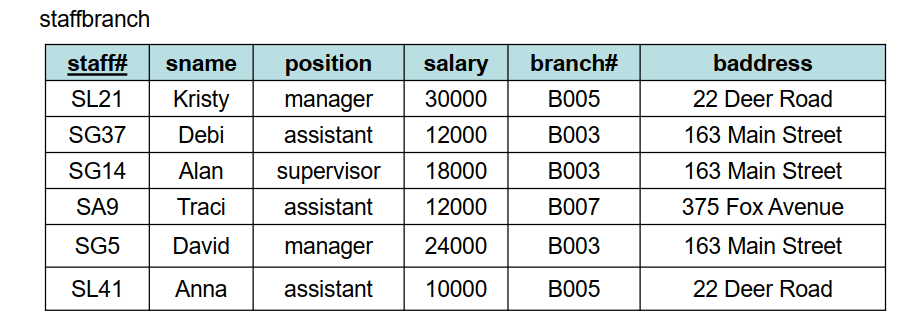

  - Quan hệ staffbranch có **dư thừa dữ liệu**. Thông tin chi tiết của một chi nhánh ngân hàng (branch) sẽ bị lặp lại cho mỗi nhân viên (staff) làm việc tại chi nhánh đó.
  - Nếu tách riêng quan hệ staff và branch thì thông tin về từng chi nhánh ngân hàng chỉ xuất hiện duy nhất một lần.
  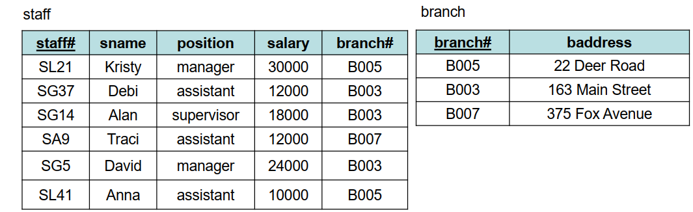

#### C. Các dạng chuẩn

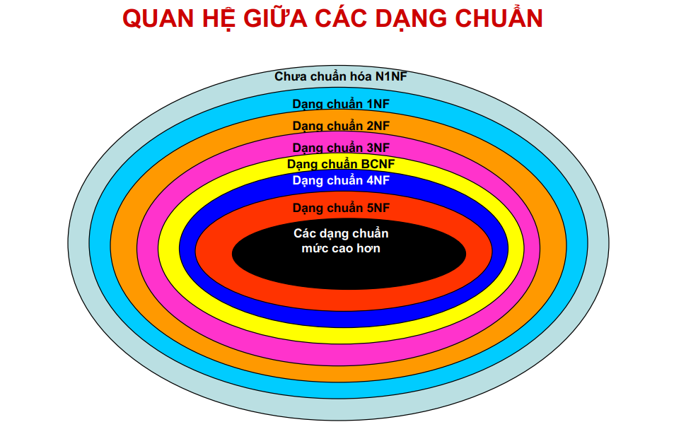

- Giải thích các dạng chuẩn thông qua tiến trình phân rã một bảng hóa đơn bán Tour chưa chuẩn hóa:
- **Cấu trúc ban đầu**: Mã HĐ, Tên Khách, SĐT, [Danh sách Mã Tour - Tên Tour - Số lượng - Đơn giá]

##### 1. Dạng chưa chuẩn hóa (Non-first Nomal Form - N1NF)

- **Các quan hệ chưa ở dạng chuẩn 1** chứa một hoặc một số thuộc tính không nguyên tố, các thuộc tính lặp, và các thuộc tính dẫn xuất.
- **Thuộc tính chứa giá trị nguyên tố**: là những thuộc tính chứa giá trị đơn và không thể phân rã được nữa.

##### 2. Dạng chuẩn 1 (First Nomal Form - 1NF)

- **Một quan hệ ở dạng chuẩn 1**:

  - Mọi giá trị thuộc tính của quan hệ đều ở dạng nguyên tố.
  - Không có thuộc tính đa trị.
  - Không có thuộc tính dẫn xuất.

- **Áp dụng**: Phân rã danh sách các `Tour` lồng ghép trong một cột thành các dòng bản ghi độc lập.

##### 3. Dạng chuẩn 2 (Second Nomal Form - 2NF)

- Một quan hệ đạt 2NF khi nó đạt 1NF và mọi thuộc tính không khóa đều phụ thuộc hàm đầy đủ (*Full Functional Dependency*) vào khóa chính.
- Tuyệt đối không tồn tại phụ thuộc hàm bộ phận.
- **Áp dụng**: Khóa chính hiện tại cấu thành từ (`Mã HĐ`, `Mã Tour`). Tuy nhiên, thuộc tính `Tên Khách` và `SĐT` chỉ phụ thuộc vào `Mã HĐ`. Hệ thống tiến hành tách thành hai quan hệ riêng biệt: `HoaDon` và `ChiTietHoaDon`.

#### 4. Dạng chuẩn 3 (Third Nomal Form - 3NF)

- Một quan hệ đạt 3NF khi nó đạt 2NF và không tồn tại bất kỳ phụ thuộc hàm bắc cầu (Transitive Dependency) nào từ thuộc tính không khóa lên khóa chính.

- **Áp dụng**: Trong quan hệ `HoaDon`, thuộc tính `SĐT` phụ thuộc vào `Tên Khách` (hoặc `Mã KH` ẩn), rồi mới phụ thuộc vào `Mã HĐ`. Hệ thống tiếp tục phân rã, trích xuất dữ liệu khách hàng sang quan hệ độc lập `KhachHang`, trích xuất dữ liệu tour sang quan hệ `Tour`.

#### D. Phân biệt: Tiêu chí cốt lõi của các Dạng chuẩn

| Dạng chuẩn | Tiêu chí vi phạm cần triệt tiêu                | Hành động kỹ thuật                                                                        |
| ---------- | ---------------------------------------------- | ----------------------------------------------------------------------------------------- |
| 1NF        | Thuộc tính đa trị, giá trị không nguyên tố.    | Tách các danh sách/mảng dữ liệu thành các bộ (tuple) độc lập                              |
| 2NF        | Phụ thuộc hàm bộ phận (Partial Dependency).    | Phân rã các thuộc tính chỉ phụ thuộc vào một phần của khóa chính gộp sang một quan hệ mới |
| 3NF        | Phụ thuộc hàm bắc cầu (Transitive Dependency). | Phân rã các thuộc tính phụ thuộc vào một thuộc tính không khóa khác sang một quan hệ mới  |

## Phần 2: Bài tập

### I.  Cài đặt MySQL và MySQL Workbench

### II. Xây dựng hệ thống Quản lý đặt tour

#### Bước 1: Phân tích thực thể từ yêu cầu

Chúng ta có thể rút ra các thực thể (bảng) sau:

- `Tour`: Lưu thông tin gốc của tour. Dữ liệu đề bài yêu cầu: Mã, tên, nơi xuất phát, nơi đến, mô tả.

- **Lịch Trình Tour** (`LichTrinh`): Nếu chỉ dùng 1 bảng Tour, ta sẽ không thể lưu nhiều ngày xuất phát cho cùng 1 tour. Do đó, ta cần tách riêng một bảng lịch trình.

- **Khách Hàng** (`KhachHang`): Lưu thông tin người đặt. Gồm: Mã, tên, số ID, loại thẻ ID, số ĐT, email, địa chỉ.

- **Hóa Đơn / Vé** (`HoaDon`): Lưu giao dịch mua của khách. Gồm: ID hóa đơn, liên kết đến Khách hàng, liên kết đến Lịch trình, số lượng khách, đơn giá tại thời điểm mua, tổng tiền, trạng thái (để xử lý việc hủy/trả vé).

#### Bước 2: Script SQL cập nhật

##### 1. Khởi tạo Database

```SQL
CREATE DATABASE IF NOT EXISTS QuanLyDatTour;
USE QuanLyDatTour;
```

- `CREATE DATABASE IF NOT EXISTS`: Lệnh tạo một cơ sở dữ liệu mới. Thêm `IF NOT EXISTS` để hệ thống tự kiểm tra, nếu có DB tên này rồi thì bỏ qua không tạo lại nữa (tránh báo lỗi).

- `USE QuanLyDatTour;`: Lệnh yêu cầu hệ thống "Hãy mở và trỏ chuột vào database này đi". Mọi bảng tạo ra sau dòng lệnh này sẽ được đưa hết vào thư mục QuanLyDatTour.

##### 2. Tạo bảng Khách Hàng (Định nghĩa đối tượng Khách hàng)

```SQL
CREATE TABLE KhachHang (
    MaKH INT AUTO_INCREMENT PRIMARY KEY,
    TenKH VARCHAR(100) NOT NULL,
    SoID VARCHAR(50) NOT NULL,
    LoaiTheID VARCHAR(50) NOT NULL, 
    SoDT VARCHAR(15) NOT NULL,
    Email VARCHAR(100),
    DiaChi VARCHAR(255)
);
```

- `CREATE TABLE`: Tạo một bảng. Bảng này gồm các cột tương ứng với các thuộc tính.

- `INT`: Kiểu số nguyên.

- `AUTO_INCREMENT`: Hệ thống sẽ tự động tăng giá trị này lên (giống như i++). Khi có khách hàng mới, bạn không cần nhập mã, hệ thống tự cấp mã 1, 2, 3...

- `PRIMARY KEY`: Khóa chính. Đây là "căn cước" của dòng dữ liệu đó, đảm bảo không có 2 dòng nào trùng mã nhau.

- `VARCHAR(100)`: Chuỗi ký tự độ dài tối đa 100.

- `NOT NULL`: Bắt buộc phải có dữ liệu, không được phép rỗng. Bạn để ý `Email` và `DiaChi` không có chữ này, nghĩa là cho phép khách hàng không nhập.

##### 3. Tạo bảng Tour

```SQL
CREATE TABLE Tour (
    MaTour INT AUTO_INCREMENT PRIMARY KEY,
    TenTour VARCHAR(255) NOT NULL,
    NoiXuatPhat VARCHAR(100) NOT NULL,
    NoiDen VARCHAR(100) NOT NULL,
    MoTa TEXT
);
```

- `TEXT`: Cũng là chuỗi ký tự nhưng dùng cho các văn bản rất dài (như bài viết review, mô tả tour vài nghìn chữ). Nếu dùng `VARCHAR` có thể sẽ bị giới hạn độ dài.

##### 4. Tạo bảng Lịch Trình (Nơi quy định ngày đi và giá)

```SQL
CREATE TABLE LichTrinh (
    MaLichTrinh INT AUTO_INCREMENT PRIMARY KEY,
    MaTour INT NOT NULL,
    NgayXuatPhat DATETIME NOT NULL,
    GiaCoBan DECIMAL(12,2) NOT NULL, 
    SoChoToiDa INT NOT NULL,
    SoChoDaDat INT DEFAULT 0, 
    FOREIGN KEY (MaTour) REFERENCES Tour(MaTour) ON DELETE CASCADE
);
```

- `DATETIME`: Kiểu dữ liệu lưu trữ cả Ngày tháng năm và Giờ phút giây (VD: 2026-12-01 08:00:00).

- `DECIMAL(12,2)`: Kiểu số thập phân với độ chính xác cao. Tham số (12,2) nghĩa là số này có tổng cộng 12 chữ số, trong đó có 2 chữ số ở phần thập phân sau dấu phẩy. Dùng kiểu này để lưu Tiền tệ thì sẽ không bị sai số làm tròn (lỗi hay gặp nếu dùng float hay double).

- `DEFAULT 0`: Nếu lúc chèn dữ liệu bạn không nhập gì vào cột này, hệ thống sẽ tự động điền số 0 (nghĩa là tour mới tạo, chưa ai đặt chỗ).

- `FOREIGN KEY ... REFERENCES ...`: Khóa ngoại. Đây là sợi dây liên kết `MaTour` của bảng này với bảng `Tour` gốc.

- `ON DELETE CASCADE`: Hiệu ứng "xóa dây chuyền". Nếu một `Tour` bị xóa hoàn toàn khỏi hệ thống, toàn bộ các Lịch trình thuộc về tour đó cũng sẽ tự động bị xóa theo để tránh sinh ra dữ liệu rác.

##### 5. Tạo bảng Hóa Đơn (Nơi lưu trữ giao dịch)

```SQL
CREATE TABLE HoaDon (
    MaHoaDon INT AUTO_INCREMENT PRIMARY KEY,
    MaKH INT NOT NULL, 
    MaLichTrinh INT NOT NULL, 
    SoLuongKhach INT NOT NULL,
    GiaVe DECIMAL(12,2) NOT NULL, 
    TongTien DECIMAL(12,2) NOT NULL,
    NgayLapHoaDon DATETIME DEFAULT CURRENT_TIMESTAMP,
    TrangThai ENUM('Thành công', 'Đã hủy') DEFAULT 'Thành công',
    TienPhatHuy DECIMAL(12,2) DEFAULT 0, 
    FOREIGN KEY (MaKH) REFERENCES KhachHang(MaKH),
    FOREIGN KEY (MaLichTrinh) REFERENCES LichTrinh(MaLichTrinh)
);
```

- Bảng này liên kết với 2 bảng khác (Khách hàng và Lịch trình) thông qua 2 `FOREIGN KEY`.

- `DEFAULT CURRENT_TIMESTAMP`: Khi một hóa đơn được tạo, hệ thống tự động lấy thời gian thực (real-time) của máy chủ ngay lúc đó để điền vào cột ngày lập hóa đơn.

- `ENUM('Thành công', 'Đã hủy')`: Kiểu dữ liệu danh sách chọn. Cột này chỉ được phép lưu 1 trong 2 chuỗi ký tự đã định nghĩa sẵn trong ngoặc. Nó giúp ép kiểu dữ liệu chặt chẽ, tránh việc có người gõ nhầm thành "Đang xử lý" hay gõ sai chính tả. Mặc định (`DEFAULT`) ban đầu khi mua vé sẽ là 'Thành công'.