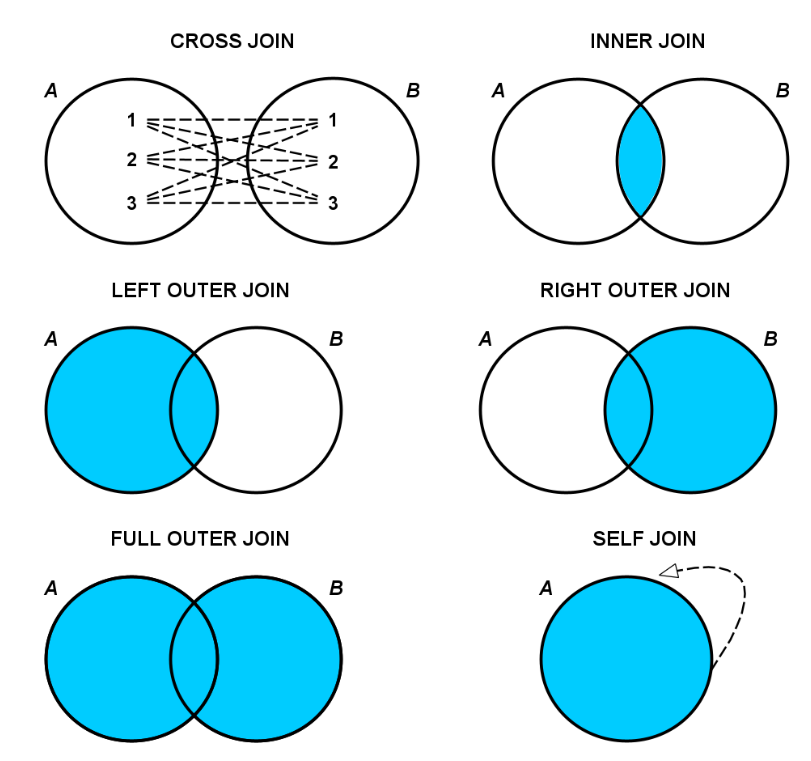
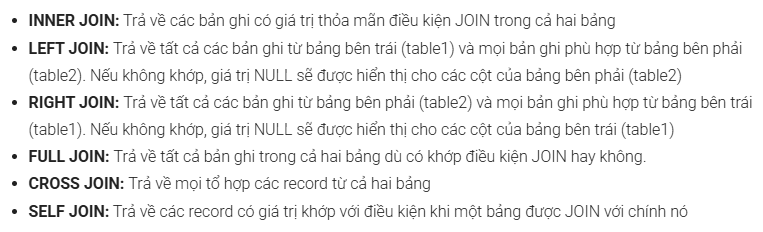
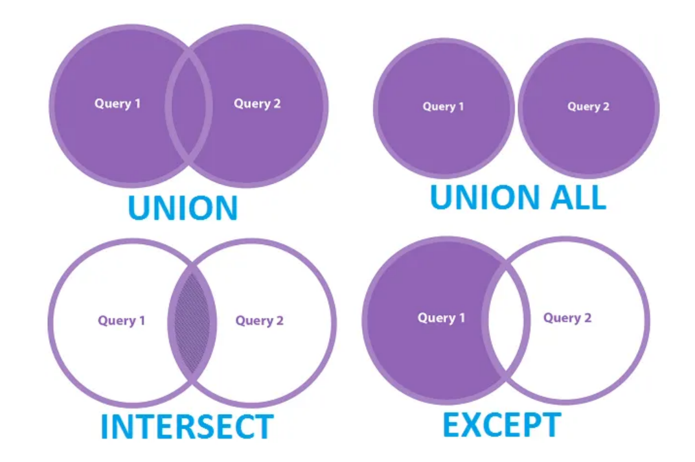
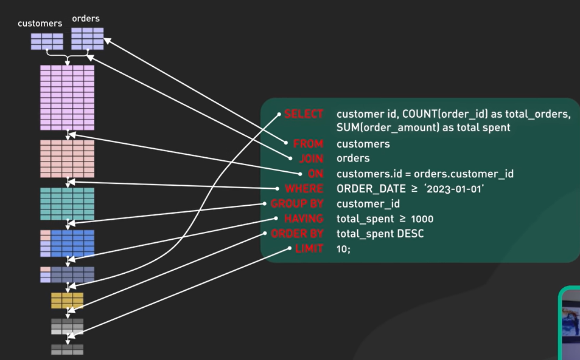

# Nguyễn Quốc Khánh
*Tài liệu chuẩn bị buổi 2*

---

# [BUỔI 3] SQL cơ bản

**Menu**

- [Nguyễn Quốc Khánh](#nguyễn-quốc-khánh)
- [\[BUỔI 3\] SQL cơ bản](#buổi-3-sql-cơ-bản)
  - [Phần 1: Các thao tác cơ bản và Lọc dữ liệu](#phần-1-các-thao-tác-cơ-bản-và-lọc-dữ-liệu)
    - [1. Cú pháp CRUD cơ bản](#1-cú-pháp-crud-cơ-bản)
      - [A. Thêm dữ liệu (`INSERT` - Create)](#a-thêm-dữ-liệu-insert---create)
      - [B. Đọc dữ liệu (`SELECT` - Read)](#b-đọc-dữ-liệu-select---read)
      - [C. Lọc dữ liệu trùng lặp (`DISTINCT`)](#c-lọc-dữ-liệu-trùng-lặp-distinct)
      - [D. Cập nhật dữ liệu (`UPDATE` - Update)](#d-cập-nhật-dữ-liệu-update---update)
      - [E. Xóa dữ liệu (`DELETE` - Delete)](#e-xóa-dữ-liệu-delete---delete)
      - [F. Tổng hợp](#f-tổng-hợp)
    - [2. Lọc dữ liệu với WHERE](#2-lọc-dữ-liệu-với-where)
  - [Phần 2: Tổng hợp, Nhóm dữ liệu và Lọc sau nhóm](#phần-2-tổng-hợp-nhóm-dữ-liệu-và-lọc-sau-nhóm)
    - [1. Các hàm tổng hợp (Aggregate Functions)](#1-các-hàm-tổng-hợp-aggregate-functions)
    - [2. Nhóm dữ liệu với GROUP BY và HAVING](#2-nhóm-dữ-liệu-với-group-by-và-having)
  - [Phần 3: Kết hợp bảng, kết quả và Truy vấn con](#phần-3-kết-hợp-bảng-kết-quả-và-truy-vấn-con)
    - [1. Kết hợp bảng (JOIN)](#1-kết-hợp-bảng-join)
    - [2. Kết hợp kết quả (UNION)](#2-kết-hợp-kết-quả-union)
    - [3. Truy vấn con (Subquery)](#3-truy-vấn-con-subquery)
  - [Phần 4: Thứ tự thực thi logic của truy vấn SQL](#phần-4-thứ-tự-thực-thi-logic-của-truy-vấn-sql)
  - [Phần 5: Bài tập Leetcode](#phần-5-bài-tập-leetcode)


---

## Phần 1: Các thao tác cơ bản và Lọc dữ liệu

Mọi hệ thống phần mềm đều vận hành dựa trên bốn thao tác dữ liệu cốt lõi, được gọi tắt là CRUD: **Create** (Tạo mới), **Read** (Đọc/Truy xuất), **Update** (Cập nhật), và **Delete** (Xóa bỏ). Trong SQL, bốn thao tác này tương ứng với các câu lệnh `INSERT`, `SELECT`, `UPDATE`, và `DELETE`.

### 1. Cú pháp CRUD cơ bản

Quá trình thao tác với cơ sở dữ liệu đòi hỏi sự chính xác tuyệt đối về mặt cú pháp và hiểu biết rõ ràng về luồng thực thi của từng câu lệnh.

#### A. Thêm dữ liệu (`INSERT` - Create)

Câu lệnh `INSERT` được sử dụng để thêm một hoặc nhiều bản ghi mới vào một bảng đã tồn tại trong cơ sở dữ liệu.

``` SQL
INSERT INTO KhachHang (MaKH, TenKH, SoDienThoai)
VALUES ('KH001', 'Nguyen Van A', '0901234567');
```

* Luồng thực thi và ý nghĩa logic:

  - Từ khóa `INSERT INTO` chỉ định rõ ràng đích đến của hành động thêm dữ liệu. Trong trường hợp này, dữ liệu sẽ được ghi vào bảng `KhachHang`.
  - Cặp ngoặc đơn đầu tiên `(MaKH, TenKH, SoDienThoai)` khai báo danh sách các cột sẽ nhận dữ liệu. Việc liệt kê rõ ràng tên cột giúp hệ thống hiểu chính xác dữ liệu nào thuộc về trường thông tin nào, đồng thời cho phép bỏ qua các cột có khả năng tự động tăng (như ID tự tăng) hoặc có giá trị mặc định (Default).
  - Từ khóa `VALUES` đi kèm với cặp ngoặc đơn thứ hai chứa các giá trị thực tế. Các giá trị này phải tuân thủ nghiêm ngặt theo thứ tự của các cột đã khai báo phía trước. Chẳng hạn, `'KH001'` tương ứng với `MaKH`. Các giá trị mang kiểu chuỗi ký tự (String/VARCHAR) hoặc thời gian (Date/Time) bắt buộc phải được bao bọc trong dấu nháy đơn.

#### B. Đọc dữ liệu (`SELECT` - Read)

Đây là lệnh được sử dụng với tần suất cao nhất. Hệ thống không thay đổi bất kỳ trạng thái nào của dữ liệu khi chạy lệnh `SELECT`.
Nó chỉ thực hiện việc trích xuất và hiển thị dữ liệu theo yêu cầu.

```SQL
SELECT TenTour, GiaTour AS Gia
FROM Tour;
```

* Luồng thực thi và ý nghĩa logic:
  - Cú pháp `SELECT` quyết định việc trích xuất các thuộc tính cụ thể nào. Việc chỉ định rõ ràng `TenTour` và `GiaTour` giúp tiết kiệm tài nguyên bộ nhớ và băng thông mạng so với việc sử dụng ký tự `*` (lấy toàn bộ cột).
  - Mệnh đề `FROM Tour` chỉ định tập hợp dữ liệu gốc (bảng `Tour`) mà hệ thống cần quét qua.
  - Từ khóa `AS` được sử dụng để thiết lập bí danh (Alias). Bằng cách gán `GiaTour AS Gia`, bảng kết quả trả về sẽ hiển thị tiêu đề cột là `Gia`. Kỹ thuật này đặc biệt hữu ích khi cần tính toán các cột mới hoặc khi tên cột gốc quá dài và phức tạp, giúp định dạng dữ liệu đầu ra thân thiện hơn với người dùng hoặc tầng ứng dụng.

#### C. Lọc dữ liệu trùng lặp (`DISTINCT`)

Trong quá trình thu thập thông tin, dữ liệu thường có sự trùng lặp (ví dụ: nhiều tour cùng đi đến một địa điểm).

```SQL
SELECT DISTINCT DiemDen
FROM Tour;
```

* Luồng thực thi và ý nghĩa logic:
  - Từ khóa `DISTINCT` được đặt ngay sát sau `SELECT`. Khi hệ thống thu thập xong kết quả từ bảng `Tour`, nó sẽ thực hiện một thuật toán loại bỏ bản sao (thường thông qua việc băm - hashing hoặc sắp xếp - sorting nội bộ) để giữ lại các giá trị duy nhất. Kết quả thu được sẽ là một danh sách các điểm đến không có bất kỳ phần tử nào lặp lại.

#### D. Cập nhật dữ liệu (`UPDATE` - Update)

Câu lệnh `UPDATE` cho phép thay đổi các giá trị đã tồn tại trong các bản ghi. Đây là một câu lệnh nguy hiểm nếu không được sử dụng kèm với điều kiện ranh giới.

```SQL
UPDATE Tour
SET GiaTour = 6000000
WHERE MaTour = 'T001';
```

* Luồng thực thi và ý nghĩa logic:
  - Lệnh `UPDATE Tour` yêu cầu hệ thống mở một phiên giao dịch (transaction) trên bảng `Tour` để chuẩn bị ghi đè dữ liệu.
  - Lệnh `SET GiaTour = 6000000 `định nghĩa giá trị mới sẽ được gán. Có thể cập nhật nhiều cột cùng lúc bằng cách phân tách chúng bằng dấu phẩy.
  - Khối `WHERE MaTour = 'T001'` đóng vai trò là hàng rào bảo vệ. Hệ thống sẽ rà soát và chỉ áp dụng lệnh `SET` lên những bản ghi khớp với điều kiện này. Việc bỏ sót mệnh đề `WHERE` sẽ dẫn đến việc: toàn bộ giá tour trong hệ thống sẽ bị ghi đè thành 6.000.000 VNĐ.

#### E. Xóa dữ liệu (`DELETE` - Delete)

Lệnh `DELETE` loại bỏ hoàn toàn một hoặc nhiều bản ghi vật lý khỏi bảng.

```SQL
DELETE FROM KhachHang
WHERE MaKH = 'KH002';
```

* Luồng thực thi và ý nghĩa logic:
  - `DELETE FROM KhachHang` báo hiệu hành động phá hủy dữ liệu trên bảng `KhachHang`.
  - Mệnh đề `WHERE` xác định mục tiêu cần xóa (khách hàng có mã KH002). Tương tự `UPDATE`, sự vắng mặt của `WHERE` sẽ làm hệ thống dọn sạch toàn bộ dữ liệu trong bảng.


#### F. Tổng hợp

| Lệnh SQL | Thao tác | Mô tả ngắn gọn            | Mức độ rủi ro đối với toàn bảng     |
| -------- | -------- | ------------------------- | ----------------------------------- |
| `SELECT` | Read     | Đọc và trích xuất dữ liệu | Thấp (Chỉ đọc)                      |
| `INSERT` | Create   | Thêm dòng dữ liệu mới     | Thấp (Chỉ thêm)                     |
| `UPDATE` | Update   | Cập nhật giá trị đã có    | Rất cao (Có thể ghi đè toàn bảng)   |
| `DELETE` | Delete   | Xóa dòng dữ liệu vật lý   | Rất cao (Có thể xóa sạch toàn bảng) |

### 2. Lọc dữ liệu với WHERE

Nếu cơ sở dữ liệu là một nhà kho khổng lồ, thì `WHERE` đóng vai trò là người gác cổng, thực hiện việc rà soát và đánh giá từng bản ghi theo các quy tắc logic toán học.
Chỉ những bản ghi nào trả về kết quả `TRUE` (Đúng) khi đi qua biểu thức điều kiện mới được phép đi tiếp vào bộ kết quả. Ngược lại, các bản ghi trả về `FALSE` hoặc `UNKNOWN` (do chứa giá trị `NULL`) sẽ bị loại bỏ.

* Cú pháp kết hợp với các toán tử:

  - SQL cung cấp một kho toán tử phong phú để xây dựng các điều kiện phức tạp trong mệnh đề `WHERE`.

    | Loại toán tử | Cú pháp                   | Ý nghĩa và Cách hoạt động                                                                                           |
    | ------------ | ------------------------- | ------------------------------------------------------------------------------------------------------------------- |
    | So sánh      | `=`, `>`, `<`, `>=`, `<=` | So sánh giá trị tuyệt đối. Có thể dùng cho số, ngày tháng, và thậm chí là chuỗi.                                    |
    | Khác nhau    | `<>` hoặc `!=`            | Lọc ra các bản ghi có giá trị không bằng với giá trị chỉ định.                                                      |
    | Khoảng       | `BETWEEN ... AND ...`     | Lọc các giá trị nằm trong một khoảng biên cụ thể (bao gồm cả 2 điểm biên).                                          |
    | Tập hợp      | `IN (v1, v2, ...)`        | Kiểm tra xem giá trị có khớp với bất kỳ phần tử nào trong một danh sách cho trước hay không.                        |
    | Tìm hiểu mẫu | `LIKE`                    | Dùng để tìm kiếm chuỗi. Sử dụng kèm ký tự đại diện `%` (đại diện cho chuỗi bất kỳ) hoặc _ (đại diện cho một ký tự). |
    | Logic Và     | `AND`                     | Biểu thức tổng chỉ trả về `TRUE` khi tất cả các điều kiện con đều `TRUE`                                            |
    | Logic Hoặc   | `OR`                      | Biểu thức tổng trả về `TRUE` khi ít nhất một điều kiện con là `TRUE`.                                               |


```SQL
SELECT TenTour, GiaTour, DiemDen
FROM Tour
WHERE (GiaTour >= 2000000 AND GiaTour <= 5000000)
  AND DiemDen IN ('Da Lat', 'Nha Trang')
  AND TenTour LIKE '%Hè%';

```

* Luồng thực thi và ý nghĩa logic:
  - Hệ thống sẽ đánh giá từng chuyến đi trong bảng `Tour` dựa trên 3 trụ cột điều kiện được kết nối bởi toán tử `AND`. Bản ghi phải vượt qua cả 3 vòng kiểm duyệt.
  - **Vòng 1**: `(GiaTour >= 2000000 AND GiaTour <= 5000000)` đảm bảo giá trị nằm trong khoảng ngân sách cho phép. (Cũng có thể được viết gọn là `GiaTour BETWEEN 2000000 AND 5000000`).
  - **Vòng 2**: `DiemDen IN ('Da Lat', 'Nha Trang')` là cách tối ưu hóa cú pháp. Thay vì viết chuỗi `DiemDen = 'Da Lat' OR DiemDen = 'Nha Trang'`, toán tử `IN` kiểm tra xem giá trị hiện tại có nằm trong tập hợp danh sách hay không.
  - **Vòng 3**: `TenTour LIKE '%Hè%'`. Ký tự đại diện `%` mang ý nghĩa là "một chuỗi ký tự bất kỳ, độ dài bất kỳ, bao gồm cả rỗng". Biểu thức này yêu cầu tên tour phải chứa từ "Hè" ở bất kỳ vị trí nào (đầu, giữa, hoặc cuối chuỗi).

## Phần 2: Tổng hợp, Nhóm dữ liệu và Lọc sau nhóm

Dữ liệu thô ở định dạng từng dòng riêng lẻ cung cấp cái nhìn vi mô, nhưng các hệ thống quản trị và báo cáo lại đòi hỏi những cái nhìn vĩ mô. Quá trình tổng hợp dữ liệu là chìa khóa để chuyển hóa các bản ghi thành những thông số mang tính chiến lược.

### 1. Các hàm tổng hợp (Aggregate Functions)

Hàm tổng hợp hoạt động như những cỗ máy ép dữ liệu: chúng tiếp nhận một cột chứa hàng loạt giá trị từ nhiều dòng khác nhau, thực hiện thuật toán toán học bên trong, và trả ra chính xác một giá trị đơn nhất.

- `COUNT(cột)`: Đếm số lượng các giá trị không chứa `NULL` trong cột được chỉ định. Nếu sử dụng `COUNT(*)`, hệ thống sẽ đếm tổng số dòng vật lý của bảng bất kể có chứa `NULL` hay không.
- `SUM(cột)`: Thực hiện phép cộng dồn tất cả các giá trị số học trong một cột.
- `AVG(cột)`: Tính giá trị trung bình cộng (Tổng chia cho Số lượng phần tử khác `NULL`).

```SQL
SELECT COUNT(MaKH), SUM(TongTien), AVG(TongTien)
FROM HoaDon;
```

* Luồng thực thi và ý nghĩa logic:

  - Lệnh `COUNT(MaKH)` rà soát cột mã khách hàng và trả về tổng số lượng hóa đơn đã được lập.
  - Lệnh `SUM(TongTien)` lấy toàn bộ giá trị của cột tổng tiền, cộng dồn lại để xuất ra một con số duy nhất là tổng doanh thu của toàn hệ thống.
  - Lệnh `AVG(TongTien)` chia tổng doanh thu cho số lượng hóa đơn để cho ra giá trị trung bình của mỗi đơn hàng. Kết quả đầu ra của truy vấn này sẽ chỉ là một dòng duy nhất chứa ba thông số thống kê.

### 2. Nhóm dữ liệu với GROUP BY và HAVING

Sức mạnh thực sự của thống kê không nằm ở việc tính tổng toàn bộ hệ thống, mà nằm ở việc phân rã dữ liệu thành các tiểu vùng để so sánh. Đây là vai trò của mệnh đề `GROUP BY`.

* Tại sao phải dùng `GROUP BY`?
    - Khi một truy vấn chứa hàm tổng hợp, hệ thống mặc định coi toàn bộ bảng là một nhóm khổng lồ duy nhất. 
    - Tuy nhiên, nếu người dùng muốn tính toán tổng doanh thu của từng điểm đến, hệ thống cần một chỉ thị để "chia nhỏ" dữ liệu trước khi thực hiện tính tổng. 
    - Lệnh `GROUP BY` ra lệnh cho cơ sở dữ liệu sắp xếp các dòng có cùng đặc điểm vào chung một nhóm, sau đó hàm tổng hợp sẽ được kích hoạt riêng rẽ trên từng nhóm đó.

```SQL
SELECT DiemDen, SUM(TongTien) AS DoanhThu
FROM Tour
GROUP BY DiemDen
HAVING SUM(TongTien) > 50000000;
```

* Luồng thực thi và ý nghĩa logic:

  - Khối `GROUP BY DiemDen`: Hệ thống sẽ lướt qua toàn bộ bảng `Tour`, tìm những chuyến đi có chung thuộc tính ở cột `DiemDen` (ví dụ: các dòng có điểm đến là Đà Lạt sẽ được gom vào một chỗ, Phú Quốc vào một chỗ).
  - Sau khi chia nhóm thành công, hàm `SUM(TongTien)` bắt đầu tính tổng số tiền của các dòng bên trong từng chỗ. Kết quả là mỗi điểm đến sẽ có một con số doanh thu riêng.
  - Mệnh đề `HAVING`: Sau khi đã có danh sách doanh thu của từng nhóm, `HAVING` đóng vai trò là màng lọc thứ hai, chỉ giữ lại những nhóm có doanh thu lớn hơn 50 triệu và loại bỏ các nhóm kém hiệu quả.

* Phân biệt nhanh: Sự khác nhau cốt lõi giữa WHERE và HAVING

| Đặc điểm             | Mệnh đề `WHERE`                                                              | Mệnh đề `HAVING`                                                                    |
| -------------------- | ---------------------------------------------------------------------------- | ----------------------------------------------------------------------------------- |
| Thời điểm hoạt động  | Lọc TRƯỚC khi nhóm. Hoạt động ngay sau khi lấy dữ liệu từ bảng.              | Lọc SAU khi nhóm. Hoạt động sau khi `GROUP BY` và hàm tổng hợp đã tính toán xong.   |
| Đối tượng tác động   | Tác động lên từng dòng dữ liệu thô (Row) riêng biệt.                         | Tác động lên các nhóm dữ liệu (Group).                                              |
| Khả năng kết hợp hàm | Bắt buộc KHÔNG ĐƯỢC sử dụng kèm với các hàm tổng hợp như `SUM()`, `COUNT()`. | Thường xuyên đi kèm với các hàm tổng hợp. Dùng để giới hạn kết quả của các hàm này. |

* **Ví dụ thực tiễn**: Nếu muốn loại bỏ các tour bị hủy ra khỏi báo cáo, hệ thống cần dùng `WHERE TrangThai != 'Huy'`. Lệnh này loại các dòng thô trước. Còn nếu muốn tìm nhóm các điểm đến mang về hơn 50 triệu, hệ thống phải dùng `HAVING SUM(TongTien) > 50000000`. Cố gắng ép `SUM()` vào mệnh đề `WHERE` sẽ khiến cơ sở dữ liệu báo lỗi cú pháp ngay lập tức.

## Phần 3: Kết hợp bảng, kết quả và Truy vấn con

Theo quy tắc chuẩn hóa dữ liệu, để tránh dư thừa và đảm bảo tính toàn vẹn, dữ liệu trong RDBMS(Hệ quản trị CSDL) được tách ra lưu trữ ở nhiều bảng riêng biệt (Bảng Khách Hàng, Bảng Hóa Đơn, Bảng Tour). 
Để trích xuất thông tin có ý nghĩa, hệ thống cần những cơ chế để nối các phần này lại với nhau.

### 1. Kết hợp bảng (JOIN)

- `JOIN` là phép toán cốt lõi của đại số quan hệ. 
- Khái niệm này cho phép kết hợp các cột từ hai hay nhiều bảng thành một bảng ngang mở rộng, dựa trên mối liên hệ logic (thường là sự trùng khớp giữa Khóa chính - Primary Key và Khóa ngoại - Foreign Key).

* Sự khác biệt giữa các cơ chế `JOIN` phổ biến:
  - `INNER JOIN`: Là phép giao của tập hợp. Nó chỉ trích xuất những bản ghi thỏa mãn điều kiện khớp ở cả hai bảng. Bất kỳ dữ liệu nào ở bảng này mà không tìm thấy đối tác ở bảng kia đều bị loại bỏ không thương tiếc.
  - `LEFT JOIN` (hoặc `LEFT OUTER JOIN`): Bảo toàn toàn bộ dữ liệu của bảng bên TRÁI (bảng gọi trước). Nếu bản ghi đó tìm được đối tác ở bảng bên phải, hệ thống sẽ điền dữ liệu tương ứng. Nếu không tìm được, các cột của bảng bên phải sẽ được điền giá trị `NULL`. Kỹ thuật này cực kỳ hữu ích để tìm ra các trường hợp ngoại lệ (*ví dụ: Tìm những khách hàng chưa từng mua bất kỳ tour nào*).
  - `RIGHT JOIN`: Logic tương tự như `LEFT JOIN`, nhưng bảo toàn toàn bộ dữ liệu của bảng bên PHẢI.

```SQL
SELECT KhachHang.TenKH, HoaDon.NgayDat
FROM KhachHang
INNER JOIN HoaDon ON KhachHang.MaKH = HoaDon.MaKH;
```

* Luồng thực thi và ý nghĩa logic:
  - Cú pháp `KhachHang INNER JOIN HoaDon` yêu cầu cơ sở dữ liệu tạo ra một phép lai giữa hai bảng.
  - Mệnh đề `ON KhachHang.MaKH = HoaDon.MaKH` chính là chìa khóa. Cơ sở dữ liệu sẽ quét từng dòng của bảng `KhachHang`, sau đó chạy sang bảng `HoaDon` tìm những dòng có `MaKH` trùng khớp để "nối" lại theo chiều ngang.
  - Cú pháp `TênBảng.TênCột (KhachHang.TenKH)` là bắt buộc khi hai bảng có những cột trùng tên nhau, giúp trình biên dịch phân biệt được cột nào thuộc về bảng nào.




### 2. Kết hợp kết quả (UNION)

- Nếu `JOIN` mở rộng dữ liệu theo chiều ngang, thì toán tử `UNION` kết hợp dữ liệu theo chiều dọc. Nó lấy tập kết quả của câu truy vấn thứ nhất và dán tập kết quả của câu truy vấn thứ hai xuống bên dưới.

```SQL
SELECT TenKH FROM KhachHang_HCM
UNION
SELECT TenKH FROM KhachHang_HN;
```

* Luồng thực thi và ý nghĩa logic:
  - Mệnh đề `SELECT` trên lấy danh sách khách hàng khu vực HCM. Mệnh đề `SELECT` dưới lấy khách hàng khu vực HN.
  - Toán tử `UNION` sẽ trộn hai danh sách này lại thành một báo cáo duy nhất. 
  - Quá trình này ngầm định thực hiện một thuật toán loại bỏ bản sao để đảm bảo không có cái tên nào xuất hiện hai lần. 
  - Nếu bài toán yêu cầu giữ nguyên mọi dữ liệu, kể cả trùng lặp, lập trình viên phải sử dụng toán tử `UNION ALL` nhằm tối ưu hóa hiệu suất (vì không cần tốn thời gian sắp xếp và cắt trùng).



* `UNION`: Hợp nhất kết quả, loại bỏ các kết quả trùng lặp
* `UNION ALL`: Hợp nhất mọi thứ, giữ lại các bản sao
* `INTERSECT`: Chỉ dữ liệu trùng lặp
* `MINUS` hoặc `EXCEPT`: Tìm điểm khác biệt
  


* **Phân biệt nhanh:** Khác biệt cốt lõi giữa `JOIN` và `UNION`

| Đặc điểm            | Phép toán `JOIN`                                                                | Phép toán `UNION`                                                                |
| ------------------- | ------------------------------------------------------------------------------- | -------------------------------------------------------------------------------- |
| Chiều tác động      | Ghép các cột lại với nhau (Nối theo chiều ngang).                               | Ghép các dòng lại với nhau (Chồng lên nhau theo chiều dọc)                       |
| Điều kiện thực hiện | Hai bảng phải có một thuộc tính chung làm cầu nối (thường thông qua khóa ngoại) | Số lượng cột được truy vấn ở trên và dưới phải bằng nhau và có cùng kiểu dữ liệu |
| Mục đích sử dụng    | Lắp ráp thông tin chi tiết từ các thực thể phân tán                             | Tổng hợp dữ liệu tương đồng từ nhiều nguồn hoặc điều kiện khác nhau              |

### 3. Truy vấn con (Subquery)

Truy vấn con là một câu lệnh truy vấn SQL bị nhốt bên trong một lớp vỏ truy vấn SQL khác. Kết quả đầu ra của truy vấn bên trong (con) sẽ được cung cấp làm điều kiện đầu vào cho truy vấn bên ngoài (cha).

Điều này phản ánh một quy trình giải quyết vấn đề tự nhiên: Để thực hiện bước A, hệ thống cần biết đáp án của bước B trước.

**Ví dụ thực tế**: Cần tìm ra tất cả các Tour du lịch có mức giá cao hơn mức giá trung bình của toàn bộ hệ thống. Câu hỏi đặt ra là mức giá trung bình hiện tại là bao nhiêu? Hệ thống không thể so sánh nếu không tính toán con số này trước.

```SQL
SELECT TenTour, GiaTour
FROM Tour
WHERE GiaTour > (SELECT AVG(GiaTour) FROM Tour);
```

* Luồng thực thi và ý nghĩa logic:

  - Bộ xử lý truy vấn sẽ ưu tiên giải quyết câu lệnh trong ngoặc đơn `(SELECT AVG(GiaTour) FROM Tour)`. Nó sẽ quét bảng, tính ra một con số vô hướng (Scalar value) – giả sử là 3.000.000 VNĐ.
  - Sau khi có kết quả, con số 3.000.000 sẽ được thay thế trực tiếp vào vị trí của ngoặc đơn. Cấu trúc câu truy vấn cha thực chất biến đổi thành: `WHERE GiaTour > 3000000.`
  - Cuối cùng, vòng lặp quét qua bảng `Tour` để lấy ra kết quả cuối cùng. Kỹ thuật này giúp các truy vấn trở nên linh hoạt và tự động thích ứng khi dữ liệu bên trong thay đổi theo thời gian.

## Phần 4: Thứ tự thực thi logic của truy vấn SQL

- Việc viết truy vấn từ trên xuống dưới theo thứ tự tiếng Anh (`SELECT ... FROM ... WHERE ...`) chỉ là cú pháp dành cho con người. 
- Ở tầng lõi của cơ sở dữ liệu, một câu truy vấn được bộ phân tích từ vựng và bộ tối ưu hóa tháo rời và thực thi theo một chu trình hoàn toàn khác.
- Việc không thấu hiểu dây chuyền lắp ráp này là nguyên nhân cốt lõi gây ra 90% lỗi cú pháp và lỗi logic cho người mới bắt đầu.
  
Dưới đây là danh sách chi tiết thứ tự thực thi chuẩn của máy chủ cơ sở dữ liệu:

1. `FROM`: Bước đầu tiên, hệ thống nạp dữ liệu từ ổ cứng vào bộ nhớ đệm (RAM). Nó cần biết kho chứa dữ liệu nằm ở đâu.
2. `JOIN`: Nếu có nhiều bảng, hệ thống sẽ thực hiện phép toán tích Đề-các (Cartesian product) kết hợp với các màng lọc `ON` để lai tạo thành một bảng tạm lớn.
3. `WHERE`: Kích hoạt màng lọc dòng. Nó loại bỏ vĩnh viễn các dòng thô không đáp ứng điều kiện toán học khỏi bảng tạm.
4. `GROUP BY`: Phân chia các dòng còn sống sót vào các xô (bucket/group) dựa trên thuộc tính quy định.
5. `HAVING`: Quét qua các xô vừa tạo, loại bỏ những xô không đạt chuẩn (lọc theo nhóm).
6. `SELECT`: Sau khi dữ liệu đã được nặn nắn thành hình, hệ thống mới bắt đầu nhặt các cột dữ liệu theo đúng yêu cầu. Ở bước này, các biểu thức toán học trên cột mới được tính toán, và các Bí danh (Alias / AS) mới chính thức được đặt tên.
7. `DISTINCT`: So sánh và quét các bản ghi kết quả để lọc bỏ sự trùng lặp.
8. `ORDER BY`: Sắp xếp bảng kết quả cuối cùng theo thứ tự từ điển hoặc giá trị (Tăng dần ASC, Giảm dần DESC).
9. `LIMIT/OFFSET` (hoặc `TOP`): Cắt xén phần đầu hoặc đuôi của bảng kết quả để phân trang hiển thị.


Sự quan trọng của việc nắm vững thứ tự thực thi:
   
   - Hiểu được chuỗi cơ chế này giải thích ngay lập tức vô số giới hạn và lỗi phổ biến. Một lỗi kinh điển là việc sử dụng Bí danh (Alias) được tạo ở lệnh `SELECT` để làm điều kiện lọc trong lệnh `WHERE`.
   - Ví dụ một câu lệnh gây lỗi: `SELECT (GiaTour - KhuyenMai) AS GiaCuoi FROM Tour WHERE GiaCuoi > 1000000;`
   - Khi chạy câu lệnh này, cơ sở dữ liệu sẽ ném ra thông báo lỗi dạng: "*Column 'GiaCuoi' does not exist*".
   - Dựa vào thứ tự thực thi, bước thứ 3 (`WHERE`) xảy ra trước bước thứ 6 (`SELECT`). Khi bộ máy đang ở bước 3, cố gắng lùng sục cái tên `GiaCuoi` để lọc dữ liệu, thì cái tên đó hoàn toàn chưa ra đời trên hệ thống. Bí danh `GiaCuoi` chỉ được gán nhãn mác ở bước thứ 6. 
   - Cách giải quyết đúng đắn nhất là viết lại biểu thức toán học thô trong `WHERE` (tức là `WHERE (GiaTour - KhuyenMai) > 1000000`).



## Phần 5: Bài tập Leetcode

Leetcode - 584

```SQL
select name
from Customer
where referee_id != 2 OR referee_id IS NULL;
```

Leetcode - 1378
``` SQL
select EmployeeUNI.unique_id, Employees.name
From Employees
left join EmployeeUNI ON Employees.id = EmployeeUNI.id;

```

Leetcode - 1141

```SQL
select activity_date AS day,
    count(distinct user_id) AS active_users
from Activity
where
    activity_date between date_sub('2019-07-27', interval 29 Day) and '2019-07-27' 
group by activity_date;

```