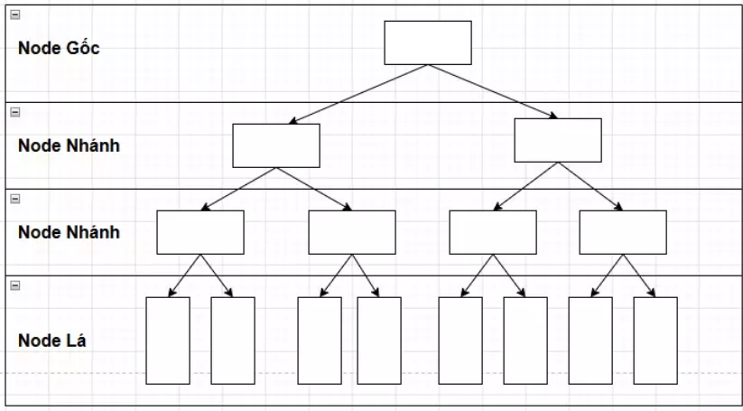
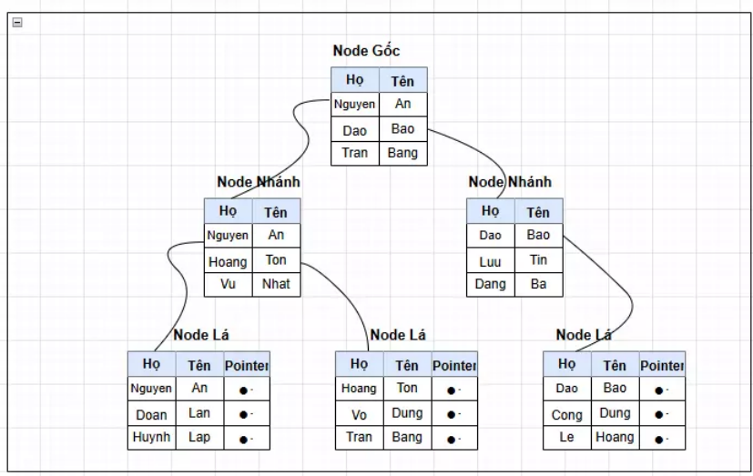
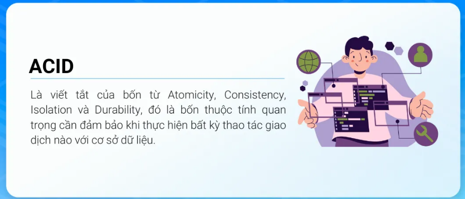
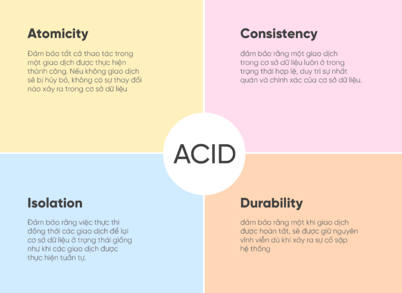

# Buổi 4: SQL Nâng Cao
*Tài liệu chuẩn bị buổi 4*

---

**Mục lục**
- [Buổi 4: SQL Nâng Cao](#buổi-4-sql-nâng-cao)
  - [Phần 1: Tối ưu truy vấn và Sử dụng Index](#phần-1-tối-ưu-truy-vấn-và-sử-dụng-index)
    - [1. Tối ưu truy vấn](#1-tối-ưu-truy-vấn)
    - [2. Sử dụng Index](#2-sử-dụng-index)
      - [A. Index là gì?](#a-index-là-gì)
      - [B. Khi nào NÊN dùng Index?](#b-khi-nào-nên-dùng-index)
      - [C. Khi nào KHÔNG nên dùng Index?](#c-khi-nào-không-nên-dùng-index)
      - [D. Lưu ý quan trọng nhất:](#d-lưu-ý-quan-trọng-nhất)
      - [E. Phân biệt nhanh: Clustered Index vs Non-Clustered Index](#e-phân-biệt-nhanh-clustered-index-vs-non-clustered-index)
  - [Phần 2: Quản lý Giao dịch (Transaction) \& ACID](#phần-2-quản-lý-giao-dịch-transaction--acid)
    - [1. Transaction là gì?](#1-transaction-là-gì)
    - [2. Tính chất ACID](#2-tính-chất-acid)
      - [A. Atomicity (Tính nguyên tử):](#a-atomicity-tính-nguyên-tử)
      - [C. Consistency (Tính nhất quán):](#c-consistency-tính-nhất-quán)
      - [I. Isolation (Tính cô lập):](#i-isolation-tính-cô-lập)
      - [D. Durability (Tính bền vững):](#d-durability-tính-bền-vững)
    - [3. Các vấn đề đọc dữ liệu đồng thời (Concurrency)](#3-các-vấn-đề-đọc-dữ-liệu-đồng-thời-concurrency)


---

## Phần 1: Tối ưu truy vấn và Sử dụng Index

### 1. Tối ưu truy vấn

Khi bảng dữ liệu chỉ có vài chục dòng, viết câu lệnh SQL kiểu gì cũng chạy nhanh như nhau.
Nhưng khi bảng có hàng triệu dòng (như bảng `HoaDon` sau vài năm vận hành), một câu lệnh viết chưa tốt có thể khiến hệ thống phải quét qua toàn bộ hàng triệu dòng đó chỉ để tìm ra vài kết quả. 
Đây chính là nguyên nhân phổ biến nhất khiến truy vấn bị chậm.

  **Một vài thói quen xấu thường gặp**:

  1. **Lạm dụng `SELECT *`**: lấy về toàn bộ cột của bảng dù thực tế chỉ cần dùng 2–3 cột, gây tốn băng thông truyền tải và bộ nhớ xử lý một cách không cần thiết.
  2. **Bọc hàm quanh cột trong `WHERE`**: ví dụ dùng `WHERE YEAR(NgayKhoiHanh) = 2026` thay vì so sánh trực tiếp khoảng ngày. Khi cột bị bọc trong một hàm như vậy, hệ thống buộc phải tính toán lại giá trị hàm đó cho **từng dòng một**, khiến nó không thể tận dụng **Index** để tìm nhanh.
  3. **Dùng `LIKE` với dấu `%` ở đầu chuỗi** (ví dụ `LIKE '%Lạt'`): khiến hệ thống không thể đoán trước điểm bắt đầu để tìm nhanh, buộc phải dò qua từng dòng.

**Ví dụ minh họa**: cùng một **mục đích tìm các tour khởi hành trong năm 2026**, nhưng viết theo 2 cách khác nhau:

**Input (bảng `Tour` ban đầu):**

| MaTour | TenTour       | NoiDen   | GiaTour   | NgayKhoiHanh |
| ------ | ------------- | -------- | --------- | ------------ |
| 1      | Đà Lạt 3N2Đ   | Đà Lạt   | 2.500.000 | 2026-03-10   |
| 2      | Phú Quốc 4N3Đ | Phú Quốc | 5.200.000 | 2026-04-15   |
| 3      | Sapa 2N1Đ     | Sapa     | 1.800.000 | 2026-03-20   |

**Câu query XẤU:**

```sql
SELECT *
FROM Tour
WHERE YEAR(NgayKhoiHanh) = 2026;
```

- `SELECT *`: lấy về **toàn bộ** các cột, kể cả những cột không cần dùng đến ở giao diện.
- `WHERE YEAR(NgayKhoiHanh) = 2026`: hàm `YEAR()` bọc quanh cột `NgayKhoiHanh`, buộc hệ thống phải tính `YEAR()` cho **từng dòng trong bảng** rồi mới so sánh được, nên dù cột này có được đánh Index thì Index cũng gần như vô dụng.

**Output (câu XẤU):**

| MaTour | TenTour       | NoiDen   | GiaTour   | NgayKhoiHanh |
| ------ | ------------- | -------- | --------- | ------------ |
| 1      | Đà Lạt 3N2Đ   | Đà Lạt   | 2.500.000 | 2026-03-10   |
| 2      | Phú Quốc 4N3Đ | Phú Quốc | 5.200.000 | 2026-04-15   |
| 3      | Sapa 2N1Đ     | Sapa     | 1.800.000 | 2026-03-20   |

**Câu query TỐT:**

```sql
SELECT TenTour, GiaTour
FROM Tour
WHERE NgayKhoiHanh >= '2026-01-01' AND NgayKhoiHanh < '2027-01-01';
```

- `SELECT TenTour, GiaTour`: chỉ lấy đúng 2 cột thực sự cần hiển thị.
- `WHERE NgayKhoiHanh >= '2026-01-01' AND NgayKhoiHanh < '2027-01-01'`: so sánh **trực tiếp** trên cột `NgayKhoiHanh`, không bọc thêm hàm nào, nên nếu cột này có **Index**, hệ thống có thể nhảy thẳng đến đúng khoảng dữ liệu cần tìm thay vì rà từng dòng.

**Output (câu TỐT):**

| TenTour       | GiaTour   |
| ------------- | --------- |
| Đà Lạt 3N2Đ   | 2.500.000 |
| Phú Quốc 4N3Đ | 5.200.000 |
| Sapa 2N1Đ     | 1.800.000 |

* **Chú ý**: **kết quả trả về giống hệt nhau về mặt dữ liệu** (đều là 3 tour năm 2026), nhưng câu tốt nhẹ hơn (ít cột thừa) và cho phép hệ thống tận dụng Index để chạy nhanh hơn rất nhiều khi dữ liệu lớn lên. Sự khác biệt nằm ở **cách hệ thống tính toán ra kết quả**, chứ không nằm ở kết quả hiển thị.

### 2. Sử dụng Index

#### A. Index là gì?

- Hãy tưởng tượng một cuốn sách giáo khoa dày 500 trang không có mục lục. Muốn tìm chương "Phương trình bậc 2" thì buộc phải lật từng trang một cho đến khi thấy.
- Nhưng nếu sách có **mục lục** (ghi rõ "Phương trình bậc 2 – trang 120"), ta chỉ cần tra mục lục là tìm đúng trang. 
- **Index trong CSDL hoạt động giống hệt mục lục sách**. Nó là một cấu trúc dữ liệu phụ, được xây riêng cho một (hoặc vài) cột, giúp hệ thống tìm ra vị trí dữ liệu cực nhanh thay vì phải quét toàn bộ bảng.




#### B. Khi nào NÊN dùng Index?

- Cột thường xuyên xuất hiện trong `WHERE`, `JOIN`, `ORDER BY`.
- Bảng có lượng dữ liệu lớn và được **đọc** (SELECT) nhiều hơn đáng kể so với **ghi**.

#### C. Khi nào KHÔNG nên dùng Index?

- Cột hiếm khi được dùng để tìm kiếm hay lọc dữ liệu.
- Bảng có ít dữ liệu (quét toàn bảng vẫn đủ nhanh, tạo Index chỉ tổ tốn thêm dung lượng lưu trữ).
- Cột có độ phân biệt thấp (ví dụ cột `GioiTinh` chỉ có 2 giá trị Nam/Nữ. Tra mục lục cho trường hợp này gần như không giúp ích gì).

#### D. Lưu ý quan trọng nhất:

- Index giúp lệnh `SELECT` chạy nhanh hơn, nhưng lại làm **chậm đi** các lệnh `INSERT`, `UPDATE`, `DELETE`.
- Lý do là mỗi khi dữ liệu trong bảng thay đổi, hệ thống phải **cập nhật lại** luôn cả mục lục (Index) đi kèm để nó luôn khớp với dữ liệu thật. 
- Giống như mỗi lần chèn thêm một trang mới vào sách, người ta cũng phải sửa lại số trang trong mục lục. 
- Vì vậy tuyệt đối không nên đánh Index tràn lan lên tất cả các cột.

**Cú pháp tạo Index**:

```sql
CREATE INDEX TenIndex
ON TenBang (TenCot);
```

- `CREATE INDEX`: từ khóa ra lệnh tạo một Index mới.
- `TenIndex`: tên tự đặt cho Index, nên đặt theo quy tắc dễ hiểu (ví dụ: `IX_TenBang_TenCot`) để sau này dễ tra cứu và quản lý.
- `ON TenBang (TenCot)`: chỉ định Index này được xây dựng trên cột nào, của bảng nào.

#### E. Phân biệt nhanh: Clustered Index vs Non-Clustered Index

 | Tiêu chí          | Clustered Index (Chỉ mục phân cụm)                                                                             | Non-Clustered Index (Chỉ mục không phân cụm)                                                      |
 | ----------------- | -------------------------------------------------------------------------------------------------------------- | ------------------------------------------------------------------------------------------------- |
 | Khái niệm         | Là loại index sắp xếp lại cách các dữ liệu vật lý được lưu trữ trên ổ đĩa theo thứ tự của cột được đánh index. | Là loại index tạo ra một cấu trúc bảng tra cứu tách biệt hoàn toàn với dữ liệu vật lý.            |
 | Sắp xếp dữ liệu   | **Sắp xếp lại chính** dữ liệu thực tế của bảng theo thứ tự Index                                               | Tạo một cấu trúc **riêng biệt**, chỉ chứa cột được đánh Index kèm con trỏ trỏ về dòng dữ liệu gốc |
 | Số lượng cho phép | Chỉ **1** Clustered Index / bảng (vì dữ liệu vật lý chỉ sắp xếp được theo đúng 1 thứ tự)                       | Có thể tạo **nhiều** Non-Clustered Index / bảng                                                   |
 | Tốc độ tra cứu    | Cực nhanh vì dữ liệu và mục lục nằm chung một chỗ                                                              | Cần thêm 1 bước nhảy (lookup) về bảng gốc để lấy đủ dữ liệu                                       |
 | Mặc định          | `PRIMARY KEY` tự động trở thành Clustered Index                                                                | Cần tạo thủ công bằng lệnh `CREATE INDEX`                                                         |

---

## Phần 2: Quản lý Giao dịch (Transaction) & ACID

### 1. Transaction là gì?

- Hãy tưởng tượng tình huống chuyển tiền ngân hàng: khách A chuyển 1.000.000đ cho khách B. 
- Về bản chất, hệ thống phải **thực hiện 2 việc**: 
  - (1) trừ 1.000.000đ trong tài khoản A. 
  - (2) cộng 1.000.000đ vào tài khoản B. 
  - Hai việc này **bắt buộc phải đi cùng nhau như một khối thống nhất**.
- Nếu bước (1) chạy xong nhưng đúng lúc đó server bị sập, mất mạng, hay xảy ra lỗi bất kỳ trước khi kịp làm bước (2) mà không có cơ chế bảo vệ nào thì 1.000.000đ của A coi như bốc hơi mà B chẳng hề nhận được!

* **Transaction** chính là cơ chế giải quyết bài toán đó: nó gộp nhiều câu lệnh SQL lại thành **một khối duy nhất**, đảm bảo **hoặc tất cả cùng thành công** (`COMMIT` – xác nhận, ghi vĩnh viễn), **hoặc nếu có bất kỳ lỗi nào xảy ra ở giữa, toàn bộ thay đổi sẽ được hủy bỏ, trả dữ liệu về đúng như trạng thái ban đầu** (`ROLLBACK` – hoàn tác).

**Trường hợp thành công (COMMIT):**

**Input (bảng `TaiKhoan` trước giao dịch):**

| MaTK | SoDu      |
| ---- | --------- |
| A    | 5.000.000 |
| B    | 2.000.000 |

```sql
BEGIN TRANSACTION;

UPDATE TaiKhoan
SET SoDu = SoDu - 1000000
WHERE MaTK = 'A';

UPDATE TaiKhoan
SET SoDu = SoDu + 1000000
WHERE MaTK = 'B';

COMMIT;
```

- `BEGIN TRANSACTION`: đánh dấu điểm bắt đầu của khối giao dịch, báo cho hệ thống biết các câu lệnh phía sau phải được xử lý cùng nhau như một thể thống nhất.
- `UPDATE TaiKhoan SET SoDu = SoDu - 1000000 WHERE MaTK = 'A'`: trừ 1.000.000 khỏi số dư của tài khoản A.
- `UPDATE TaiKhoan SET SoDu = SoDu + 1000000 WHERE MaTK = 'B'`: cộng 1.000.000 vào số dư của tài khoản B.
- `COMMIT`: xác nhận toàn bộ các thay đổi ở trên là hợp lệ, ghi vĩnh viễn vào cơ sở dữ liệu. Nếu thiếu `COMMIT`, mọi thay đổi vẫn chỉ đang ở trạng thái "tạm" và có thể bị hoàn tác.

**Output (sau khi `COMMIT` thành công):**

| MaTK | SoDu      |
| ---- | --------- |
| A    | 4.000.000 |
| B    | 3.000.000 |

**Trường hợp xảy ra lỗi (ROLLBACK):**

Giả sử ngay sau khi trừ tiền A, hệ thống phát hiện có lỗi (ví dụ mất kết nối, hoặc tài khoản B không hợp lệ), lập trình viên chủ động hủy bỏ giao dịch:

```sql
BEGIN TRANSACTION;

UPDATE TaiKhoan
SET SoDu = SoDu - 1000000
WHERE MaTK = 'A';

ROLLBACK;
```

- Hai dòng đầu giống hệt ví dụ trên: mở giao dịch và trừ tiền tài khoản A.
- `ROLLBACK`: ra lệnh hoàn tác, hủy bỏ **toàn bộ** các thay đổi đã thực hiện kể từ lúc `BEGIN TRANSACTION`, đưa dữ liệu quay về đúng trạng thái trước khi giao dịch bắt đầu.

**Output (sau khi `ROLLBACK`):**

| MaTK | SoDu      |
| ---- | --------- |
| A    | 5.000.000 |
| B    | 2.000.000 |

**Lưu ý**: dữ liệu output sau `ROLLBACK` **giống y hệt** dữ liệu Input ban đầu, như thể chưa từng có gì xảy ra.

### 2. Tính chất ACID



#### A. Atomicity (Tính nguyên tử): 

- Tất cả các thao tác trong một giao dịch phải được thực hiện thành công hoàn toàn, hoặc không có thao tác nào được ghi nhận.
- Nếu có một bước bất kỳ bị lỗi, toàn bộ giao dịch sẽ bị hủy bỏ và quay lại trạng thái ban đầu nhờ lệnh `Rollback`.
- **Ví dụ**: Chuyển tiền từ tài khoản A sang B gồm trừ tiền A và cộng tiền B; nếu trừ tiền A thành công mà cộng tiền B lỗi, hệ thống sẽ hoàn tác (rollback) để tiền không bị mất.

#### C. Consistency (Tính nhất quán):

- Cơ sở dữ liệu phải chuyển từ trạng thái hợp lệ này sang trạng thái hợp lệ khác sau khi giao dịch hoàn tất.
- Mọi dữ liệu thay đổi đều phải tuân thủ các quy tắc ràng buộc của cơ sở dữ liệu như khóa ngoại, kiểu dữ liệu hoặc `CHECK`.
- **Ví dụ**: Số dư tài khoản sau khi giao dịch không được phép âm (nếu có ràng buộc `balance` >= 0), nếu vi phạm giao dịch sẽ bị từ chối.


#### I. Isolation (Tính cô lập):

- Kết quả của một giao dịch chưa hoàn thành sẽ bị ẩn đi đối với các giao dịch khác cho đến khi nó được `Commit` (lưu chính thức).
- Giúp ngăn ngừa các lỗi đọc dữ liệu bẩn (dirty read) hay dữ liệu không đồng bộ.

#### D. Durability (Tính bền vững):

- Khi một giao dịch đã được `Commit`, dữ liệu sẽ được lưu vĩnh viễn vào bộ nhớ lưu trữ (ổ đĩa).
- Dữ liệu này sẽ không bị mất ngay cả khi hệ thống gặp sự cố đột ngột như sập nguồn hay mất điện.



### 3. Các vấn đề đọc dữ liệu đồng thời (Concurrency)

Khi có **nhiều người dùng cùng thao tác** trên một hệ thống tại cùng một thời điểm (ví dụ hàng trăm nhân viên cùng thao tác trên phần mềm đặt tour), nếu không kiểm soát tốt, hệ thống có thể gặp các vấn đề sau:

- **Dirty Read (Đọc rác)**: một Transaction **đọc phải** dữ liệu đã bị thay đổi bởi một Transaction khác nhưng **chưa được `COMMIT`** — nghĩa là dữ liệu đó chưa chắc chắn, hoàn toàn có thể bị `ROLLBACK` (hủy bỏ) ngay sau đó.
- **Dirty Write (Ghi đè rác)**: hai Transaction cùng ghi đè lên **cùng một dữ liệu** mà không được kiểm soát đúng thứ tự, khiến thay đổi hợp lệ của một bên bị mất hoàn toàn.

Ví dụ tình huống thực tế xảy ra **Dirty Read** trên bảng `HoaDon`:

| Thời điểm | Thread 1 (Nhân viên A)                                                                        | Thread 2 (Nhân viên B)                                                                                        |
| --------- | --------------------------------------------------------------------------------------------- | ------------------------------------------------------------------------------------------------------------- |
| T1        | `BEGIN TRANSACTION` → cập nhật `TrangThai = N'Đã hủy'` cho hóa đơn `MaHD = 5` (chưa `COMMIT`) | —                                                                                                             |
| T2        | —                                                                                             | Đọc dữ liệu hóa đơn `MaHD = 5`, thấy `TrangThai = N'Đã hủy'`                                                  |
| T3        | Phát hiện nhập nhầm mã hóa đơn → `ROLLBACK` (hủy thay đổi)                                    | —                                                                                                             |
| T4        | —                                                                                             | Đã dùng thông tin "Đã hủy" (thực chất là **sai**, vì hóa đơn 5 chưa từng bị hủy) để xử lý tiếp cho khách hàng |

Để giải quyết các vấn đề trên, SQL cho phép cấu hình **mức cô lập** (Isolation Levels) giữa các Transaction, phổ biến từ thấp đến cao gồm: 
- `READ UNCOMMITTED`: Cho phép Dirty Read, nhanh nhất nhưng rủi ro nhất.
- `READ COMMITTED`: Mức mặc định của SQL Server, chỉ cho phép đọc dữ liệu đã `COMMIT`.
- `REPEATABLE READ`: Khóa không cho ghi đè khi người khác đang đọc.
- `SERIALIZABLE`: Ép các giao dịch phải xếp hàng chạy lần lượt (An toàn tuyệt đối nhưng làm chậm toàn bộ hệ thống).

**Phân biệt nhanh: Dirty Read vs Dirty Write**

 | Tiêu chí            | Dirty Read (Đọc rác)                                                                                                                         | Dirty Write (Ghi đè rác)                                                                                                           |
 | ------------------- | -------------------------------------------------------------------------------------------------------------------------------------------- | ---------------------------------------------------------------------------------------------------------------------------------- |
 | Bản chất            | Xảy ra khi một giao dịch đọc phải dữ liệu **đang được thay đổi** bởi một giao dịch khác nhưng chưa được `commit` (xác nhận).                 | Xảy ra khi một giao dịch **ghi đè** lên dữ liệu đã **được cập nhật** bởi một giao dịch khác nhưng giao dịch đó vẫn chưa `commit`.  |
 | Thao tác chính      | Thao tác **READ** (Đọc) đọc trúng dữ liệu tạm thời.                                                                                          | Thao tác **WRITE/UPDATE** (Ghi) ghi đè lẫn nhau trên dữ liệu chưa hoàn tất.                                                        |  |
 | Hậu quả             | Nếu giao dịch kia bị hủy (`ROLLBACK`), dữ liệu mà giao dịch đọc đã thấy trở thành **dữ liệu rác/không có thực**, dẫn đến tính toán sai lệch. | Gây mất dữ liệu của giao dịch đầu tiên nếu giao dịch thứ hai ghi đè và `commit`, hoặc làm hỏng trạng thái nhất quán của bản ghi.   |
 | Mức độ nghiêm trọng | Thường **ít nguy hiểm** hơn, dữ liệu hệ thống gốc chưa bị phá hủy ngay mà chỉ ảnh hưởng đến logic của phía đọc.                              | **Cực kỳ nguy hiểm**, phá vỡ tính cô lập cơ bản nhất, hầu như mọi hệ CSDL đều cấm tuyệt đối ở mọi mức cô lập (kể cả mức thấp).     |
 | Cách khắc phục      | Nâng mức cô lập lên **Read Committed** hoặc cao hơn.                                                                                         | Sử dụng cơ chế khóa độc quyền (**Exclusive Lock**) cho thao tác ghi; mọi cơ sở dữ liệu chuẩn đều tự động ngăn chặn hiện tượng này. |
