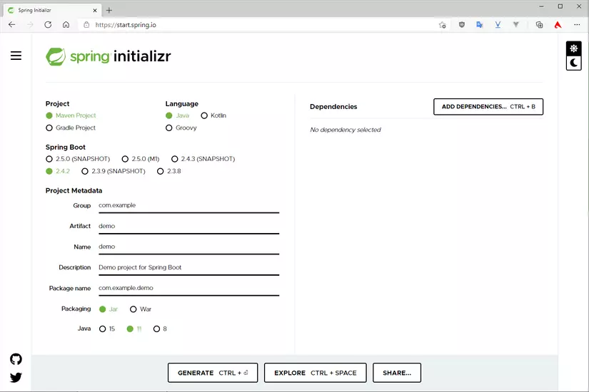
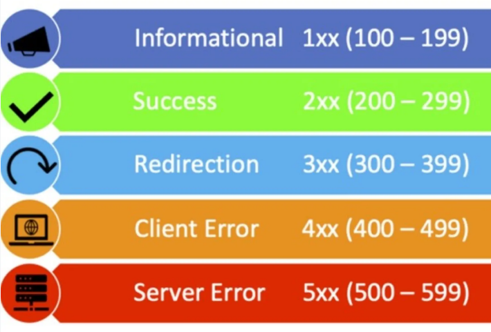
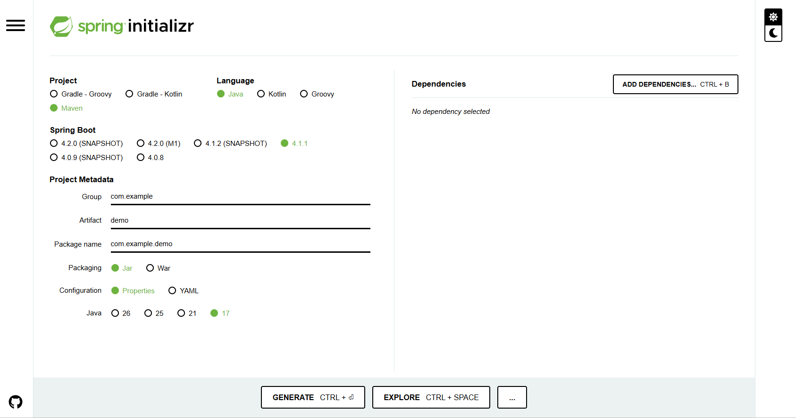
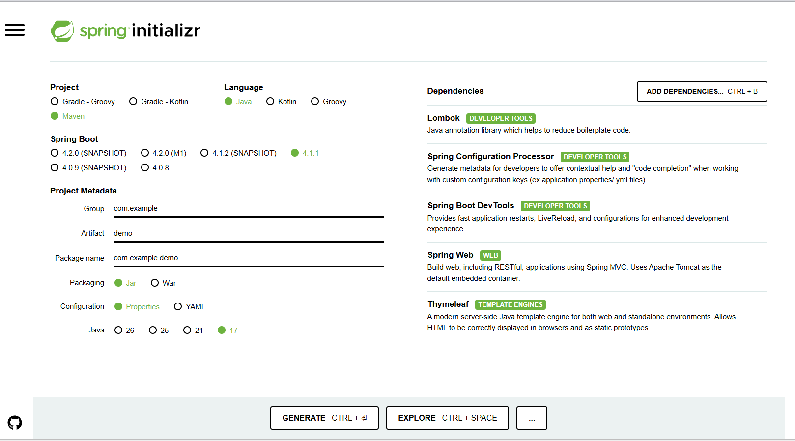
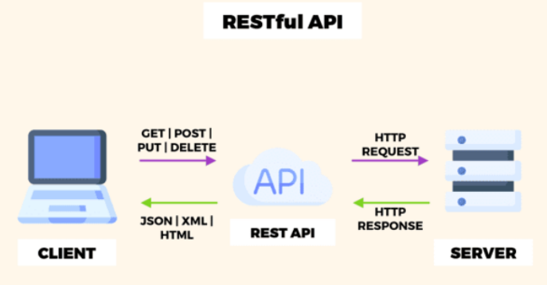
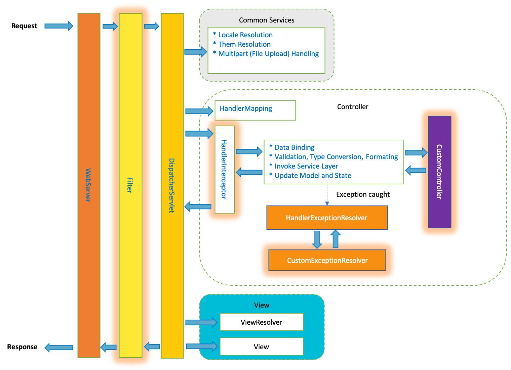
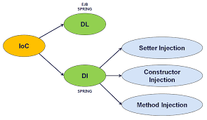

# BACKEND – Khóa Spring Boot Cơ Bản 
# Buổi 5: Các Kiến Thức Cơ Bản
*Tài liệu chuẩn bị buổi 5*

---

**Mục lục**
- [BACKEND – Khóa Spring Boot Cơ Bản](#backend--khóa-spring-boot-cơ-bản)
- [Buổi 5: Các Kiến Thức Cơ Bản](#buổi-5-các-kiến-thức-cơ-bản)
  - [Phần 1: Giao thức mạng và Trao đổi dữ liệu](#phần-1-giao-thức-mạng-và-trao-đổi-dữ-liệu)
    - [1. HTTP là gì?](#1-http-là-gì)
      - [A. Khái niệm](#a-khái-niệm)
      - [B. Ví dụ](#b-ví-dụ)
      - [C. Tại sao lại cần nó?](#c-tại-sao-lại-cần-nó)
      - [D. Phân biệt nhầm lẫn: `HTTP` vs `HTTPS`](#d-phân-biệt-nhầm-lẫn-http-vs-https)
      - [E. Demo / Input – Output:](#e-demo--input--output)
    - [2. Các method trong HTTP](#2-các-method-trong-http)
      - [A. Khái niệm](#a-khái-niệm-1)
      - [B. Ví dụ minh họa](#b-ví-dụ-minh-họa)
      - [C. Vai trò và vì sao cần phân biệt method](#c-vai-trò-và-vì-sao-cần-phân-biệt-method)
      - [D. Phân biệt nhầm lẫn: POST và PUT](#d-phân-biệt-nhầm-lẫn-post-và-put)
      - [E. Demo — Input/Output](#e-demo--inputoutput)
    - [3. Request là gì, Response là gì?](#3-request-là-gì-response-là-gì)
      - [A. Khái niệm](#a-khái-niệm-2)
      - [B. Ví dụ minh họa](#b-ví-dụ-minh-họa-1)
      - [C. Vai trò — Vì sao cần có Request và Response](#c-vai-trò--vì-sao-cần-có-request-và-response)
      - [D. Cấu tạo của Request và Response](#d-cấu-tạo-của-request-và-response)
      - [E. Phân biệt nhầm lẫn: Status Code 4xx và 5xx](#e-phân-biệt-nhầm-lẫn-status-code-4xx-và-5xx)
      - [F. Demo — Input/Output](#f-demo--inputoutput)
  - [Phần 2: Giao tiếp giữa các hệ thống](#phần-2-giao-tiếp-giữa-các-hệ-thống)
    - [4. API là gì, RESTful API là gì?](#4-api-là-gì-restful-api-là-gì)
      - [A. Khái niệm](#a-khái-niệm-3)
      - [B. Ví dụ minh họa](#b-ví-dụ-minh-họa-2)
      - [C. Vai trò — Vì sao cần có API](#c-vai-trò--vì-sao-cần-có-api)
      - [D. Các nguyên tắc cốt lõi của REST](#d-các-nguyên-tắc-cốt-lõi-của-rest)
      - [E. Phân biệt nhầm lẫn: API thông thường và RESTful API](#e-phân-biệt-nhầm-lẫn-api-thông-thường-và-restful-api)
      - [F. Demo — Input/Output](#f-demo--inputoutput-1)
  - [Phần 3: Design Pattern cốt lõi trong Spring Boot](#phần-3-design-pattern-cốt-lõi-trong-spring-boot)
    - [5. DI (Dependency Injection) và IoC (Inversion of Control)](#5-di-dependency-injection-và-ioc-inversion-of-control)
      - [A. Khái niệm](#a-khái-niệm-4)
      - [B. Ví dụ minh họa](#b-ví-dụ-minh-họa-3)
      - [C. Vai trò — Vì sao cần đến IoC và DI](#c-vai-trò--vì-sao-cần-đến-ioc-và-di)
      - [D. Các kiểu Dependency Injection](#d-các-kiểu-dependency-injection)
      - [E. Phân biệt nhầm lẫn: IoC và DI](#e-phân-biệt-nhầm-lẫn-ioc-và-di)
      - [F. Demo — Input/Output](#f-demo--inputoutput-2)


---

## Phần 1: Giao thức mạng và Trao đổi dữ liệu

### 1. HTTP là gì?

#### A. Khái niệm

- `HTTP` (*HyperText Transfer Protocol - Giao thức Truyền tải Siêu Văn Bản*) là một bộ **luật giao tiếp chung** mà trình duyệt, ứng dụng di động (Client) và máy chủ (Server) phải cùng tuân theo mỗi khi trao đổi dữ liệu qua Internet. 


- Nó quy định rõ: 
  - Câu hỏi phải có định dạng ra sao.
  - Câu trả lời phải trông như thế nào.
- Để hai bên, dù được viết bằng ngôn ngữ lập trình khác nhau, chạy trên nền tảng khác nhau, vẫn hiểu đúng ý nhau.

- **Quy tắc**: một yêu cầu (request) thì chỉ trả lại một phản hồi (response) duy nhất. Và response cho một request sẽ luôn giống nhau trong cùng một điều kiện.

#### B. Ví dụ

- Hình dung `HTTP` giống như luật lệ giao thông: 
  - Dù đi xe máy hãng nào, ở thành phố nào, chỉ cần tuân thủ luật chung (đèn đỏ dừng, đèn xanh đi...) thì mọi phương tiện đều lưu thông an toàn trên cùng một con đường, mà chẳng cần biết chiếc xe kia được chế tạo ra sao. 
- Tương tự, một ứng dụng viết bằng Java hoàn toàn tương tác được với một server viết bằng Python hay Node.js, miễn là cả hai cùng tuân thủ chuẩn `HTTP`.

#### C. Tại sao lại cần nó?

- Nếu không có một chuẩn giao tiếp chung như `HTTP`, mỗi công ty sẽ tự bịa ra cách giao tiếp riêng của mình — trình duyệt Chrome sẽ không biết cách hỏi dữ liệu từ server Facebook, app di động sẽ không load nổi bất kỳ website nào.
- `HTTP` tồn tại để đảm bảo **mọi hệ thống trên Internet, bất kể công nghệ gì bên trong, đều hiểu được nhau**.

#### D. Phân biệt nhầm lẫn: `HTTP` vs `HTTPS`

| Tiêu chí        | HTTP                                                                                       | HTTPS                                                                                                                                                  |
| --------------- | ------------------------------------------------------------------------------------------ | ------------------------------------------------------------------------------------------------------------------------------------------------------ |
| Định nghĩa      | HTTP là viết tắt của **HyperText Transfer Protocol** (*Giao thức truyền tải siêu văn bản*) | HTTPS là viết tắt của *Hypertext Transfer Protocol Secure* (*Giao thức truyền tải siêu văn bản bảo mật*)                                               |
| Cổng            | HTTP dùng cổng 80                                                                          | HTTPS dùng cổng 443                                                                                                                                    |
| Ý nghĩa chữ S   | Không có                                                                                   | Secure — dữ liệu được mã hóa trước khi truyền đi                                                                                                       |
| Cơ chế          | Truyền dữ liệu ở dạng văn bản thô                                                          | Về bản chất vẫn là HTTP, nhưng được truyền qua thêm một lớp mã hóa gọi là TLS/SSL (Transport Layer Security / Secure Sockets Layer) trước khi đóng gói |
| Độ an toàn      | Ai chặn được đường truyền cũng đọc được nội dung                                           | Kẻ xấu có chặn được đường truyền cũng không đọc hiểu nổi nội dung                                                                                      |
| Thực tế sử dụng | Gần như không còn dùng cho website hay API thật                                            | Là chuẩn bắt buộc cho hầu hết hệ thống hiện nay                                                                                                        |

#### E. Demo / Input – Output:

Về bản chất, một câu hỏi `HTTP` đơn giản nhất trông như sau (dạng thô, trước khi được các thư viện như trình duyệt hay Spring Boot đóng gói đẹp đẽ  ):

```
GET /api/tours HTTP/1.1
Host: tour-booking.com
```

Đây là một đoạn văn bản thuần túy được gửi qua đường truyền mạng, mang ý nghĩa:

- Này server ở địa chỉ `tour-booking.com`, hãy `GET` (lấy) cho tôi dữ liệu tại đường dẫn `/api/tours`, theo phiên bản giao thức `HTTP/1.1`".
- Vì server cũng hiểu đúng chuẩn này, nó sẽ xử lý và gửi lại dữ liệu tương ứng.

Server nhận và xử lý đúng chuẩn, gửi lại response tương ứng:
 
```
HTTP/1.1 200 OK
Content-Type: application/json
 
{"maTour": 101, "tenTour": "Đà Lạt 3N2Đ"}
```

- Dòng đầu tiên (`HTTP/1.1 200 OK`) cho biết request đã được xử lý thành công.
- Dòng `Content-Type: application/json` báo cho client biết dữ liệu trả về ở phần thân (body) bên dưới đang ở định dạng JSON.
- Phần còn lại chính là dữ liệu thực tế mà client cần.


---

### 2. Các method trong HTTP

#### A. Khái niệm

`HTTP method` là phần khai báo mục đích của một request — cho server biết client đang muốn thực hiện hành động gì lên dữ liệu. 4 method phổ biến nhất là:

- `GET`: lấy (đọc) dữ liệu.
- `POST`: tạo mới một dữ liệu.
- `PUT`: cập nhật (thay thế) một dữ liệu đã có.
- `DELETE`: xóa dữ liệu.
- `PATCH`: cập nhật một phần của tài nguyên thay vì thay thế toàn bộ.
- `HEAD`: Giống `GET`, nhưng chỉ trả về phần header mà không kèm theo nội dung phản hồi. Thường dùng để kiểm tra xem một trang web hoặc tài nguyên có tồn tại hay không. 
- `OPTIONS`: Dùng để kiểm tra các tùy chọn giao tiếp hoặc các phương thức HTTP nào được máy chủ hỗ trợ cho một tài nguyên.

#### B. Ví dụ minh họa

Trong hệ thống quản lý đặt tour du lịch:

- **Xem** danh sách các tour hiện có dùng `GET`.
- **Thêm** một tour mới vào hệ thống dùng `POST`.
- **Sửa** lại giá hoặc thông tin của một tour đã tồn tại dùng `PUT`.
- **Gỡ** bỏ một tour không còn mở bán vé nữa dùng `DELETE`.

#### C. Vai trò và vì sao cần phân biệt method

Nếu không phân biệt rõ method, server sẽ không biết được ý định thật sự đằng sau một request là gì.
Cùng một địa chỉ `/api/tours` nhưng có thể mang 4 mục đích hoàn toàn khác nhau, tùy vào method đi kèm.

- Một khái niệm quan trọng gắn liền với các method này là tính **idempotent** (tạm dịch: bất biến khi lặp lại):
  - Một thao tác được gọi là idempotent nếu gọi nó nhiều lần liên tiếp với cùng dữ liệu đầu vào thì kết quả cuối cùng trên server không thay đổi thêm so với chỉ gọi một lần.
  - `GET`, `PUT`, `DELETE` đều là idempotent.
  - Ví dụ gọi `DELETE` một tour đã bị xóa thêm lần nữa, tour đó vẫn ở trạng thái "không tồn tại", không có gì thay đổi thêm. Riêng `POST` thì không idempotent, vì mỗi lần gọi sẽ tạo thêm một bản ghi hoàn toàn mới.
 
#### D. Phân biệt nhầm lẫn: POST và PUT
 
| Tiêu chí        | POST                                                            | PUT                                                                 |
| --------------- | --------------------------------------------------------------- | ------------------------------------------------------------------- |
| Mục đích chính  | Tạo mới một tài nguyên                                          | Cập nhật (thay thế) một tài nguyên đã tồn tại                       |
| Tính idempotent | Không — gọi lại nhiều lần sẽ tạo ra nhiều bản ghi mới khác nhau | Có — gọi lại nhiều lần với cùng dữ liệu, kết quả không đổi thêm     |
| Khi nào dùng    | Khi tạo một tour hoàn toàn mới, chưa có mã                      | Khi cập nhật một tour đã có sẵn mã (ví dụ sửa giá của `MaTour = 5`) |
| Dữ liệu gửi lên | Chỉ chứa thông tin của đối tượng mới                            | Phải chứa toàn bộ thông tin đầy đủ để ghi đè bản ghi cũ             |
 
#### E. Demo — Input/Output
 
Input — gửi request `POST` để tạo tour mới:
 
```
POST /api/tours
```
```json
{
  "tenTour": "Đà Lạt 3N2Đ",
  "giaTour": 2500000
}
```
 
Output — server tạo thành công, trả về tour vừa tạo kèm mã tự sinh:
 
```json
{
  "maTour": 101,
  "tenTour": "Đà Lạt 3N2Đ",
  "giaTour": 2500000
}
```
 
Nếu gửi lại y hệt request `POST` này thêm một lần nữa, server sẽ tạo thêm một tour hoàn toàn mới với `maTour` khác (ví dụ `102`).
 
So sánh với `PUT` — cập nhật giá của đúng tour vừa tạo:
 
```
PUT /api/tours/101
```
```json
{
  "tenTour": "Đà Lạt 3N2Đ",
  "giaTour": 2200000
}
```
 
Output:
 
```json
{
  "maTour": 101,
  "tenTour": "Đà Lạt 3N2Đ",
  "giaTour": 2200000
}
```
 
Lần này `maTour` không đổi — vẫn là `101` — chỉ có `giaTour` được cập nhật. Dù có gửi lại request `PUT` này thêm nhiều lần nữa, kết quả cuối cùng vẫn chỉ có đúng một tour `101` với giá `2200000`, không phát sinh thêm bản ghi nào.

---

### 3. Request là gì, Response là gì?

#### A. Khái niệm



- **Request** là dữ liệu mà phía Client gửi đi để hỏi hoặc ra lệnh cho Server.
- **Response** là dữ liệu mà Server gửi ngược lại cho Client sau khi đã xử lý xong yêu cầu đó.

#### B. Ví dụ minh họa

Khi ứng dụng frontend của hệ thống đặt tour cần lấy danh sách khách hàng để hiển thị lên màn hình quản trị, nó gửi một request đến đúng địa chỉ API tương ứng trên server.
Server truy vấn cơ sở dữ liệu, xử lý xong sẽ đóng gói kết quả thành một response chứa dữ liệu khách hàng, gửi trả lại cho frontend để hiển thị.

#### C. Vai trò — Vì sao cần có Request và Response

- Nếu chỉ có Request mà không có Response, phía Client sẽ không bao giờ biết được yêu cầu của mình có được xử lý thành công hay không, dữ liệu mình cần đã sẵn sàng chưa.
- Response là cơ chế phản hồi bắt buộc để hai bên luôn đồng bộ trạng thái với nhau. Đây cũng là lý do mọi giao thức giao tiếp mạng đều được thiết kế theo cặp "hỏi – đáp" chứ không chỉ có chiều gửi đi.

#### D. Cấu tạo của Request và Response

Một **Request** gồm 4 thành phần chính:

- **URL**: địa chỉ tài nguyên muốn thao tác, ví dụ `/api/tours/101`.
- **Method**: mục đích thao tác — `GET`, `POST`, `PUT`, `DELETE`.
- **Header**: các thông tin kèm theo, không phải dữ liệu chính nhưng cần thiết để server xử lý đúng. Một số header thường gặp:
  - `Content-Type`:cho biết định dạng dữ liệu trong Body, thường là `application/json`
  - `Authorization`:chứa thông tin xác thực, ví dụ một đoạn token, để server biết ai đang gọi request
  - `Accept`: cho biết client mong muốn nhận lại dữ liệu ở định dạng nào
- **Body**: nội dung dữ liệu thực sự muốn gửi, thường ở dạng JSON, chỉ xuất hiện ở các method như `POST`, `PUT`.

Một **Response** gồm 3 thành phần chính:

- **Status Code**: mã số 3 chữ số cho biết kết quả xử lý.
- **Header**: thông tin đi kèm response, ví dụ định dạng dữ liệu trả về.
- **Body**: nội dung dữ liệu thực sự trả về cho Client.

**Status Code** được chia thành 5 nhóm theo chữ số đầu tiên:
 
| Nhóm  | Ý nghĩa chung                                                                  |
| ----- | ------------------------------------------------------------------------------ |
| `1xx` | Đã nhận request, đang tiếp tục xử lý (ít gặp trong lập trình web thông thường) |
| `2xx` | Xử lý thành công                                                               |
| `3xx` | Cần chuyển hướng sang một địa chỉ khác                                         |
| `4xx` | Lỗi phía Client — request gửi lên sai hoặc thiếu                               |
| `5xx` | Lỗi phía Server — server gặp sự cố khi xử lý                                   |



**Một số mã cần nhớ**:
- `200` (OK — thành công)
- `400` (Bad Request — request sai định dạng hoặc thiếu dữ liệu)
- `404` (Not Found — không tìm thấy tài nguyên được yêu cầu)
- `500` (Internal Server Error — server gặp lỗi nội bộ khi xử lý).



#### E. Phân biệt nhầm lẫn: Status Code 4xx và 5xx

| Tiêu chí              | 4xx                                                   | 5xx                                                           |
| --------------------- | ----------------------------------------------------- | ------------------------------------------------------------- |
| Lỗi nằm ở đâu         | Phía Client                                           | Phía Server                                                   |
| Nguyên nhân điển hình | Gõ sai URL, thiếu dữ liệu bắt buộc, gửi sai định dạng | Code server bị lỗi, database sập, hết bộ nhớ xử lý            |
| Ai cần sửa            | Người/hệ thống gửi request cần sửa lại request        | Đội ngũ vận hành/lập trình backend cần kiểm tra và sửa server |

#### F. Demo — Input/Output

Input — JSON Request gửi lên để tạo một khách hàng mới:

```json
{
  "hoTen": "Nguyễn Văn A",
  "soDienThoai": "0987654321",
  "email": "vana@gmail.com"
}
```
 
Output — JSON Response server trả về, kèm Status Code `201 Created`:
 
```json
{
  "maKH": 15,
  "hoTen": "Nguyễn Văn A",
  "soDienThoai": "0987654321",
  "email": "vana@gmail.com",
  "ngayTao": "2026-02-20"
}
```

Server đã tự sinh thêm `maKH` và `ngayTao`. Đây là dữ liệu do hệ thống tự quản lý, phía Client không cần và không nên tự gửi lên.

---

## Phần 2: Giao tiếp giữa các hệ thống

### 4. API là gì, RESTful API là gì?

#### A. Khái niệm



**API** (*Application Programming Interface*) là tập hợp các điểm truy cập mà Server chủ động mở sẵn, cho phép các ứng dụng khác gọi vào để lấy hoặc gửi dữ liệu, mà không cần biết bên trong Server được lập trình ra sao, dùng cơ sở dữ liệu gì.
 
**RESTful API** là một API được thiết kế tuân theo bộ quy tắc có tên **REST** — viết tắt của **Representational State Transfer**. Hiểu theo nghĩa đen, cụm từ này có nghĩa là "chuyển giao trạng thái thông qua các bản trình bày". Nói dễ hiểu hơn: mỗi khi Client muốn biết trạng thái hiện tại của một dữ liệu nào đó (ví dụ tour số 101 đang có giá bao nhiêu, còn bao nhiêu chỗ), Server sẽ không gửi thẳng dữ liệu gốc trong database, mà đóng gói trạng thái đó thành một "bản trình bày" (representation) — trong thực tế gần như luôn là JSON — rồi gửi bản trình bày này cho Client.
 
#### B. Ví dụ minh họa
 
Trong hệ thống đặt tour, phần Backend viết bằng Spring Boot sẽ mở ra một tập hợp các API, ví dụ `/api/tours`, `/api/khach-hang`. Phần Frontend (giao diện web hoặc app) sẽ gọi vào đúng những API này để lấy hoặc gửi dữ liệu, mà hoàn toàn không cần biết Backend đang dùng loại cơ sở dữ liệu nào, viết bằng công nghệ gì bên trong. Nếu sau này team đổi từ SQL Server sang PostgreSQL, miễn API vẫn trả đúng dữ liệu như cũ, Frontend không cần sửa bất kỳ dòng code nào.
 
#### C. Vai trò — Vì sao cần có API
 
Nếu không có API, ứng dụng frontend sẽ phải truy cập trực tiếp vào cơ sở dữ liệu hoặc logic nội bộ của server — cực kỳ nguy hiểm về bảo mật, đồng thời khiến hai bên bị ràng buộc chặt chẽ với nhau: chỉ cần server đổi cấu trúc database, toàn bộ frontend có thể hỏng theo. API tạo ra một lớp trung gian ổn định, cho phép Server thay đổi cách xử lý bên trong thoải mái, miễn là API vẫn trả lời đúng như đã cam kết với Client.
 
#### D. Các nguyên tắc cốt lõi của REST
 
Một API muốn được gọi là RESTful cần tuân theo một số nguyên tắc thiết kế sau:
 
1. **Resource-based (Hướng tài nguyên)**: mọi thứ trong hệ thống đều được xem là một "tài nguyên" (resource) có định danh riêng thông qua URL — ví dụ tour số 101 được định danh bằng `/api/tours/101`.
2. **Uniform Interface (Giao diện thống nhất)**: dùng đúng bộ HTTP method chuẩn (`GET`, `POST`, `PUT`, `DELETE`) để thao tác lên tài nguyên, thay vì tự chế ra hành động riêng trong URL.
3. **Stateless (Không trạng thái)**: mỗi request phải tự chứa đầy đủ thông tin cần thiết để server xử lý được ngay lập tức, server không lưu lại "trạng thái phiên làm việc" từ request trước đó của cùng một client.
4. **Representation (Bản trình bày)**: dữ liệu trao đổi qua lại giữa Client và Server, dù ở Request Body hay Response Body, đều là một "bản trình bày" — thường ở dạng JSON — cho trạng thái thực của tài nguyên tại thời điểm đó, chứ không phải bản thân dữ liệu gốc trong cơ sở dữ liệu.

#### E. Phân biệt nhầm lẫn: API thông thường và RESTful API
 
| Tiêu chí               | API thông thường                                      | RESTful API                                                                                                    |
| ---------------------- | ----------------------------------------------------- | -------------------------------------------------------------------------------------------------------------- |
| Quy tắc thiết kế       | Tùy hứng, mỗi nơi một kiểu                            | Tuân theo bộ chuẩn REST rõ ràng, dễ đoán                                                                       |
| Cách đặt tên URL       | Thường nhét luôn hành động vào URL                    | Dùng danh từ cho URL, để HTTP method thể hiện hành động                                                        |
| Lưu trạng thái phiên   | Có thể lưu trạng thái phiên làm việc ở phía server    | Không lưu — mỗi request độc lập, tự đủ thông tin                                                               |
| Ví dụ URL chuẩn REST   | —                                                     | `GET /api/tours` (lấy danh sách tour), `POST /api/tours` (tạo tour mới), `DELETE /api/tours/5` (xóa tour số 5) |
| Ví dụ URL thiết kế xấu | `GET /api/get-all-tours`, `GET /api/delete-tour?id=5` | —                                                                                                              |
 
Điểm mấu chốt: URL chuẩn REST không nhét động từ vào URL (không viết `get-all`, `delete-tour`...) vì bản thân HTTP method (`GET`, `POST`, `DELETE`) đã đóng vai trò diễn tả hành động rồi — URL chỉ nên là danh từ, đại diện cho loại tài nguyên đang thao tác.
 
#### F. Demo — Input/Output
 
Input — Client gọi API để lấy thông tin một tour cụ thể theo chuẩn RESTful:
 
```
GET /api/tours/101
```
 
Output — Response trả về đúng thông tin tour đó:
 
```json
{
  "maTour": 101,
  "tenTour": "Đà Lạt 3N2Đ",
  "giaTour": 2500000,
  "soCho": 40
}
```
 
Chỉ cần nhìn vào URL `/api/tours/101` kết hợp method `GET`, một lập trình viên khác — kể cả chưa từng đọc tài liệu của hệ thống — cũng có thể đoán đúng ý nghĩa của API này. Đó chính là giá trị cốt lõi mà chuẩn RESTful mang lại.
 

 
---
 
## Phần 3: Design Pattern cốt lõi trong Spring Boot
 
### 5. DI (Dependency Injection) và IoC (Inversion of Control)

#### A. Khái niệm

Khi viết code Java theo cách tự nhiên nhất, để một class sử dụng được một class khác, người mới thường tự tay khởi tạo nó bằng từ khóa `new` ngay bên trong:
 
```java
public class TourService {
 
    private EmailSender emailSender = new EmailSender();
 
    public void bookTour(String tourName) {
        emailSender.send(tourName);
    }
 
}
```
 
- `TourService`: class xử lý nghiệp vụ đặt tour.
- `private EmailSender emailSender = new EmailSender();`: `TourService` tự tay tạo ra một đối tượng `EmailSender` cụ thể bằng từ khóa `new`.
- `bookTour(String tourName)`: phương thức xử lý đặt tour, bên trong gọi `emailSender.send(tourName)` để gửi thông báo xác nhận.
Cách viết này khiến `TourService` bị "dính chặt" (gọi là **Coupling** — sự phụ thuộc chặt chẽ) vào đúng một class `EmailSender` cụ thể. Muốn thay `EmailSender` bằng một cách gửi thông báo khác, hoặc muốn thay bằng một phiên bản giả lập để viết Unit Test, bắt buộc phải sửa trực tiếp vào bên trong `TourService`.
 
Giải pháp cho vấn đề Coupling gồm 2 khái niệm luôn đi liền với nhau:
 
- **IoC — Inversion of Control (*Đảo ngược quyền điều khiển*)**: thay vì để `TourService` tự tay `new` ra `EmailSender`, quyền tạo object đó được giao cho một thành phần khác đứng ngoài quản lý. Trong Spring Boot, thành phần đó chính là **Spring Container** (còn gọi là **IoC Container**).
- **DI — Dependency Injection (Tiêm phụ thuộc)**: là cách thức cụ thể mà Spring Container dùng để đưa (tiêm) các object đã tạo sẵn vào đúng nơi cần dùng. Ví dụ đưa thẳng `EmailSender` vào `TourService` thông qua constructor.
- Nói ngắn gọn: **IoC là nguyên lý** ("hãy để một thế lực khác quản lý việc tạo object"), còn **DI là kỹ thuật hiện thực hóa** nguyên lý đó trong code thực tế.

#### B. Ví dụ minh họa

```java
public class TourService {
 
    private EmailSender emailSender = new EmailSender();
 
    public void bookTour(String tourName) {
        emailSender.send(tourName);
    }
 
}
```

Đoạn code trên là ví dụ điển hình của coupling vì nó khiến `TourService` và `EmailSender` luôn phải đi liền với nhau. Vấn đề này không chỉ xảy ra một lần mà nó lặp lại ở bất kỳ đâu trong hệ thống có thói quen dùng `new` để tạo các thành phần phụ thuộc.

Ví dụ tương tự:

- Một class `HoaDonService` xử lý nghiệp vụ hóa đơn nhưng lại tự `new` ra một `PaymentGateway` (cổng thanh toán) ngay bên trong nó
- Nếu công ty đổi nhà cung cấp thanh toán, hoặc muốn test nghiệp vụ hóa đơn mà không thực sự gọi đến cổng thanh toán thật, code bên trong `HoaDonService` lại phải bị sửa.
- Đây là lý do vấn đề Coupling cần một giải pháp mang tính hệ thống, áp dụng nhất quán cho toàn bộ dự án, chứ không phải xử lý riêng lẻ từng trường hợp và đó chính là vai trò của IoC/DI.

#### C. Vai trò — Vì sao cần đến IoC và DI

- Nếu không giải quyết vấn đề Coupling, hệ thống sẽ ngày càng khó bảo trì: 
  - Mỗi lần muốn đổi một thành phần nhỏ như nguồn vào khác thì phải tìm lại những code đang dùng `new` để sửa theo. Việc viết Unit Test cũng gần như bất khả thi, vì không thể giả lập (mock) một class đang bị tạo cứng bên trong class khác.

- IoC/DI giải quyết cả hai vấn đề trên cùng lúc:
  - **Linh hoạt hơn**: muốn đổi cách triển khai một thành phần (ví dụ đổi `EmailSender` sang một cách gửi thông báo khác), chỉ cần thay đổi ở nơi cấu hình, không phải sửa code nghiệp vụ.
  - **Test được dễ dàng**: khi viết Unit Test cho `TourService`, có thể tiêm vào một phiên bản `EmailSender` giả lập (không gửi email thật), thay vì bị buộc phải dùng đúng bản `new EmailSender()` đã viết cứng.
  - 
Đây chính là cách hiện thực hóa nguyên tắc **Dependency Inversion** (một trong 5 nguyên tắc thiết kế hướng đối tượng SOLID): một class nên phụ thuộc vào một khai báo trừu tượng (ví dụ interface), thay vì phụ thuộc trực tiếp vào một class cụ thể do chính nó tự tạo ra.

#### D. Các kiểu Dependency Injection



Có 3 cách phổ biến để thêm một dependency vào class:
 
1. **Constructor Injection**: dependency được truyền vào thông qua constructor. Đây là cách được khuyến khích sử dụng nhiều nhất, vì dependency có thể được khai báo `final` (không đổi sau khi khởi tạo), đảm bảo class luôn có đủ dependency cần thiết ngay từ lúc được tạo ra, và rất thuận tiện khi viết Unit Test.
2. **Setter Injection**: dependency được truyền vào thông qua một phương thức `setEmailSender(...)` riêng, sau khi object đã được tạo ra. Cách này linh hoạt hơn (có thể thay đổi dependency sau khi khởi tạo) nhưng lại khó đảm bảo class luôn có đủ dependency cần thiết trước khi được sử dụng.
3. **Field Injection**: dependency được tiêm thẳng vào biến (field) của class thông qua một annotation, không cần constructor hay setter riêng. Cách này viết ngắn gọn nhất nhưng lại khó viết Unit Test và khó nhìn ra rõ ràng class đang phụ thuộc vào những gì, nên ngày càng ít được khuyến khích trong các dự án Spring Boot hiện đại.



#### E. Phân biệt nhầm lẫn: IoC và DI
 
| Tiêu chí | IoC                                                   | DI                                                                |
| -------- | ----------------------------------------------------- | ----------------------------------------------------------------- |
| Bản chất | Một nguyên lý thiết kế hay tư tưởng chung             | Một kỹ thuật cụ thể để hiện thực hóa nguyên lý đó                 |
| Phạm vi  | Rộng - "giao quyền kiểm soát cho một thành phần khác" | Hẹp hơn - chỉ riêng việc tiêm object phụ thuộc vào class cần dùng |
| Quan hệ  | IoC là mục tiêu cần đạt được                          | DI là cách phổ biến nhất để đạt được mục tiêu đó                  |
 
#### F. Demo — Input/Output

Code chưa áp dụng DI — tự `new` bên trong:
 
```java
public class TourService {
 
    private EmailSender emailSender = new EmailSender();
 
    public void bookTour(String tourName) {
        emailSender.send(tourName);
    }
 
}
```
 
Ở đây, `TourService` tự mình tạo ra một `EmailSender` cố định ngay khi class được khởi tạo. Không ai từ bên ngoài có thể can thiệp hay thay thế bằng một `EmailSender` khác, kể cả khi cần dùng một phiên bản giả lập để viết Unit Test.
 
Code đã áp dụng DI thông qua Constructor Injection:
 
```java
public class TourService {
 
    private final EmailSender emailSender;
 
    public TourService(EmailSender emailSender) {
        this.emailSender = emailSender;
    }
 
    public void bookTour(String tourName) {
        emailSender.send(tourName);
    }
 
}
```
 
- `private final EmailSender emailSender;`: `TourService` chỉ khai báo rằng mình cần một `EmailSender` để hoạt động, nhưng không tự tạo ra nó.
- `public TourService(EmailSender emailSender) { this.emailSender = emailSender; }`: đây chính là Constructor Injection — object `EmailSender` được truyền từ bên ngoài vào thông qua constructor ngay lúc khởi tạo `TourService`, thay vì bị `new` cứng bên trong.
- `bookTour(String tourName)`: phương thức xử lý nghiệp vụ, sử dụng `emailSender` đã được truyền sẵn, hoàn toàn không quan tâm nó được tạo ra từ đâu.

Luồng chạy thực tế trong Spring Boot: 

- khi ứng dụng khởi động, Spring Container sẽ tự động quét, tạo sẵn một object `EmailSender`
- Sau đó tự động truyền đúng object đó vào constructor của `TourService`
- Khi cần dùng đến thì lập trình viên không cần viết bất kỳ dòng `new` nào cho `EmailSender` nữa.
- Cơ chế "tự động quét và tiêm" này trong Spring Boot được thực hiện thông qua các annotation như `@Component`, `@Service`, `@Autowired` (là các chú thích cốt lõi trong Spring Framework dùng để quản lý đối tượng và tự động tiêm phụ thuộc)
