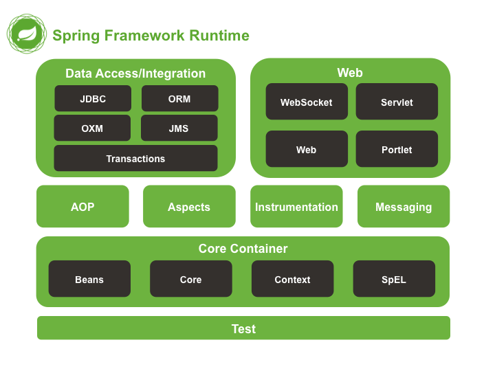
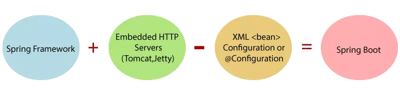
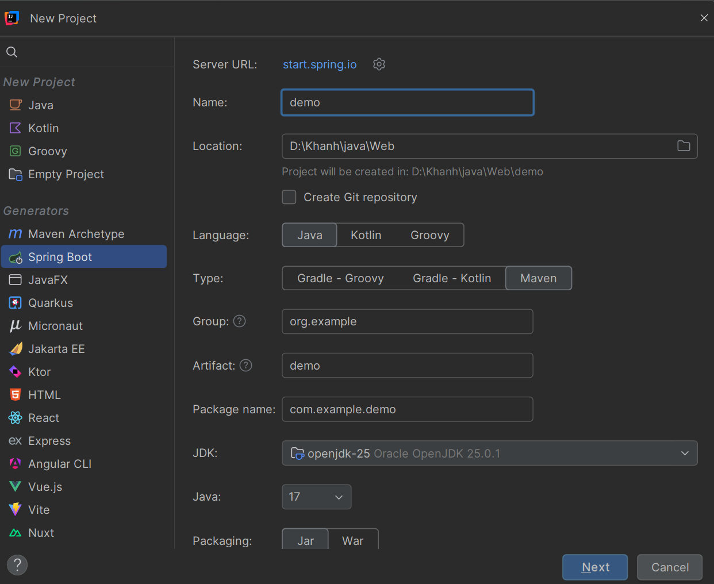
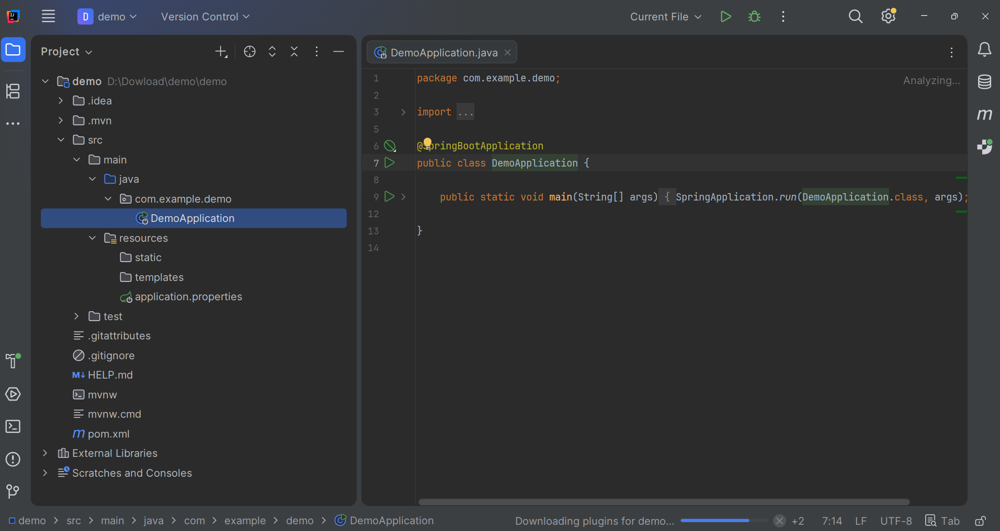
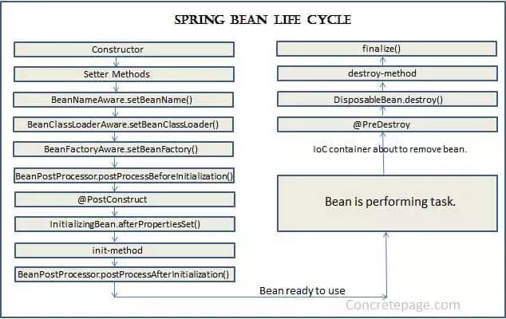

# [BACKEND – Khóa Spring Boot Cơ Bản] 
# Buổi 6: Spring MVC
*Tài liệu chuẩn bị buổi 6*

---

**Mục lục**

- [Phần 1: Trái tim của hệ sinh thái Spring Boot](#phần-1-trái-tim-của-hệ-sinh-thái-spring-boot)
  - [1. Khởi tạo dự án Spring Boot](#1-khởi-tạo-dự-án-spring-boot)
  - [2. Bean, BeanFactory và Vòng đời của Bean](#2-bean-beanfactory-và-vòng-đời-của-bean)
- [Phần 2: Các Annotation cốt lõi](#phần-2-các-annotation-cốt-lõi)
  - [1. @SpringBootApplication](#1-springbootapplication)
  - [2. @Component và @Bean](#2-component-và-bean)
  - [3. @Autowired](#3-autowired)
- [Phần 3: Kiến trúc Spring MVC và View Template](#phần-3-kiến-trúc-spring-mvc-và-view-template)
  - [1. Spring MVC và @Controller](#1-spring-mvc-và-controller)
  - [2. Thymeleaf](#2-thymeleaf)
- [Phần 4: Công cụ tối ưu năng suất](#phần-4-công-cụ-tối-ưu-năng-suất)
  - [1. Lombok](#1-lombok)
  - [2. Log trong Spring Boot (Log4j và @Slf4j)](#2-log-trong-spring-boot-log4j-và-slf4j)
- [Phần 5: Bài tập chuẩn bị trước (Bắt buộc)](#phần-5-bài-tập-chuẩn-bị-trước-bắt-buộc)
  - [1. Khởi tạo Model](#1-khởi-tạo-model)
  - [2. Xây dựng Controller](#2-xây-dựng-controller)
  - [3. Tạo View](#3-tạo-view)

---

## Phần 1: Trái tim của hệ sinh thái Spring Boot

### 1. Khởi tạo dự án Spring Boot

#### A. Bản chất và Khái niệm

- Spring là một Java framework siêu to và khổng lồ, làm được đủ mọi thứ.
- Nó được chia thành nhiều module, mỗi module làm một chức năng, ví dụ: Spring Core, Web, Data access, AOP,... 
- Spring được xây dựng dựa trên 2 khái niệm nền tảng là Dependency injection và AOP (Aspect Oriented Programming).



- Một rắc rối khi dùng Spring là việc cấu hình (config) dự án quá phức tạp. Ta phải làm đủ thứ việc chỉ để tạo một web HelloWorld:
  - Tạo Maven hoặc Gradle project
  - Thêm các thư viện cần thiết
  - Tạo XML để cấu hình project, cấu hình các bean
  - Code và build thành file WAR
  - Cấu hình Tomcat server để chạy được file WAR vừa build

- Spring khá mạnh mẽ nhưng việc cấu hình rất phức tạp. Do đó Spring boot ra đời, với các ưu điểm:
  - Auto config: tự động cấu hình thay cho bạn, chỉ cần bắt đầu code và chạy là được
  - Xây dựng các bean dựa trên annotation thay vì XML
  - Server Tomcat được nhúng ngay trong file JAR build ra, chỉ cần chạy ở bất kì đâu java chạy được



- Một dự án Spring Boot được quản lý thư viện thông qua một công cụ build (thường là Maven, khai báo trong file `pom.xml`).
- Thay vì phải tự khai báo và tự đảm bảo tương thích phiên bản cho từng thư viện lẻ, Spring Boot cung cấp các gói phụ thuộc gọi là **Starter**, mỗi Starter đóng gói sẵn một bộ thư viện đã được kiểm định tương thích với nhau cho một mục đích cụ thể:
  - `spring-boot-starter-web`: gồm Spring MVC, một máy chủ Tomcat được nhúng sẵn (Embedded Tomcat), và Jackson (thư viện chuyển đổi qua lại giữa object Java và JSON).
  - `spring-boot-starter-thymeleaf`: gồm engine Thymeleaf, đồng thời tự động cấu hình sẵn một `ViewResolver` ánh xạ tên View trả về từ Controller thành đường dẫn file trong thư mục `src/main/resources/templates/`.
  - `lombok`: khác với hai Starter trên, đây là một annotation processor chỉ hoạt động ở thời điểm biên dịch (compile-time), không được đóng gói vào file chạy cuối cùng — vì vậy thường được khai báo kèm `<optional>true</optional>`.

- Khi ứng dụng khởi động, phương thức `main` gọi `SpringApplication.run(...)`. 
- Lệnh này kích hoạt một chuỗi xử lý theo đúng thứ tự: tạo một `ApplicationContext` (container quản lý object), quét toàn bộ classpath để tìm các class được đánh dấu annotation quản lý bởi Spring, khởi tạo các Bean và tiêm dependency giữa chúng, và nếu phát hiện có `spring-boot-starter-web` trong classpath sẽ tự động khởi động một máy chủ Tomcat nhúng, mở cổng lắng nghe (mặc định `8080`) để sẵn sàng tiếp nhận HTTP Request.

```xml
<dependencies>
    <dependency>
        <groupId>org.springframework.boot</groupId>
        <artifactId>spring-boot-starter-web</artifactId>
    </dependency>
    <dependency>
        <groupId>org.springframework.boot</groupId>
        <artifactId>spring-boot-starter-thymeleaf</artifactId>
    </dependency>
    <dependency>
        <groupId>org.projectlombok</groupId>
        <artifactId>lombok</artifactId>
        <optional>true</optional>
    </dependency>
</dependencies>
```

```java
@SpringBootApplication
public class TourAppApplication {

    public static void main(String[] args) {
        SpringApplication.run(TourAppApplication.class, args);
    }

}
```
`SpringApplication.run(TourAppApplication.class, args)` truyền vào chính class chứa `main` để Spring biết điểm bắt đầu quét component, và truyền `args` để giữ nguyên các tham số dòng lệnh (nếu có) cho tầng cấu hình bên trong sử dụng.

#### B. Cách tạo ra một dự án Spring boot

##### bước 1: Mở Spring initializr

Spring Boot có một công cụ giúp chúng ta nhanh chóng khởi tạo project gọi là **Spring Initializr**. 
Spring Initializr có thể truy cập trên web tại http://start.spring.io/, hoặc với IntelliJ thì có tích hợp luôn vào khi tạo project luôn.




##### Bước 2: Khai báo thông tin project

Như hình trên, ở ngăn bên trái là nơi chúng ta khai báo một số thông tin project như:

- **Loại project**: là chọn loại package manager nào, Maven hoặc Gradle.
- **Language**: chọn ngôn ngữ code, ở đây là Java
- **Phiên bản Spring Boot**: Các version có SNAPSHOT là bản chưa ổn định, không nên chọn
- **Loại file build ra**: với Spring Boot thì nên chọn JAR để đỡ cấu hình Tomcat server
- **Phiên bản Java**: chọn phiên bản đề xuất để ổn định

Ngoài ra cũng cần khai báo thêm các metadata như tên project, tên package, artifact,...

##### Bước 3: Chọn dependency

Ngăn bên phải là chọn các dependency, có thể hiểu là các thư viện phụ trợ. Để code được web service cần có Spring web. Các thư viện khác có ý nghĩa như sau:

- **Lombok**: nên chọn, nó giúp code Java ngắn hơn, nhưng cần cài thêm plugin Lombok vào IDE nữa
- **Thymeleaf**: Thymeleaf sẽ giúp pass data vào view của mô hình MVC, trả về trang HTML có data cho client
- **Spring configuration processor, Spring devtools** là các tool hỗ trợ thêm khi code


##### Bước 4: Hoàn tất

Sau khi làm xong các bước trên thì ấn Generate. Máy sẽ tự động tải về 1 file zip chứa sources code ban đầu.
Sau đó giải nén và bắt đầu code.



Cấu trúc project được khởi tạo sẵn như trên.

#### B. Tại sao cần có? Không có thì sao?

- Trước khi có Spring Boot, một dự án Spring Framework thuần cần: 
  - Cài đặt và cấu hình thủ công một máy chủ Servlet (Tomcat/Jetty) bên ngoài
  - Đóng gói ứng dụng thành file `.war` rồi triển khai (deploy) vào đúng máy chủ đó, đồng thời tự khai báo cấu hình cho từng thành phần (DataSource, ViewResolver, bộ chuyển đổi JSON...) thông qua file XML hoặc Java Config dài dòng. 
  
- Spring Boot loại bỏ toàn bộ gánh nặng này bằng cơ chế **auto-configuration**: dựa vào chính những thư viện đang có mặt trong classpath (ví dụ thấy có `spring-boot-starter-web`), Spring Boot **tự suy luận và cấu hình sẵn** những thành phần hợp lý theo mặc định, cho phép chạy ứng dụng chỉ bằng một lệnh `java -jar` duy nhất, không phụ thuộc vào máy chủ cài đặt sẵn bên ngoài.

#### C. Phân biệt nhầm lẫn: Spring Framework và Spring Boot

| Tiêu chí           | Spring Framework                                                                  | Spring Boot                                                                           |
| ------------------ | --------------------------------------------------------------------------------- | ------------------------------------------------------------------------------------- |
| Cấu hình           | Phải khai báo thủ công (XML hoặc Java Config) cho từng thành phần                 | Tự động cấu hình (auto-configuration) dựa trên dependency có sẵn                      |
| Máy chủ            | Cần cài đặt, cấu hình Tomcat/Jetty bên ngoài, đóng gói thành `.war` để triển khai | Tích hợp sẵn Embedded Tomcat trong file `.jar`, chạy trực tiếp bằng `java -jar`       |
| Quản lý dependency | Tự khai báo và tự đảm bảo tương thích phiên bản giữa các thư viện                 | Cung cấp sẵn các Starter đã đóng gói bộ thư viện tương thích nhau                     |
| Quan hệ            | Là nền tảng gốc (core framework)                                                  | Được xây dựng trên nền Spring Framework, bổ sung lớp tiện ích để triển khai nhanh hơn |


### 2. Bean, BeanFactory và Vòng đời của Bean

#### A. Bản chất và Khái niệm

- **Bean** là một object mà việc tạo ra, cấu hình, và huỷ bỏ hoàn toàn do Spring Container quản lý, thay vì do lập trình viên tự gọi `new` và tự giữ tham chiếu. Đây chính là cách hiện thực hóa `IoC`. (Nói một cách đơn giản, bean là những module chính của chương trình, được tạo ra và quản lý bởi Spring IoC container)

- **BeanFactory** là interface gốc của mọi IoC Container trong Spring, định nghĩa các thao tác cơ bản nhất:

  - `getBean()` để lấy một Bean theo tên hoặc theo kiểu.
  - `containsBean()` để kiểm tra sự tồn tại. 

- `BeanFactory` khởi tạo Bean theo cơ chế **lazy**: object chỉ thực sự được tạo ra khi có lời gọi `getBean()` đầu tiên yêu cầu đến nó.

- **ApplicationContext** là interface mở rộng từ `BeanFactory`, bổ sung thêm các tính năng cấp doanh nghiệp: publish/subscribe sự kiện nội bộ (`ApplicationEvent`), tích hợp AOP, hỗ trợ đa ngôn ngữ. 
- **Khác biệt quan trọng nhất về hành vi**: 
  - `ApplicationContext` khởi tạo theo cơ chế **eager** đối với các Bean có phạm vi mặc định là `singleton`.
  - Nghĩa là toàn bộ các Bean này được tạo sẵn ngay khi ứng dụng khởi động, không đợi đến khi có ai gọi `getBean()`.
  - Trong một ứng dụng Spring Boot, chính `ApplicationContext` (không phải `BeanFactory` trần) là thứ được khởi tạo khi `SpringApplication.run()` chạy.

- **Xét về bản chất bộ nhớ**: 
  - có thể hình dung `ApplicationContext` như một cấu trúc dữ liệu dạng Map, tồn tại trên vùng nhớ Heap của JVM trong suốt vòng đời ứng dụng với khóa (key) là tên định danh của Bean, giá trị (value) là tham chiếu đến object thực tế tương ứng. 
  - Khi một class khác cần dùng đến một Bean, về bản chất Spring đang tra cứu trong chính cấu trúc Map nội bộ này để lấy ra đúng tham chiếu object đã tồn tại sẵn, chứ không cấp phát vùng nhớ cho một object hoàn toàn mới.

Vòng đời của một **Bean** (phạm vi mặc định `singleton`) trải qua 4 giai đoạn chính:

1. **Instantiation (Khởi tạo)**: Container gọi constructor tương ứng, cấp phát vùng nhớ trên Heap cho object mới.
2. **Populate Properties (Nạp thuộc tính)**: Container tìm và gán các dependency cần thiết (các Bean khác) vào field, constructor, hoặc setter của object vừa tạo — đây chính là bước `DI` thực sự xảy ra.
3. **Initialization (Khởi tạo hoàn tất)**: Container gọi các callback đã đăng ký (ví dụ phương thức được đánh dấu `@PostConstruct`), cho phép object thực hiện thêm các bước chuẩn bị (ví dụ nạp dữ liệu cache ban đầu) trước khi được đưa vào sử dụng chính thức.
4. **Destruction (Huỷ bỏ)**: Khi `ApplicationContext` đóng lại (ứng dụng dừng), Container gọi các callback huỷ đã đăng ký (ví dụ phương thức được đánh dấu `@PreDestroy`), cho phép object giải phóng tài nguyên (đóng kết nối, dừng luồng nền...) trước khi tham chiếu bị loại khỏi Container và chờ Garbage Collector dọn dẹp.



#### B. Tại sao cần có? Không có thì sao?

Nếu không có `BeanFactory`/`ApplicationContext` quản lý tập trung, mỗi nơi trong code cần dùng đến một service sẽ tự `new` ra bản sao riêng của mình dẫn đến nhiều object giống hệt nhau cùng tồn tại trên bộ nhớ thay vì dùng chung một instance `singleton` duy nhất, gây lãng phí tài nguyên. 
Nghiêm trọng hơn, không có Container quản lý vòng đời đồng nghĩa với việc không có nơi tập trung để gọi các callback dọn dẹp dễ dẫn đến rò rỉ tài nguyên (ví dụ quên đóng kết nối cơ sở dữ liệu, quên dừng một luồng nền) mỗi khi ứng dụng tắt.

#### C. Phân biệt nhầm lẫn: BeanFactory và ApplicationContext

| Tiêu chí           | BeanFactory                                        | ApplicationContext                                                   |
| ------------------ | -------------------------------------------------- | -------------------------------------------------------------------- |
| Cách khởi tạo Bean | Lazy - chỉ tạo khi có lời gọi `getBean()` đầu tiên | Eager - tạo sẵn toàn bộ Bean `singleton` ngay khi ứng dụng khởi động |
| Tính năng          | Chỉ có thao tác cơ bản của một IoC Container       | Mở rộng thêm: publish sự kiện, tích hợp AOP, hỗ trợ đa ngôn ngữ      |
| Sử dụng thực tế    | Hiếm khi được dùng trực tiếp                       | Là interface thực sự được Spring Boot khởi tạo và sử dụng xuyên suốt |

#### D. Demo & Input/Output

Input: một Bean có khai báo callback ở hai giai đoạn Initialization và Destruction:

```java
@Component
public class TourCacheService {

    @PostConstruct
    public void loadCache() {
    }

    @PreDestroy
    public void clearCache() {
    }

}
```

Output: trình tự Container tự động gọi các phương thức này, không cần bất kỳ lời gọi thủ công nào:

| Thời điểm                                                           | Phương thức được gọi | Ý nghĩa                                                     |
| ------------------------------------------------------------------- | -------------------- | ----------------------------------------------------------- |
| Ngay sau khi Bean được tạo và dependency (nếu có) đã được tiêm xong | `loadCache()`        | Bean đã sẵn sàng, thực hiện nạp dữ liệu cache ban đầu       |
| Ngay trước khi `ApplicationContext` đóng lại (ứng dụng dừng)        | `clearCache()`       | Giải phóng tài nguyên trước khi Bean bị loại khỏi Container |

---

## Phần 2: Các Annotation cốt lõi

### 1. @SpringBootApplication

#### A. Bản chất và Khái niệm

`@SpringBootApplication` là một **meta-annotation**. Bản thân nó là sự kết hợp của 3 annotation khác, được đóng gói lại để giảm số dòng khai báo:

- `@Configuration`: đánh dấu class này là một nguồn khai báo Bean, có thể chứa các phương thức `@Bean` bên trong.
- `@EnableAutoConfiguration`: yêu cầu Spring Boot tự động cấu hình các thành phần dựa trên những thư viện đang có mặt trong classpath. Ví dụ nếu phát hiện `spring-boot-starter-web`, Spring Boot sẽ tự cấu hình sẵn `DispatcherServlet`, bộ chuyển đổi JSON, Embedded Tomcat.
- `@ComponentScan`: yêu cầu Spring quét package chứa class hiện tại và toàn bộ package con bên dưới, tìm các class được đánh dấu bởi các annotation nhóm stereotype (`@Component`, `@Service`, `@Repository`, `@Controller`) rồi tự động đăng ký chúng thành Bean.

**Bản chất cơ chế quét**:

- Tại thời điểm khởi động, Spring dùng reflection để duyệt qua các file `.class` đã biên dịch trong classpath, bắt đầu từ đúng package chứa class được đánh dấu `@SpringBootApplication`, rồi đi xuống toàn bộ package con.
- Đây là lý do vì sao class chứa `main` (và `@SpringBootApplication`) luôn nên đặt ở package gốc của dự án.
- Nếu đặt sâu vào một package con, những class nằm ở các package "anh em" khác cùng cấp sẽ nằm ngoài phạm vi quét, không được đăng ký làm Bean.

#### B. Tại sao cần có? Không có thì sao?

Nếu không có `@SpringBootApplication` gộp sẵn 3 annotation trên, lập trình viên phải tự khai báo riêng lẻ cả `@Configuration`, `@EnableAutoConfiguration`, `@ComponentScan`. 
Điều đó không chỉ dài dòng hơn mà còn dễ vô tình bỏ sót một trong ba, dẫn đến hậu quả nghiêm trọng: thiếu `@ComponentScan` khiến toàn bộ Controller, Service tự viết không được Spring nhận diện, gây lỗi `NoSuchBeanDefinitionException` ngay khi ứng dụng cố gắng tiêm dependency vào chúng.

#### C. Phân biệt nhầm lẫn: Đặt đúng vị trí và đặt sai vị trí class chứa @SpringBootApplication

| Tình huống                       | Cấu trúc package                                                                                                   | Hậu quả                                                                                                                                            |
| -------------------------------- | ------------------------------------------------------------------------------------------------------------------ | -------------------------------------------------------------------------------------------------------------------------------------------------- |
| Đặt đúng: tại package gốc        | `com.example.tourapp.TourAppApplication` quét được `com.example.tourapp.controller`, `com.example.tourapp.service` | Toàn bộ Bean trong các package con đều được phát hiện và đăng ký                                                                                   |
| Đặt sai: lùi vào một package con | `com.example.tourapp.config.TourAppApplication` chỉ quét được từ `com.example.tourapp.config` trở xuống            | Các class trong `com.example.tourapp.controller` (nằm ngoài phạm vi quét) không được đăng ký làm Bean, gây lỗi khi có class khác cố tiêm chúng vào |

#### D. Demo & Input/Output

Input: cấu trúc package của dự án đặt Application class ở package gốc:

```
com.example.tourapp
    TourAppApplication.java
    controller
        ProfileController.java
    service
        TourCacheService.java
```

Output: log console lúc khởi động (rút gọn), xác nhận các Bean đã được đăng ký thành công vào `ApplicationContext`:

```
Started TourAppApplication in 2.134 seconds (process running for 2.56)
```

Nếu không có bất kỳ dòng lỗi `NoSuchBeanDefinitionException` nào xuất hiện trước dòng `Started`, nghĩa là toàn bộ Bean trong `controller` và `service` đã được `@ComponentScan` phát hiện và khởi tạo thành công.

### 2. @Component và @Bean

#### A. Bản chất và Khái niệm

`@Component` là một annotation đánh dấu ở cấp độ **Class**. Khi quá trình Component Scanning quét thấy một class có `@Component` (hoặc các annotation chuyên biệt hóa từ nó như `@Service`, `@Repository`, `@Controller`), Spring sẽ tự dùng reflection gọi constructor của chính class đó để tạo object, rồi đăng ký object vừa tạo vào `ApplicationContext`.

`@Bean` là một annotation đánh dấu ở cấp độ **Method**, chỉ có ý nghĩa khi được khai báo bên trong một class có `@Configuration`. Giá trị mà phương thức đó trả về — bất kể logic khởi tạo bên trong phương thức phức tạp ra sao — sẽ được đăng ký làm Bean. Khác biệt kỹ thuật cốt lõi: với `@Component`, Spring tự chủ động tạo object bằng cách gọi constructor của chính class đó; với `@Bean`, Spring không hề biết (và không cần biết) bên trong phương thức khởi tạo object bằng cách nào — nó chỉ đơn thuần gọi phương thức đó đúng một lần rồi lấy giá trị trả về. Chính vì đặc điểm này, `@Bean` có thể áp dụng cho cả những class đến từ thư viện bên ngoài — nơi lập trình viên không có quyền chỉnh sửa source code để tự thêm `@Component` vào.

#### B. Tại sao cần có? Không có thì sao?

Nếu chỉ có `@Component`, sẽ không có cách nào đăng ký làm Bean cho một class thuộc thư viện bên thứ ba (ví dụ `RestTemplate` của chính Spring, hay một class từ một thư viện `.jar` khác) — vì không thể chỉnh sửa source code của thư viện để gắn thêm annotation vào. Ngược lại, nếu chỉ có `@Bean` mà không có `@Component`, mọi class nghiệp vụ tự viết trong dự án — kể cả những class đơn giản nhất — đều buộc phải có người viết riêng một phương thức `@Bean` tương ứng trong một class `@Configuration`, gây bùng nổ số lượng cấu hình thủ công không cần thiết. Hai annotation tồn tại song song để giải quyết đúng hai bài toán khác nhau: `@Component` cho class tự viết, `@Bean` cho những object cần logic khởi tạo tùy biến hoặc đến từ nguồn không sửa được source.

#### C. Phân biệt nhầm lẫn: @Component và @Bean

| Tiêu chí         | @Component                                                                         | @Bean                                                                                  |
| ---------------- | ---------------------------------------------------------------------------------- | -------------------------------------------------------------------------------------- |
| Vị trí đánh dấu  | Trên khai báo Class                                                                | Trên khai báo Method (bên trong một class có `@Configuration`)                         |
| Ai tạo object    | Spring tự dùng reflection gọi constructor của chính Class đó                       | Lập trình viên tự viết logic khởi tạo bên trong method, Spring chỉ nhận giá trị trả về |
| Áp dụng được cho | Chỉ các Class do chính team viết ra, có source code, gắn được annotation trực tiếp | Bất kỳ object nào, kể cả Class đến từ thư viện bên ngoài không sửa được source         |
| Cơ chế phát hiện | Component Scanning (`@ComponentScan`) tự động quét toàn bộ classpath               | Được gọi tường minh khi Spring xử lý class `@Configuration` chứa nó                    |

#### D. Demo — Input/Output

Input 1 — một class tự viết, dùng `@Component`:

```java
@Component
public class TourValidator {

    public boolean isValid(String tourName) {
        return tourName != null && !tourName.isBlank();
    }

}
```

Spring quét thấy class này có `@Component`, tự gọi constructor mặc định (không tham số) để tạo object, rồi đăng ký vào Container với tên Bean mặc định là `tourValidator` (chữ cái đầu của tên Class được viết thường).

Input 2 — một class thuộc thư viện Spring, đăng ký làm Bean thông qua `@Bean`:

```java
@Configuration
public class AppConfig {

    @Bean
    public RestTemplate restTemplate() {
        return new RestTemplate();
    }

}
```

`RestTemplate` là một class thuộc thư viện Spring, không thể tự thêm `@Component` vào source code của nó. Bằng cách viết phương thức `restTemplate()` trả về một object `RestTemplate` mới, rồi đánh dấu `@Bean`, Spring sẽ gọi phương thức này đúng một lần lúc khởi động, lấy giá trị trả về đăng ký làm Bean tên `restTemplate`.

Output — trạng thái `ApplicationContext` sau khi khởi động xong, chứa cả hai Bean trên:

| Tên Bean        | Kiểu dữ liệu    | Được tạo bởi                                            |
| --------------- | --------------- | ------------------------------------------------------- |
| `tourValidator` | `TourValidator` | Component Scanning tự động gọi constructor              |
| `restTemplate`  | `RestTemplate`  | Phương thức `restTemplate()` khai báo trong `AppConfig` |

### 3. @Autowired

#### A. Bản chất và Khái niệm

`@Autowired` là cơ chế Spring dùng để tự động tìm và gán (tiêm) một Bean phù hợp vào nơi cần dùng — có thể đặt trên constructor, trên field, hoặc trên setter. Khi Container xử lý đến bước Populate Properties (giai đoạn 2 trong vòng đời Bean đã phân tích ở Phần 1), gặp một chỗ được đánh dấu `@Autowired`, nó sẽ tra cứu trong cấu trúc Map nội bộ của `ApplicationContext` để tìm một Bean có kiểu dữ liệu khớp với kiểu đang cần (gọi là autowiring **byType**). Nếu tìm thấy đúng một Bean khớp kiểu, Container gán thẳng tham chiếu đến Bean đó vào vị trí cần tiêm — không có bất kỳ lệnh `new` nào được gọi ở đây.

Về mặt cơ chế bên dưới, có sự khác biệt giữa các vị trí đặt `@Autowired`: với Constructor Injection, việc tiêm dependency diễn ra ngay trong lúc Container gọi constructor để khởi tạo object (gộp chung vào giai đoạn Instantiation); với Field Injection, Container dùng reflection để gán thẳng giá trị vào field — kể cả khi field đó được khai báo `private` — bằng cách gọi `setAccessible(true)` để vượt qua giới hạn truy cập thông thường của Java, việc này diễn ra sau khi object đã được tạo xong.

#### B. Tại sao cần có? Không có thì sao?

Nếu không có `@Autowired`, lập trình viên buộc phải tự tay gọi `applicationContext.getBean(EmailSender.class)` ở mọi nơi cần dùng dependency — vừa dài dòng, vừa khiến class nghiệp vụ bị phụ thuộc trực tiếp vào chính `ApplicationContext` (một dạng Coupling khác, lần này là phụ thuộc vào bản thân Container thay vì phụ thuộc vào `new`). `@Autowired` cho phép khai báo nhu cầu dependency một cách khai báo (declarative) — chỉ cần đánh dấu annotation, phần tìm kiếm và gán giá trị hoàn toàn do Container tự động xử lý phía sau.

#### C. Phân biệt nhầm lẫn: Có bắt buộc viết @Autowired hay không

| Tình huống                         | Có cần viết `@Autowired` tường minh không                                                                                                                |
| ---------------------------------- | -------------------------------------------------------------------------------------------------------------------------------------------------------- |
| Class chỉ có đúng một constructor  | Không bắt buộc — từ Spring 4.3 trở đi, Spring tự động áp dụng Constructor Injection ngay cả khi không có `@Autowired`                                    |
| Class có nhiều hơn một constructor | Bắt buộc — phải đánh dấu rõ `@Autowired` lên đúng constructor mà Spring cần dùng để tiêm dependency, nếu không Spring sẽ không biết chọn constructor nào |

#### D. Demo — Input/Output

Input — `ApplicationContext` đã có sẵn một Bean tên `emailSender` (kiểu `EmailSender`), được đăng ký từ trước thông qua `@Component` trên class `EmailSender`:

```java
@Service
public class TourService {

    private final EmailSender emailSender;

    @Autowired
    public TourService(EmailSender emailSender) {
        this.emailSender = emailSender;
    }

}
```

Output — khi Container khởi tạo Bean `tourService`, nó tra cứu trong `ApplicationContext` và tìm thấy đúng một Bean kiểu `EmailSender`, sau đó gọi constructor `TourService(EmailSender emailSender)` với tham số truyền vào chính là Bean đó. Kết quả: field `emailSender` bên trong `tourService` trỏ đến cùng một object `emailSender` duy nhất đang tồn tại trong Container, không có bản sao nào được tạo thêm.

---

## Phần 3: Kiến trúc Spring MVC và View Template

### 1. Spring MVC và @Controller

#### A. Bản chất và Khái niệm

Spring MVC xử lý một Request theo đúng trình tự sau:

1. Client gửi một HTTP Request đến server (ví dụ trình duyệt truy cập `GET /profile`).
2. Request chạm vào **DispatcherServlet** trước tiên — đây là "Front Controller" duy nhất của toàn bộ ứng dụng, được Spring Boot tự động cấu hình sẵn (nhờ `@EnableAutoConfiguration` đã phân tích ở Phần 2) để hứng tất cả Request gửi đến ứng dụng, bất kể URL nào.
3. `DispatcherServlet` tra cứu **HandlerMapping** để xác định chính xác Controller nào, phương thức nào sẽ xử lý Request này — dựa trên việc so khớp URL và HTTP method với các khai báo `@GetMapping`, `@PostMapping`... trong toàn bộ Controller đã được đăng ký.
4. `DispatcherServlet` gọi đúng phương thức đó.
5. Phương thức xử lý logic nghiệp vụ (thường gọi xuống tầng Service), đưa dữ liệu cần hiển thị vào một object `Model`, rồi trả về tên của View — một chuỗi `String` (ví dụ `"profile"`).
6. `DispatcherServlet` đưa tên View đó cho **ViewResolver** để xác định chính xác file template tương ứng (ví dụ ánh xạ `"profile"` thành file `templates/profile.html`).
7. Template Engine (Thymeleaf, phân tích ở mục 2) đọc file HTML đó, kết hợp với dữ liệu trong `Model` để tạo ra một trang HTML hoàn chỉnh.
8. `DispatcherServlet` đóng gói HTML hoàn chỉnh đó thành Response, gửi trả về Client.


Về bản chất kỹ thuật, `@Controller` là một annotation kế thừa (chính xác hơn là được đánh dấu meta) từ `@Component` — nên bản thân nó cũng khiến class được đăng ký làm Bean thông qua Component Scanning như bình thường. Nhưng `@Controller` mang thêm một ý nghĩa đặc biệt đối với `HandlerMapping`: nó khai báo rằng class này chứa các phương thức sẽ được `DispatcherServlet` gọi đến để xử lý Request, chứ không đơn thuần chỉ là một Bean nghiệp vụ thông thường.

#### B. Tại sao cần có? Không có thì sao?

Nếu không có `DispatcherServlet` đóng vai trò điểm vào tập trung duy nhất, mỗi Controller sẽ phải tự cấu hình một Servlet riêng để lắng nghe đúng URL pattern của chính nó — đúng theo cách lập trình Servlet thuần của Java EE cũ, đòi hỏi khai báo XML rất rườm rà cho từng Servlet, đồng thời khó áp dụng logic xử lý tập trung (logging, exception handling, security) cho toàn bộ ứng dụng vì Request không đi qua một điểm chung nào cả. Kiến trúc Front Controller (DispatcherServlet) cho phép khai báo route đơn giản bằng annotation (`@GetMapping("/profile")`) ngay trên phương thức Java, đồng thời vẫn giữ được một điểm tập trung để áp dụng các xử lý chung cho toàn bộ Request đi qua hệ thống.

#### C. Phân biệt nhầm lẫn: @Controller và @RestController

| Tiêu chí                       | @Controller                                                  | @RestController                                                                           |
| ------------------------------ | ------------------------------------------------------------ | ----------------------------------------------------------------------------------------- |
| Giá trị trả về của phương thức | Được hiểu là tên View cần render                             | Được serialize trực tiếp (thường thành JSON) và ghi thẳng vào Response Body               |
| Dùng cho                       | Ứng dụng Server-side Rendering, trả về HTML (dùng Thymeleaf) | Xây dựng RESTful API, trả về dữ liệu thô cho Client tự xử lý                              |
| Annotation tương đương         | —                                                            | Tương đương `@Controller` kết hợp `@ResponseBody` áp dụng cho mọi phương thức trong class |

#### D. Demo — Input/Output

Input — Client gửi `GET /profile`:

```java
@Controller
public class ProfileController {

    @GetMapping("/profile")
    public String showProfile(Model model) {
        model.addAttribute("hoTen", "Nguyen Van A");
        return "profile";
    }

}
```

Output — trình tự xử lý thực tế: `DispatcherServlet` nhận Request, tra `HandlerMapping` tìm thấy phương thức `showProfile` khớp với URL `/profile` và method `GET`, gọi phương thức này. Phương thức trả về chuỗi `"profile"` kèm theo `Model` chứa key `hoTen`. `ViewResolver` ánh xạ `"profile"` thành file `templates/profile.html`. Thymeleaf đọc file đó, nội suy giá trị `hoTen` vào, trả về HTML hoàn chỉnh cho Client.

### 2. Thymeleaf

#### A. Bản chất và Khái niệm

Thymeleaf là một **Template Engine** thực hiện **Server-side Rendering** — nghĩa là toàn bộ quá trình "lắp ráp" dữ liệu vào HTML diễn ra trên Server, trước khi Response được gửi đi. Cơ chế xử lý cụ thể: khi Controller trả về tên View, Spring xác định đúng file `.html` tương ứng trong thư mục `src/main/resources/templates/`; Thymeleaf đọc file này và phân tích nó thành một cây DOM (giống cách trình duyệt phân tích HTML); trong quá trình duyệt cây DOM đó, Thymeleaf tìm các thuộc tính đặc biệt thuộc namespace của nó (các thuộc tính bắt đầu bằng `th:`, ví dụ `th:text`), tính toán giá trị biểu thức tương ứng dựa trên dữ liệu có trong `Model` mà Controller đã truyền vào, rồi thay thế nội dung hoặc giá trị thuộc tính của thẻ HTML đó; cuối cùng, cây DOM sau khi đã được điền dữ liệu được chuyển ngược lại thành một chuỗi HTML thuần túy — đây chính là nội dung thực sự nằm trong Response Body gửi về Client.

Vì việc xử lý diễn ra hoàn toàn trên Server trước khi phản hồi, trình duyệt của Client chỉ nhận về HTML/CSS/JS thuần túy — hoàn toàn không biết (và không cần biết) Thymeleaf hay `Model` từng tồn tại. Một đặc điểm kỹ thuật đáng chú ý: vì các thuộc tính `th:*` chỉ là thuộc tính HTML hợp lệ thông thường (không phải cú pháp lạ chèn vào giữa nội dung), file `.html` gốc của Thymeleaf vẫn là một file HTML hợp lệ, có thể mở trực tiếp bằng trình duyệt để xem bố cục tĩnh (dù chưa có dữ liệu thật) mà không cần chạy ứng dụng — đặc điểm này thường được gọi là "natural templating".

#### B. Tại sao cần có? Không có thì sao?

Nếu không có template engine, Controller sẽ phải tự tay ghép chuỗi HTML bằng cách nối chuỗi trực tiếp trong code Java (ví dụ `"<h1>" + hoTen + "</h1>"`) để trả về — cách làm này khiến logic nghiệp vụ và phần trình bày giao diện bị trộn lẫn vào cùng một nơi, vi phạm nguyên tắc tách biệt mối quan tâm (Separation of Concerns) vốn là tinh thần cốt lõi của kiến trúc MVC, đồng thời cực kỳ khó bảo trì và dễ phát sinh lỗi khi giao diện phức tạp dần lên. Thymeleaf tách hoàn toàn phần hiển thị (View — file HTML thuần) ra khỏi phần logic (Controller — code Java), cho phép hai phần này được chỉnh sửa độc lập với nhau.

#### C. Phân biệt nhầm lẫn: Server-side Rendering và Client-side Rendering

| Tiêu chí                        | Server-side Rendering (Thymeleaf)   | Client-side Rendering (React, Vue...)                                |
| ------------------------------- | ----------------------------------- | -------------------------------------------------------------------- |
| Nơi xử lý dữ liệu thành HTML    | Trên Server, trước khi gửi Response | Trên trình duyệt (Client), sau khi nhận dữ liệu thô (thường là JSON) |
| HTML trình duyệt nhận được      | Đã có sẵn đầy đủ nội dung           | Ban đầu gần như rỗng, được JavaScript render thêm nội dung sau       |
| Annotation Controller tương ứng | `@Controller` trả về tên View       | `@RestController` trả về dữ liệu JSON thô                            |

#### D. Demo — Input/Output

Input — dữ liệu trong `Model` được Controller truyền vào: `hoTen = "Nguyen Van A"`, `maSinhVien = "B21DCCN001"`.

File template `profile.html` trước khi render:

```html
<!DOCTYPE html>
<html xmlns:th="http://www.thymeleaf.org">
<body>
    <h1 th:text="${hoTen}"></h1>
    <p th:text="${maSinhVien}"></p>
</body>
</html>
```

`th:text="${hoTen}"` báo cho Thymeleaf biết: hãy lấy giá trị của biến `hoTen` trong `Model`, rồi đặt giá trị đó làm nội dung văn bản bên trong thẻ `<h1>`, thay thế cho nội dung rỗng hiện có giữa hai thẻ mở/đóng.

Output — HTML thực sự được gửi về trình duyệt sau khi Thymeleaf xử lý xong:

```html
<!DOCTYPE html>
<html>
<body>
    <h1>Nguyen Van A</h1>
    <p>B21DCCN001</p>
</body>
</html>
```

Thuộc tính `th:text` và khai báo `xmlns:th` đã hoàn toàn biến mất khỏi HTML cuối cùng — trình duyệt nhận về một trang HTML hoàn toàn bình thường.

---

## Phần 4: Công cụ tối ưu năng suất

### 1. Lombok

#### A. Bản chất và Khái niệm

Lombok là một annotation processor hoạt động tại thời điểm **biên dịch** (compile-time), khác hẳn về bản chất so với các cơ chế dựa trên reflection lúc runtime của Spring đã phân tích ở các phần trước. Khi trình biên dịch Java (`javac`) build dự án, nó gọi đến annotation processor của Lombok, đọc các annotation như `@Getter`, `@Setter`... rồi tự động sinh thêm bytecode tương ứng (getter, setter, constructor, `toString()`...) trực tiếp vào file `.class` — y hệt như thể lập trình viên đã tự gõ tay các phương thức đó, dù file `.java` gốc hoàn toàn không chứa chúng. Đây là lý do vì sao mở file `.java` bằng một trình soạn thảo văn bản thông thường sẽ không thấy các getter/setter này, nhưng chương trình khi biên dịch và chạy vẫn gọi được chúng bình thường.

Công dụng của từng annotation phổ biến:

- `@Getter` / `@Setter`: tự sinh getter/setter cho toàn bộ field của class (hoặc chỉ một field nếu đặt annotation trực tiếp lên field đó).
- `@ToString`: tự sinh phương thức `toString()` liệt kê tên và giá trị của toàn bộ field.
- `@Data`: annotation tổng hợp, tương đương kết hợp `@Getter` + `@Setter` + `@ToString` + `@EqualsAndHashCode` + `@RequiredArgsConstructor` (constructor cho các field `final` hoặc `@NonNull`).
- `@Builder`: tự sinh một cấu trúc Builder Pattern đầy đủ, cho phép khởi tạo object theo kiểu gọi phương thức nối tiếp nhau (method chaining), dễ đọc hơn khi object có nhiều field.
- `@NoArgsConstructor`: tự sinh constructor không tham số.
- `@AllArgsConstructor`: tự sinh constructor đầy đủ tham số cho toàn bộ field.

#### B. Tại sao cần có? Không có thì sao?

Nếu không có Lombok, mỗi class dữ liệu (model, DTO) dù chỉ có vài field cũng phải viết tay hàng chục dòng getter, setter, constructor, `toString()` lặp đi lặp lại — vừa tốn thời gian, vừa dễ gõ sai (ví dụ getter vô tình trả về nhầm field), vừa khiến file class bị phình to, che khuất phần thông tin thực sự quan trọng là danh sách field. Lombok giữ cho source code ngắn gọn, tập trung vào phần logic có ý nghĩa, đồng thời giảm thiểu lỗi con người khi phải viết đi viết lại các đoạn code có khuôn mẫu lặp lại (boilerplate code).

#### C. Phân biệt nhầm lẫn: Object mutable và immutable khi dùng Lombok

| Tổ hợp annotation                                      | Kết quả                                                                                 | Đặc điểm                                                                                        |
| ------------------------------------------------------ | --------------------------------------------------------------------------------------- | ----------------------------------------------------------------------------------------------- |
| `@Data` (có `@Setter`)                                 | Object **mutable** — có thể thay đổi giá trị field sau khi đã khởi tạo                  | Phù hợp với các entity cần cập nhật dữ liệu trong vòng đời sử dụng                              |
| `@Getter` + `@AllArgsConstructor` (không có `@Setter`) | Object **immutable** — giá trị field cố định ngay từ lúc khởi tạo, không thể đổi sau đó | Phù hợp với các đối tượng chỉ dùng để truyền dữ liệu một chiều, tránh bị chỉnh sửa ngoài ý muốn |

#### D. Demo — Input/Output

Class Java thuần, không dùng Lombok:

```java
public class SinhVien {

    private String hoTen;
    private String maSinhVien;
    private String lop;

    public SinhVien() {
    }

    public SinhVien(String hoTen, String maSinhVien, String lop) {
        this.hoTen = hoTen;
        this.maSinhVien = maSinhVien;
        this.lop = lop;
    }

    public String getHoTen() {
        return hoTen;
    }

    public void setHoTen(String hoTen) {
        this.hoTen = hoTen;
    }

    public String getMaSinhVien() {
        return maSinhVien;
    }

    public void setMaSinhVien(String maSinhVien) {
        this.maSinhVien = maSinhVien;
    }

    public String getLop() {
        return lop;
    }

    public void setLop(String lop) {
        this.lop = lop;
    }

    @Override
    public String toString() {
        return "SinhVien{hoTen=" + hoTen + ", maSinhVien=" + maSinhVien + ", lop=" + lop + "}";
    }

}
```

Class tương đương, dùng Lombok:

```java
@Data
@NoArgsConstructor
@AllArgsConstructor
public class SinhVien {

    private String hoTen;
    private String maSinhVien;
    private String lop;

}
```

Output — sau khi biên dịch, cả hai class trên tạo ra file `.class` chứa đúng những phương thức giống hệt nhau về mặt bytecode: constructor không tham số, constructor đầy đủ tham số, 3 cặp getter/setter, và `toString()`. Điểm khác biệt duy nhất nằm ở số dòng code lập trình viên phải tự gõ tay: 35 dòng so với 8 dòng.

### 2. Log trong Spring Boot (Log4j và @Slf4j)

#### A. Bản chất và Khái niệm

**SLF4J** (Simple Logging Facade for Java) là một lớp giao diện chung (facade), đứng trung gian giữa code ứng dụng và framework ghi log thực sự vận hành bên dưới — ví dụ Logback (mặc định đi kèm sẵn trong `spring-boot-starter-web`) hoặc Log4j2. `@Slf4j` — một annotation của chính Lombok — tự động sinh ra một field `static final` tên `log` kiểu `org.slf4j.Logger` ngay trong class được đánh dấu, tương đương việc lập trình viên tự viết tay dòng `private static final Logger log = LoggerFactory.getLogger(TenClass.class);`. Khi gọi `log.info(...)`, `log.warn(...)`, `log.error(...)`, lời gọi này đi qua lớp facade SLF4J, rồi đến implementation thực sự (Logback) để xử lý: định dạng dòng log theo pattern đã cấu hình, gắn timestamp, gắn tên thread, rồi ghi ra đích đến đã cấu hình (console, file, hoặc cả hai).

#### B. Tại sao cần có? Vì sao không dùng System.out.println()

- **Vấn đề I/O blocking**: `System.out.println()` ghi trực tiếp, đồng bộ (synchronous) vào luồng output chuẩn của hệ điều hành ngay lập tức mỗi lần được gọi — có thể làm nghẽn luồng xử lý hiện tại nếu thiết bị xuất chậm (ví dụ terminal, hoặc log đang được ghi vào một hệ thống mạng). Các framework log chuyên dụng hỗ trợ ghi log bất đồng bộ (asynchronous appender), tách hẳn việc ghi log ra khỏi luồng xử lý chính, giúp Request không bị chậm lại chỉ vì thao tác ghi log.
- **Không phân cấp được mức độ quan trọng**: `System.out.println()` không phân biệt được đâu là thông tin thông thường, đâu là cảnh báo, đâu là lỗi nghiêm trọng — tất cả đều là văn bản thuần như nhau. Framework log cung cấp sẵn các mức (level) rõ ràng: `TRACE`, `DEBUG`, `INFO`, `WARN`, `ERROR`, cho phép lọc hoặc bật/tắt log theo từng mức khi cần — ví dụ môi trường Production chỉ bật từ `WARN` trở lên để giảm nhiễu, trong khi môi trường Development bật cả `DEBUG` để dễ điều tra lỗi.
- **Khó xuất ra file, khó quản lý tập trung**: muốn ghi log ra file bằng `System.out.println()`, lập trình viên phải tự viết thêm code redirect I/O thủ công, không có cơ chế tự động xoay vòng file log theo ngày (log rotation), không nén file log cũ, và không dễ tích hợp với các hệ thống thu thập log tập trung mà môi trường doanh nghiệp thực tế luôn cần đến.

#### C. Phân biệt nhầm lẫn: SLF4J, Logback và Log4j2

| Thành phần | Vai trò                                                                                                                     |
| ---------- | --------------------------------------------------------------------------------------------------------------------------- |
| SLF4J      | Lớp giao diện chung (facade) — code ứng dụng chỉ gọi qua lớp này, không quan tâm bên dưới dùng framework ghi log cụ thể nào |
| Logback    | Một implementation cụ thể, được Spring Boot đính kèm mặc định khi dùng `spring-boot-starter-web`                            |
| Log4j2     | Một implementation khác, có thể thay thế Logback nếu cần (phải cấu hình loại bỏ Logback trước)                              |

#### D. Demo — Input/Output

Input — gọi phương thức `bookTour("Đà Lạt 3N2Đ")`:

```java
@Service
@Slf4j
public class TourService {

    public void bookTour(String tourName) {
        log.info("Bat dau xu ly dat tour: {}", tourName);
    }

}
```

`@Slf4j` tự sinh field `log`. Cú pháp `{}` trong chuỗi log đóng vai trò placeholder, Spring sẽ tự thay thế bằng giá trị của tham số tương ứng truyền vào — tránh phải tự nối chuỗi bằng dấu `+`.

Output — dòng log thực tế xuất hiện trên console:

```
2026-03-10 09:15:42.113  INFO 21344 --- [main] c.e.tourapp.service.TourService : Bat dau xu ly dat tour: Da Lat 3N2D
```

Cấu trúc dòng log gồm: thời gian ghi log, mức độ log (`INFO`), process ID, tên thread, tên class phát sinh log, và nội dung message.

---

## Phần 5: Bài tập chuẩn bị trước

Đề bài: xây dựng một trang web giới thiệu thông tin cá nhân bằng Spring Boot kết hợp Thymeleaf, tuân theo đúng kiến trúc MVC đã phân tích ở Phần 3. Dữ liệu hiển thị lấy từ một Object, được hardcode trực tiếp trong Controller (chưa cần kết nối cơ sở dữ liệu ở buổi này).

### 1. Khởi tạo Model

Tạo class `SinhVien` chứa thông tin cá nhân, dùng dữ liệu mẫu theo mô hình sinh viên Học viện Công nghệ Bưu chính Viễn thông (PTIT), áp dụng Lombok để rút gọn code:

```java
@Data
@NoArgsConstructor
@AllArgsConstructor
public class SinhVien {

    private String hoTen;
    private String maSinhVien;
    private String lop;
    private String nganhHoc;
    private String khoaHoc;

}
```

`@Data` sinh sẵn getter/setter/`toString()` cho cả 5 field. `@NoArgsConstructor` và `@AllArgsConstructor` cung cấp cả hai kiểu constructor, để class này có thể được khởi tạo linh hoạt — hoặc bằng constructor rỗng rồi set từng field, hoặc truyền đủ tham số ngay trong một dòng như ở mục 2 bên dưới.

### 2. Xây dựng Controller

```java
@Controller
public class ProfileController {

    @GetMapping("/profile")
    public String getProfile(Model model) {
        SinhVien sinhVien = new SinhVien("Nguyen Van A", "B21DCCN001", "D21CQCN01-B", "Cong nghe thong tin", "K21");
        model.addAttribute("sinhVien", sinhVien);
        return "profile";
    }

}
```

`@Controller` đăng ký class này vừa làm Bean, vừa khai báo với `HandlerMapping` rằng các phương thức bên trong sẽ xử lý Request. `@GetMapping("/profile")` khai báo phương thức `getProfile` sẽ được gọi khi có Request `GET /profile`. Bên trong, một object `SinhVien` được khởi tạo trực tiếp bằng constructor đầy đủ tham số (do `@AllArgsConstructor` cung cấp), sau đó được đưa nguyên cả object vào `Model` dưới key `sinhVien` — khác với ví dụ ở Phần 3 chỉ đưa từng field lẻ, cách làm này cho phép View truy cập vào từng thuộc tính của object thông qua cú pháp dấu chấm. Cuối cùng, phương thức trả về chuỗi `"profile"`, báo cho `ViewResolver` tìm đến file `templates/profile.html`.

### 3. Tạo View

```html
<!DOCTYPE html>
<html xmlns:th="http://www.thymeleaf.org">
<head>
    <title>Thong tin ca nhan</title>
</head>
<body>
    <h1 th:text="${sinhVien.hoTen}"></h1>
    <p th:text="${sinhVien.maSinhVien}"></p>
    <p th:text="${sinhVien.lop}"></p>
    <p th:text="${sinhVien.nganhHoc}"></p>
    <p th:text="${sinhVien.khoaHoc}"></p>
</body>
</html>
```

Biểu thức `${sinhVien.hoTen}` không truy cập trực tiếp vào field `private` của object — Thymeleaf tự động gọi phương thức `getHoTen()` (do Lombok sinh ra ở bước 1) trên object `sinhVien` lấy được từ `Model`, để lấy ra giá trị cần hiển thị. Cùng cơ chế đó áp dụng cho các dòng còn lại.

Output — HTML thực tế trả về trình duyệt khi truy cập `http://localhost:8080/profile`:

```html
<!DOCTYPE html>
<html>
<head>
    <title>Thong tin ca nhan</title>
</head>
<body>
    <h1>Nguyen Van A</h1>
    <p>B21DCCN001</p>
    <p>D21CQCN01-B</p>
    <p>Cong nghe thong tin</p>
    <p>K21</p>
</body>
</html>
```

Toàn bộ cú pháp Thymeleaf đã được xử lý và biến mất khỏi kết quả cuối cùng — đúng với bản chất Server-side Rendering đã phân tích ở Phần 3: trình duyệt chỉ nhận về HTML thuần, đã có sẵn đầy đủ dữ liệu.